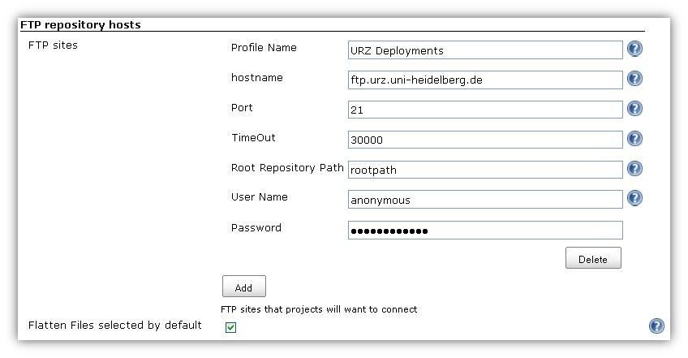
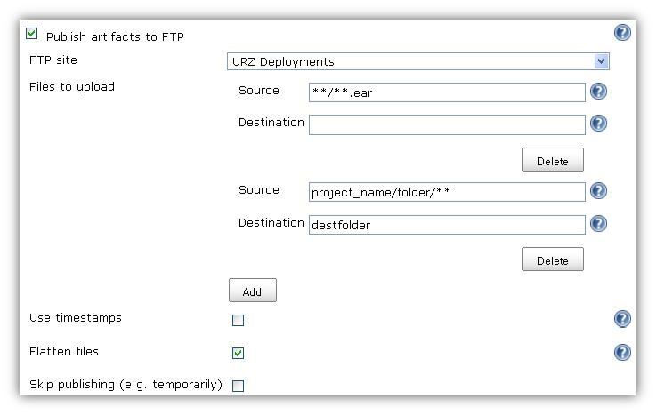

This plugin can be used to upload project artifacts and whole
directories to an ftp server. The following image show the configuration
part of this plugin that can be found under

the Jenkins System Configuration page. The fields are self explanatory
with a little help text.

  

  After you define one or more ftp servers, configure your jobs to
define what should be uploaded. See the image below for an example.
  
First you choose the target ftp server - in this example "URZ
Deployments". So after that you specify the files and or folder to
upload you are free to define an absolute path or a

fileset pattern (like in ant <http://ant.apache.org/>). So I guess with
this information you can use this plugin very well and don't forget I
developed this in my spare time so some feature are still

missing and maybe some bugs are living. Thankful to anybody how support
jenkins and this plugin. See the comments for information about some
current bugs.  
