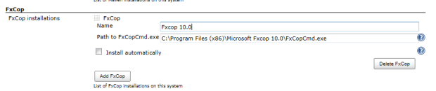
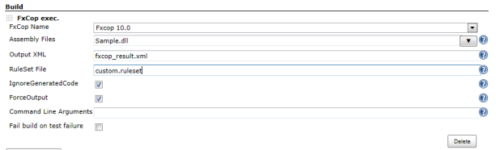

[FxCopCmd.exe](http://msdn.microsoft.com/en-us/library/bb429474%28v=vs.80%29.aspx)
execute plugin.

# Description

[FxCopCmd.exe](http://msdn.microsoft.com/en-us/library/bb429474%28v=vs.80%29.aspx)
execute plugin.  
Output xml can be used to [Violations
Plugin](https://wiki.jenkins-ci.org/display/JENKINS/Violations).

# Configuration

## System configuration

1.  Open the system configuration page "Manage Jenkins-\>Configure
    system"
2.  Enter the path to the FxCop command line client, that should be used
    by Jenkins.

-   Example: **C:\\Program Files (x86)\\Microsoft Fxcop
    10.0\\FxCopCmd.exe**

## Job configuration

[TABLE]

# Common Problems

FxCopCmd.exe can produce several warnings, and when it does, the build
will be marked as unstable. Look in your console output for the fxcop
output.

[TABLE]

# Changelog

##### Version 1.1 (02/28/2013)

-   add forceOutput field.

##### Version 1.0 (02/26/2013)

-   Initial release
