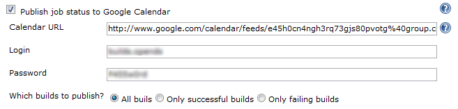

# What's this?

This plugin publishes build records over to [Google
Calendar](http://www.google.com/calendar/).

  
  

This plugin needs to know your calendar XML feed address to push data to
Google calendar. You can find this URL through the following steps:

1.  Go to Google Calendar
2.  Click the triangle icon on the right of the calendar you would like
    to use
3.  Select "Calendar Settings"
4.  Click on either of the two XML buttons and copy the link

# Changelog

### Version 0.4 (2011/11/04)

-   JENKINS-11617

### Version 0.3 (2009/12/28)

-   Use password form field so password isn't visible
-   Update uses of deprecated APIs

### Version 0.2 (2008/07/21)

-   Metadata update only release to fix update center
    ([report](http://www.nabble.com/How-to-install-Locale-plugin--Google-calendar-plugin-is-installed-instead.-tt18564660.html))
