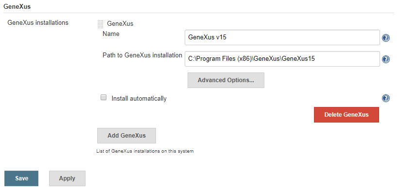
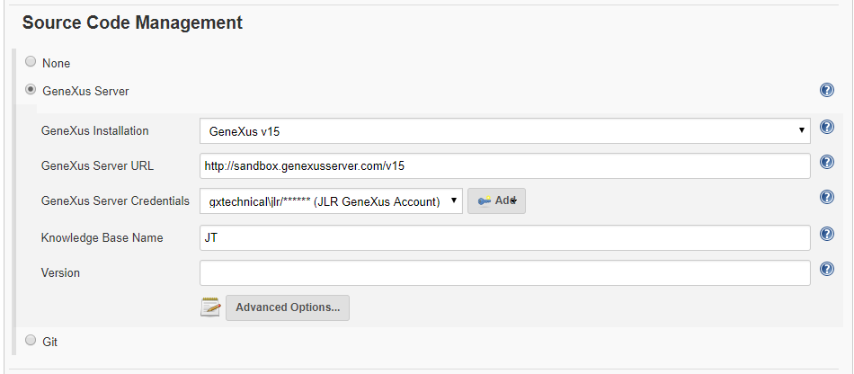
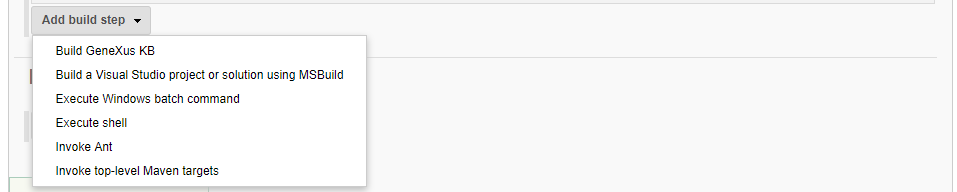
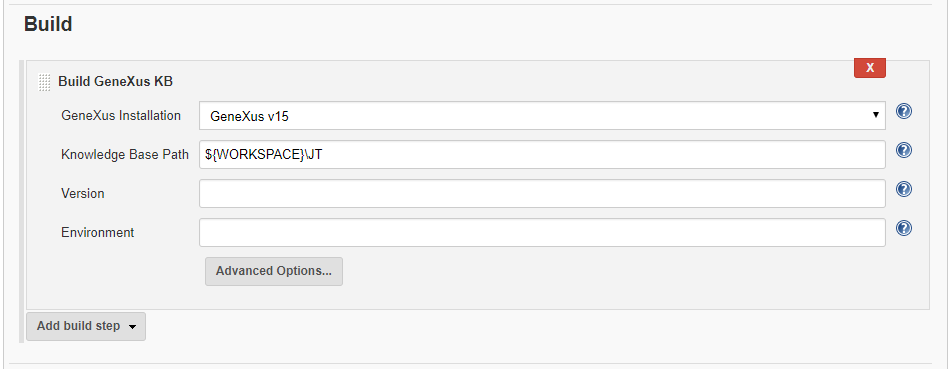

This plugin allows SCM and Build integration for GeneXus projects 

Offers support for [GeneXus](https://genexus.com/) projects:

-   Register GeneXus installations (for varied versions and
    configurations)
-   Use [GeneXus Server](http://gxserver.com/) as SCM (checkout, poll
    for changes and update local knowledge base)
-   Build GeneXus Knowledge Bases (using eithe generic MSBuild steps, or
    GeneXus-specific build steps)

## Usage

### GeneXus Installations

After installing GeneXus Plugin, go to "Manage Jenkins" / "Global Tool
Configuration", look for the "GeneXus" section and register the GeneXus
installations you want.

For example, you may want to register a GeneXus installation at
"C:\\Program Files (x86)\\GeneXus\\GeneXus15", naming it as "GeneXus
v15":

 

{width="823"
height="399"}

 

Click"Add GeneXus" if you want to register multiple installations (eg:
for other GeneXus versions).

Many GeneXus-related operations make use of the MSBuild engine (eg:
checkout, update, build). Clicking on "Advanced Options" you may select
the MSBuild installation you want to use with a particular GeneXus
installation.

### Source Code Management (SCM)

While creating or editing the configuration for a Jenkins project, on
the Source Code Management section you may select "GeneXus Server" and
fill the configuration options and properties. You may click the help
icons for further help on each of these options.

{width="950"
height="416"}

### Build Steps

At the Build section, the "Add build step" button will offer a "Build
GeneXus KB" options.

{width="957"
height="192"}

After selecting that option, you may configure the build options. Once
again, the help icons provide additional info on each field.

{width="950"
height="369"}

 

 

 

 

 
