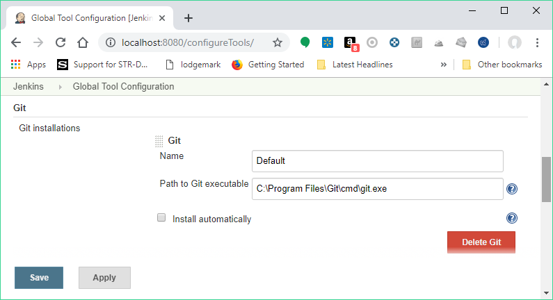
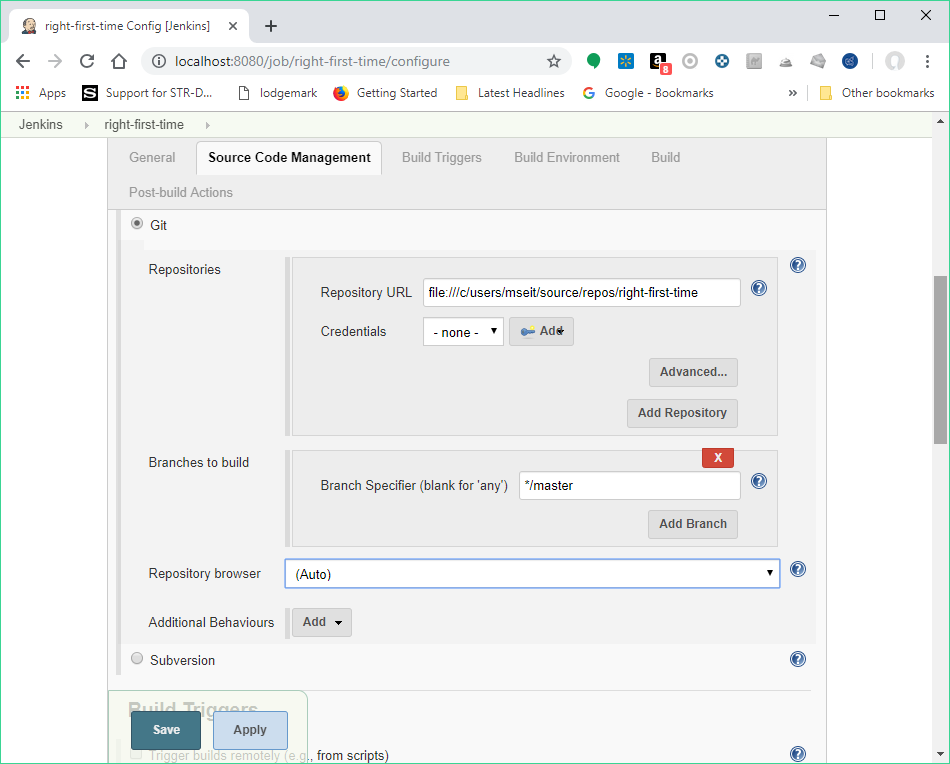

This plugin allows use of [Git](http://git-scm.com/) as a build SCM,
including repository browsers for several providers. A recent Git
runtime is required (1.7.9 minimum, 1.8.x recommended). Interaction with
the Git runtime is performed by the use of the [Git Client
Plugin](http://localhost:8085/display/JENKINS/Git+Client+Plugin), which
is only tested on official [git client](http://git-scm.com/). Use exotic
installations at your own risk.

# Configuration

## Global Settings

In the `Configure System` page, the Git Plugin provides the following
options

-   **Global Config** `user.name` **Value**: if provided
    `git config user.name <value>` is called before builds. This can be
    overridden by individual projects.
-   **Global Config** `user.email` **Value**: if provided
    `git config user.email <value>` is called before builds. This can be
    overridden by individual projects.
-   **Create new accounts base on author/committer's email**: if
    checked, upon parsing of git change logs, new user accounts are
    created on demand for the identified committers / authors in the
    internal Jenkins database. The e-mail address is used as the id of
    the account.

Pipeline Scripts

Please note that these config variables are not passed through to
Pipeline jobs [
JENKINS-43563](https://issues.jenkins.io/browse/JENKINS-43563) - Getting
issue details... STATUS So this configuration will need to be added in
the job if you wish to make git commits

  

## Project Configuration

At the project level the Git Plugin is configured by selecting the
**Git** option at the **Source Code Management** section.

The main section is **Repositories** where several can be configured.
The information to provide include:

-   The **Repository URL**, which is mandatory. The URL uses the same
    syntax as the git clone command. This can be a URL or a local file
    path. Note that for super-projects (repositories with submodules),
    only a local file path or a complete URL is valid.
    -   The following are examples of valid git URLs.
        -   `ssh://git@github.com/org-name/project-name.git`
        -   `git@github.com:org-name/project.git` (short notation for
            ssh protocol)
        -   `ssh://user@other.host.com/~/repos/R.git` (to access the
            {`repos/R.git` repository in the user's home directory)
        -   `https://github.com/github/git.git`
        -   `git://github.com/org-name/project.git`
    -   If the repository is a super-project, the location from which to
        clone submodules is dependent on whether the repository is bare
        or non-bare (i.e. has a working directory).
        -   If the super-project is bare, the location of the submodules
            will be taken from `.gitmodules`.
        -   If the super-project is **not** bare, it is assumed that the
            repository has each of its submodules cloned and checked out
            appropriately. Thus, the submodules will be taken directly
            from a path like `${SUPER_PROJECT_URL}/${SUBMODULE`}, rather
            than relying on information from `.gitmodules`.
    -   For a local URL/path to a super-project,
        `git rev-parse --is-bare-repository` is used to detect whether
        the super-project is bare or not.
    -   For a remote URL to a super-project, the ending of the URL
        determines whether a bare or non-bare repository is assumed:
        -   If the remote URL ends with `/.git`, a non-bare repository
            is assumed.
        -   If the remote URL does NOT end with `/.git`, a bare
            repository is assumed.
-   **Credentials**: Credentials to use to connect to the repository
    (unless anonymous access is allowed), using the Jenkins Credentials
    Management functionality. The type of credentials used depends on
    the underlying protocol. For SSH connections only private key
    authentication is supported.

The next section is **Branches to Build** in which several branch
specifiers can be provided. For each of these specs, leaving it blank
means that all branches will be examined for changes and built. The
safest way is to use the refs/heads/\<branchName\> syntax. This way the
expected branch is unambiguous. See the online help for more options.

A **Repository Browser** can also be configured, which adds links in
"changes" views within Jenkins to an external system for browsing the
details of those changes. The "Auto" selection attempts to infer the
repository browser from other jobs, if supported by the SCM and a job
with matching SCM details can be found, though it can also be selected
manually.

Finally, the Git Plugin is extensible and the plugin itself as well as
external plugins can provide **Additional Behaviours** to tweak the SCM
configuration inside each particular project. Please refer to the online
help of each of the additional options for further information.

# Bugs

-   Check the [open
    issues](http://issues.jenkins-ci.org/secure/IssueNavigator.jspa?mode=hide&reset=true&jqlQuery=project+%3D+JENKINS+AND+status+in+(Open%2C+%22In+Progress%22%2C+Reopened)+AND+component+%3D+%27git-plugin%27)
    carefully to see if the issue has already been reported
-   [Create an
    issue](http://issues.jenkins-ci.org/secure/CreateIssueDetails.jspa?pid=10172&issuetype=1&components=15543&priority=3)
    if needed, and make sure to choose the **git-plugin**
    sub-component.  Make sure to mention the plugin version number in
    the issue description.

**Note**: Source code can be found at
<https://github.com/jenkinsci/git-plugin>.

# Gotchas

-   If you are seeing output indicating Git could not clone, something
    like the output below, go to to the Jenkins configuration settings
    (not the project settings, the global ones) and change the Git path
    to a fully qualified path (eg. not "git" but "/usr/bin/git" or
    wherever your Git binary is installed). You should also verify that
    the permissions are correct if you are doing a file system based
    clone.

``` syntaxhighlighter-pre
Started by user anonymous
Checkout:workspace / C:\Documents and Settings\Administrator\.hudson\jobs\watir\workspace - hudson.remoting.LocalChannel@1a1f370
Last Build : #4
Checkout:workspace / C:\Documents and Settings\Administrator\.hudson\jobs\watir\workspace - hudson.remoting.LocalChannel@1a1f370
Cloning the remote Git repository
Cloning repository origin
$ git clone -o origin git://github.com/bret/watir.git "C:\Documents and Settings\Administrator\.hudson\jobs\watir\workspace"
Trying next repository
ERROR: Could not clone from a repository
FATAL: Could not clone
hudson.plugins.git.GitException: Could not clone
    at hudson.plugins.git.GitSCM$2.invoke(GitSCM.java:400)
    at hudson.plugins.git.GitSCM$2.invoke(GitSCM.java:358)
    at hudson.FilePath.act(FilePath.java:676)
    at hudson.FilePath.act(FilePath.java:660)
    at hudson.plugins.git.GitSCM.checkout(GitSCM.java:358)
    at hudson.model.AbstractProject.checkout(AbstractProject.java:833)
    at hudson.model.AbstractBuild$AbstractRunner.checkout(AbstractBuild.java:314)
    at hudson.model.AbstractBuild$AbstractRunner.run(AbstractBuild.java:266)
    at hudson.model.Run.run(Run.java:948)
    at hudson.model.Build.run(Build.java:112)
    at hudson.model.ResourceController.execute(ResourceController.java:93)
    at hudson.model.Executor.run(Executor.java:118)
```

-   You may need to tell Git the user Jenkins is running as. Such
    user is probably tomcat6, but you can easily find out by creating an
    empty job and entering "whoami" in an "execute shell" build step,
    then running the job and looking at the console output for the
    username. Once you have the name, on a Linux/Unix system switch to
    that user by using either of the following, which works even if the
    user doesn't have shell access.

    ``` syntaxhighlighter-pre
    $ su - -s /bin/bash tomcat6
    $ sudo su - -s /bin/bash tomcat6
    ```

    Now cd to the directory containing the clone Jenkins created, and
    use git config user.name and git config user.email to set the
    values.

    ``` syntaxhighlighter-pre
    $ cd /srv/jenkins/jobs/project/workspace
    $ git config user.email "some@email.com"
    $ git config user.name "jenkins"
    ```

    **Don't setup a [credential
    helper](https://git-scm.com/docs/gitcredentials), or if one is
    defined, delete that section from the `~/.gitconfig` file. It can
    cause weird authentication issues.**  
      
    When you are done, log off as the Jenkins user.

# Jenkins, GIT plugin and Windows

Installing the plugin itself works like a charm but configuring the
system to work properly under Windows can be a bit tricky. Let´s see the
problems you may run into.

## Git for Windows executable path

Note: [Microsoft
recommends](https://docs.microsoft.com/en-us/azure/devops/repos/git/share-your-code-in-git-cmdline?view=azure-devops) using
"[Git for Windows](https://git-scm.com/download/win)" as the git CLI
client for Visual Studio 2017

The "Path to executable" for "Git for Windows" is C:\\Program
Files\\Git\\cmd\\git.exe

{height="400"}

## Configuring Jenkins to use OpenSSH bundled with msysgit Windows installer

By default, the Jenkins Windows installer sets up Jenkins to run as a
service on Windows, which runs as the “Local System account”, NOT your
user account. Since the “Local System account” does not have SSH keys or
known\_hosts set up, “git clone” will hang during the build.  It's
possible to keep Jenkins running as the “Local System account” and clone
repositories via SSH by making sure that the “Local System account” is
set up with a properly configured .ssh directory (i.e. id\_rsa,
id\_rsa.pub, AND known\_hosts).  On my Windows 7 x64 box, this directory
is C:\\Windows\\SysWOW64\\config\\systemprofile\\.ssh and in Windows
Server 2012 R2 is C:\\Windows\\system32\\config\\systemprofile

The first time you connect via SSH to a remote server, you would
normally get prompted with the question "Are you sure you want to
continue connecting (yes/no)?", which would populate the remote server
info in your \~/.ssh/known\_hosts.  Even with proper SSH keys set up for
the Jenkins user, if you don't have a properly configured
\~/.ssh/known\_hosts, the build will still hang. 

A quick way to generate this known\_hosts file is to copy your Jenkins
build SSH keys into C:\\Program Files (x86)\\Git\\.ssh (so that ssh.exe
can find them), and run

``` syntaxhighlighter-pre
 c:\>"C:\Program Files (x86)\Git\bin\ssh.exe" -T git@your.git.server
```

This will populate C:\\Program Files (x86)\\Git\\.ssh\\known\_hosts and
then you can just copy C:\\Program Files (x86)\\Git\\.ssh to
C:\\Windows\\SysWOW64\\config\\systemprofile\\.ssh (the “Local System
account” home).

For a more detailed tutorial, see
<http://computercamp-cdwilson-us.tumblr.com/post/48589650930/jenkins-git-clone-via-ssh-on-windows-7-x64>

## Adding the server to your trusted list

First of all, if your system/user never connected to the git server, you
will have to add the server to your list of trusted servers.  
If you get something like this:

``` syntaxhighlighter-pre
The authenticity of host 'GIT SERVER (127.0.0.1)' can't be established.
RSA key fingerprint is 41:d2:d9:31:76:7d:bd:0d:5e:3f:19:db:5d:34:4d:9d.
Are you sure you want to continue connecting (yes/no)? yes
```

or

``` syntaxhighlighter-pre
The server's host key is not cached in the registry...
```

Find plink.exe on your system and run:

``` syntaxhighlighter-pre
plink.exe yourgitserver.com
```

Answer Yes when prompt. You ignore the login part with CTRL+C.  
Beware, this is user specific. SO if you run jenkins as user 'John',
make sure you login as 'John' before running the previous command.

An alternative option is to add some entries in the registry to
HKEY\_USERS\\.DEFAULT. You will typically run into this problem is you
let Jenkins runn as "Local System" but try to add the key to your list
while logged in with your user. The registry entries added for a
specific user can be found here:

``` syntaxhighlighter-pre
HKEY_CURRENT_USER\Software\SimonTatham\PuTTY\SshHostKeys
```

#### Setup your environment variables

General hint: Avoid spaces in environment paths

Mainly, you will need:

-   GIT\_HOME =\> Folder where your git.exe is located
-   HOME =\> The parent folder of the folder containing your SSH Keys
    (e.g If your keys are in C:\\SSHKeys, set HOME to C:)
-   PATH =\> Add the folder where your plink.exe is located

Once this is done, make sure you restart your consoles and the jenkins
service.

#### SSH Keys

You will need to generate your SSH keys. The public key will have to be
added/installed on the server. Systems like Gitorious, Gitosis or Github
make it easy: you will have to simply copy/paste your key. If you need
to setup the authentication with a 'simple' server, look for
'authorized\_keys' in this
document <http://www.eng.cam.ac.uk/help/jpmg/ssh/authorized_keys_howto.html>

You can read this: <http://help.github.com/win-set-up-git/> to see how
to generate the keys.

One solution to avoid entering your password (the one you defined in the
ssh key in the process above) is to use Pageant.exe. Visit the link
below for more
details: <http://www.ualberta.ca/CNS/RESEARCH/LinuxClusters/pka-putty.html>

**Note:**\* future \*integration with
[ssh-credentials-plugin](http://localhost:8085/display/JENKINS/SSH+Credentials+Plugin)
could help

## Some windows fun

If you did everything, you should now have a \~/.ssh folder
(c:\\Users\\Bob\\.ssh for instance) and this folder contains your
keys.  
At that point, you may even be able to manually (from the console),
clone your repository but Jenkins keeps failing with something like
this:

``` syntaxhighlighter-pre
code 128: Cloning into C:\Program Files\Jenkins\jobs\PG3\workspace...
fatal: The remote end hung up unexpectedly
```

If you run into this issue, you may need to copy the id\_rsa\* files
from your \~./.ssh to another folder.  
Find your git.exe and check if there is an .ssh folder there. If so,
copy \~./ssh/id\_rsa\* to this folder and try again.

## Git for Windows Installation and Windows Certificate Stores

A simpler approach with handling certificates in Windows is to configure
Git to "Use the native Windows Secure Channel library" during its
installation. This configures Git to use the Windows certificate stores
to find certificates it needs to connect to remote repositories. Most
typical Windows users use the Windows certificate stores to store web
server certificates and personal certificates (e.g. pkcs \#12) so using
this setting makes sense. If you find that you are unable to clone a
repository that uses https or requires a personal certificate for
authentication, reinstall the Git client with this setting.  One such
error that relates to an authentication failure when connecting to a
remote git repository is the following:

``` syntaxhighlighter-pre
ERROR: Couldn't find any revision to build. Verify the repository and branch configuration for this job. 
```

## Visual Studio 2017 local source repositories

The Git repository URL for local Visual Studio 2017 repositories is
"file:///c/users/\<user\>/source/repos/\<solution/project\>"

Example:

{height="400"}  

# Push notification from repository

To minimize the delay between a push and a build, it is recommended to
set up the post-receive hook in the repository to poke Jenkins when a
new push occurs. To do this, add the following line in your
`hooks/post-receive` file, where `<URL of the Git repository>` is the
fully qualified URL you use when cloning this repository.

    curl http://yourserver/git/notifyCommit?url=<URL of the Git repository>[&branches=branch1[,branch2]*][&sha1=<commit ID>]

This will scan all the jobs that:

-   Have *Build Triggers \> Poll SCM* enabled.  No polling *Schedule* is
    required.
-   Are configured to build the repository at the specified URL
-   Are configured to build the optionally specified branches or commit
    ID

For jobs that meet these conditions, polling will be immediately
triggered.  If polling finds a change worthy of a build, a build will in
turn be triggered.

This allows a script to remain the same when jobs come and go in
Jenkins. Or if you have multiple repositories under a single repository
host application (such as Gitosis), you can share a single post-receive
hook script with all the repositories. Finally, this URL doesn't require
authentication even for secured Jenkins, because the server doesn't
directly use anything that the client is sending. It runs polling to
verify that there is a change, before it actually starts a build.

When successful, the list of projects that were triggered is returned.

`<commit ID` is optional. If set, it will trigger a build immediately,
without polling for changes. The advantage of this is that you then can
have all pushes tested by jenkins, even when developers push at the same
time.

# Enabling JGit

The git client plugin provides multiple git implementations.  The
default git implementation relies on command line git.  Command line git
must be installed on each agent.

Administrators can enable a pure java implementation of the git protocol
from the "**Git**" button in "**Manage Jenkins**" \> "**Global Tool
Configuration**".  Implementations are added with the "Add" button. 
Once JGit (or JGit apache) has been added, jobs will include a picklist
"Git executable" in the git configuration section of the job.

# Why Not JGit

As of 1.2.0, the Git plugin uses
[git-client-plugin](http://localhost:8085/display/JENKINS/Git+Client+Plugin)
for all Git low-level operation. git-client was extracted from git
plugin 1.1.x code base, to ensure
*[SoC](http://en.wikipedia.org/wiki/Separation_of_concerns)* and allow
other plugins (gerrit, git-parameters...) to directly use and contribute
to this one when needed.

The git-client plugin 1.0.4 used JGit by default, while still including
the command line Git implementation as an alternate implementation.
 Initial deployments of the JGit based plugin exposed a number of gaps
in the JGit implementation.  Those gaps need to be resolved in the JGit
implementation before it can be used as the default implementation.
Beginning with git-client-plugin 1.0.5, the command line implementation
is the default implementation.

The git-client-plugin provides both command line and JGit
implementations for the GitClient interface. Using command line
demonstrated (based on large git plugin issue list) to be fragile :
running an external process any time some git repository interaction is
required introduces file and process leaks, filesystem locks, etc. It's
highly system dependent and require user to install and configure
adequate tools on all build slaves. It's based on parsing command
output, and as such can be broken by any git cli update - legacy code
already check git-cli version to detect which option can be used. Once
the JGit functionality gaps are closed, we consider JGit will be the way
to go. If you want to experiment with the JGit implementation, either
configure JGit as an available git installation from the "Manage
Jenkins" page, or run Jenkins with
-Dorg.jenkinsci.plugins.gitclient.Git.useCLI=false (same for slaves).

# Fast Remote Polling

Fast Remote Polling is a feature that uses a speedy *'git ls-remote
...'* command to perform the SCM polling action rather than having to a
clone and fetch a local repository.

**This feature is enabled by default as of versions 2.2+.**

In the event that Fast Remote Polling is detected as being not possible
(branches to build contains wildcards, etc), polling will fallback to
requiring a workspace.

However, it is possible in some environments that Fast Remote Polling
will not work due to the fact that it executes on the master and the
master may not have a working Git installation.

A workaround for this is to add an additional behavior of **Force
polling using workspace** to all jobs where you want to use SCM polling.

# Advanced Features

## Using Git, Jenkins and pre-build branch merging

Continuous Integration tools such as Jenkins are useful on projects as
they give users early indication that a particular codebase is
'unstable' - and that if a developer checks it out, there will be
trouble ahead (they won't be able to work on their own code, because
someone else has broken something).

Unfortunately, by the time the build completes, this is often too late
(particularly if the build cycle time is very long), as a developer has
updated their working copy to the latest, unstable code in the
repository and has begun work.

This can lead to the code base remaining unstable as developers tread on
each others toes steadily fixing one thing, but breaking something else.

Some environments (e.g. TeamCity) attempt to fix this by making commits
into SVN only 'really' happen once they have been tested. These kinds of
'delayed-commits' are problematic, because local SCM tools assume that
commits will be immediately available, which can confuse them. In many
ways this mechanism is a hack to get around the fact that branch
management in SVN is very heavyweight.

Fortunately, with GIT and Jenkins, you can achieve the same 'stable
branches' with minimal effort.

Set up your Jenkins project, and leave the 'branch' field in the Git SCM
blank. This will cause Jenkins to consider any change on any branch for
building.

Next, pick a particular branch name as the integration target in the
'Advanced' section - (e.g. 'master', or 'stable'), and select 'Merge
before build'.

Select 'Push GIT tags back to origin repository' from the post-build
actions (this is required to update your centralised git repo with the
results of the build).

Now, developers should never commit directly to your integration branch
(the 'master' or 'stable'). Instead, they should either use feature
branches, or create new remote branches on commit (e.g : "git push
origin HEAD:refs/heads/myNewFeature"). You could also set up your GIT
repository to only accept commits onto the integration branch from
Jenkins.

You're done. Commits should now be automatically merged with the
integration branch (they will fail if they do not merge cleanly), and
built. If the build succeeds, the result of the merge will be pushed
back to the remote git repository.

## Using Extra Repositories

Since GIT is a Distributed SCM, it is possible in the Advanced section
to specify multiple repositories. You may wish to do this to, for
example, pull all in-progress work from individual developers machines,
and pre-test them before they are committed to a centralised repository
- this way developers may get an early warning that a branch in progress
may not be stable.

The GIT plugin will make reasonable attempts to try and pull submodule
states from distributed repositories, with the proviso that this feature
is not currently well supported within GIT itself.

## Autogenerate submodule configurations

A common development pattern for many users is the use of a
'superproject' that aggregates a number of submodules. For example,
ProjectA may have ComponentA, ComponentB and ComponentC. ComponentA is a
shared library, and is set to use a particular revision (maybe on a
branch called 'ProjectA' in case there are any changes). Usually, any
changes to the project configuration require a commit to the ProjectA
superproject.

However - there could be other changes happening on other branches of
ComponentA (say to the development of the next version). Without someone
generating commits into ProjectA to test these, any regressions or
incompatibilities may be missed.

The autogenerate submodule configurations feature will create commits
into ProjectA for all possible combinations of the branches present in
the submodules that the project uses.

## Recursive submodules

The GIT plugin supports repositories with submodules which in turn have
submodules themselves. This must be turned on though: in *Job
Configuration* -\> Section *Source Code Management*, *Git* -\>
*Advanced* Button (under *Branches to build*) -\> *Recursively update
submodules*.

## Environment variables

The git plugin sets several environment variables you can use in your
scripts:

-   `GIT_COMMIT` - SHA of the current
-   `GIT_BRANCH` - Name of the remote repository (defaults to `origin`),
    followed by name of the branch currently being used, e.g.
    "`origin/master`" or "`origin/foo`"
-   `GIT_LOCAL_BRANCH` - Name of the branch on Jenkins. When the
    "checkout to specific local branch" behavior is configured, the
    variable is published.  If the behavior is configured as null or
    \*\*, the property will contain the resulting local branch name sans
    the remote name. 
-   `GIT_PREVIOUS_COMMIT` - SHA of the previous built commit from the
    same branch (not set on first build on a branch)
-   `GIT_PREVIOUS_SUCCESSFUL_COMMIT` - SHA of the previous
    ***successfully*** built commit from the same branch (not set on
    first build on a branch)
-   `GIT_URL` - Repository remote URL
-   `GIT_URL_``N` - Repository remote URLs when there are more than 1
    remotes, e.g. GIT\_URL\_1, GIT\_URL\_2
-   `GIT_AUTHOR_NAME` and `GIT_COMMITTER_NAME` - The name entered if the
    "Custom user name/e-mail address" behaviour is enabled; falls back
    to the value entered in the Jenkins system config under "Global
    Config user.name Value" (if any)
-   `GIT_AUTHOR_EMAIL` and `GIT_COMMITTER_EMAIL` - The email entered if
    the "Custom user name/e-mail address" behaviour is enabled; falls
    back to the value entered in the Jenkins system config under "Global
    Config user.email Value" (if any)

# Change Log - [Moved to GitHub](https://github.com/jenkinsci/git-plugin/releases)

### Version 3.11.0 (July 27, 2019) - [Moved to GitHub](https://github.com/jenkinsci/git-plugin/releases/tag/git-3.11.0)

### Version 3.10.1 (July 5, 2019) - [Moved to GitHub](https://github.com/jenkinsci/git-plugin/releases/tag/git-3.10.1)

### Version 3.10.0 (May 2, 2019)

-    
     Require Java 8
-    
     Require Jenkins 2.121.1 or newer
-    
     Fix upgrade compatibility error for mergeStrategy 'default' of
    pre-build merge in pipeline jobs
    ([JENKINS-51638](https://issues.jenkins-ci.org/browse/JENKINS-51638))

### Version 3.9.4 (April 24, 2019)

-   [  ](https://jenkins.io/security/advisory/2019-01-28/)
    Fix object not found exception scanning multibranch pipeline
    repo ([JENKINS-50394](https://issues.jenkins-ci.org/browse/JENKINS-50394))

### Version 4.0.0-rc (January 30, 2019)

-    
     Require Java 8
-    
     Require Jenkins 2.60
-    
     Make matrix project dependency optional
-    
     Add shallow cloning for submodules
    ([JENKINS-21248](https://issues.jenkins-ci.org/browse/JENKINS-21248))
-    
     Add option to search for users by e-mail address
    ([JENKINS-9016](https://issues.jenkins-ci.org/browse/JENKINS-9016))
-    
     Add parallel update for submodules
    ([JENKINS-44720](https://issues.jenkins-ci.org/browse/JENKINS-44720))
-    
     Stop bloating build.xml files with BuildData
    ([JENKINS-19022](https://issues.jenkins-ci.org/browse/JENKINS-19022))
-    
     Fix notifyCommit for branch names that contain '/' characters
    ([JENKINS-29603](https://issues.jenkins-ci.org/browse/JENKINS-29603), [JENKINS-32174](https://issues.jenkins-ci.org/browse/JENKINS-32174))
-    
     Fix empty "depth" parameter handling for shallow cloning
    ([JENKINS-53050](https://issues.jenkins-ci.org/browse/JENKINS-53050))
-    
     Ignore exceptions when generating commit message as informational
    message in build log
    ([JENKINS-53725](https://issues.jenkins-ci.org/browse/JENKINS-53725))
-    
     Fix snippet generator gitlab version class cast exception
    ([JENKINS-46650](https://issues.jenkins-ci.org/browse/JENKINS-46650))
-    
     Fix git tool references on agent
    ([JENKINS-55827](https://issues.jenkins-ci.org/browse/JENKINS-55827))

### Version 3.9.3 (January 30, 2019)

-   [  
    Fix l](https://jenkins.io/security/advisory/2019-01-28/)ocal tool
    reference was ignored
    ([JENKINS-55827](https://issues.jenkins-ci.org/browse/JENKINS-55827)),
    regression in 3.9.2

### Version 3.9.2 (January 28, 2019)

-   [  
    Fix security
    issue](https://jenkins.io/security/advisory/2019-01-28/)

### Version 3.9.1 (June 4, 2018)

-     
    Fix security issue ([security
    advisory](https://jenkins.io/security/advisory/2018-06-04/))

### Version 3.9.0 (May 12, 2018)

-    
     Require Jenkins 1.642.3 instead of 1.625.3 (workflow dependency
    update)
-    
     Test automation improvements
    ([JENKINS-50621](https://issues.jenkins-ci.org/browse/JENKINS-50621),
    [JENKINS-50540](https://issues.jenkins-ci.org/browse/JENKINS-50540),
    [JENKINS-50777](https://issues.jenkins-ci.org/browse/JENKINS-50777))
-    
     Support SHA1 references in Pipeline shared libraries
    ([JENKINS-48061](https://issues.jenkins-ci.org/browse/JENKINS-48061))
-    
     Added a new trait enabling discovery of custom refs
    ([JENKINS-48061](https://issues.jenkins-ci.org/browse/JENKINS-48061))
-    
     Don't require a workspace for polling in Freestyle projects that
    use ChangeLogToBranch extension
-    
     Don't require a workspace for polling in Freestyle projects that
    use author in changelog extension
    ([JENKINS-50683](https://issues.jenkins-ci.org/browse/JENKINS-50683)
    and [google groups
    discussion](https://groups.google.com/d/msg/jenkinsci-dev/irft9lJIYVk/xnhNnrWcjJgJ))
-    
     Correct the Pipeline data binding for merge strategy in
    UserMergeOptions
    ([JENKINS-34070](https://issues.jenkins-ci.org/browse/JENKINS-34070))
-    
     Retain repository browser URL when saved from Pipeline job
    definition page
    ([JENKINS-36451](https://issues.jenkins-ci.org/browse/JENKINS-36451))

### Version 3.8.0 (**February** 26, 2018)

-    
     Fix security issue ([security
    advisory](https://jenkins.io/security/advisory/2018-02-26/))

### Version 3.7.0 (**December** 21, 2017)

-    
     Fix checkout performance regression due to many rev-parse calls
    ([JENKINS-45447](https://issues.jenkins-ci.org/browse/JENKINS-45447))
-    
     Add Bitbucket and Gitlab browser guessing (in addition to existing
    GitHub browser guessing)
    ([PR\#562](https://github.com/jenkinsci/git-plugin/pull/562))
-    
     Validate Fisheye git browser URL during input
    ([JENKINS-48064](https://issues.jenkins-ci.org/browse/JENKINS-48064))
-    
     Allow retry by throwing IOException if submodule update fails
    ([JENKINS-32481](https://issues.jenkins-ci.org/browse/JENKINS-32481))
-    
     Don't pass empty username to User.get()
    ([JENKINS-48589](https://issues.jenkins-ci.org/browse/JENKINS-48589))

### Version 3.6.4 (November 5, 2017)

-    
     Add support for tagged pipeline shared libraries lost in 3.6.3
    ([JENKINS-47824](https://issues.jenkins-ci.org/browse/JENKINS-47824))

### Version 3.6.3 (October 26, 2017)

-    
     Fix ssh based branch indexing failure with default credentials
    ([JENKINS-47629](https://issues.jenkins-ci.org/browse/JENKINS-47659),
    [JENKINS-47659, ](https://issues.jenkins-ci.org/browse/JENKINS-47680)[JENKINS-47680](https://issues.jenkins-ci.org/browse/JENKINS-47659))

### [Version 3.6.2 (October 23, 2017)](https://issues.jenkins-ci.org/browse/JENKINS-47659)

-   [ 
     Fix visibility of enum required to implement new API
    for](https://issues.jenkins-ci.org/browse/JENKINS-47659)
    [JENKINS-47526](https://issues.jenkins-ci.org/browse/JENKINS-47526)

### Version 3.6.1 (October 23, 2017)

-    
     A merge conflict in PreBuildMerge will corrupt BuildData history in
    previous builds
    ([JENKINS-44037](https://issues.jenkins-ci.org/browse/JENKINS-44037))
-    
     Allow up to 4 second time offset in Windows file systems
    ([PR\#536](https://github.com/jenkinsci/git-plugin/pull/536))
-    
     Improve test coverage
    ([PR\#537](https://github.com/jenkinsci/git-plugin/pull/537),
    [PR\#539](https://github.com/jenkinsci/git-plugin/pull/539),
    [PR\#540](https://github.com/jenkinsci/git-plugin/pull/540))
-    
     Fix incorrect activation of tag categories (the tag category was
    enabled in all the right situations but as a result of the wrong
    test) ([PR\#541](https://github.com/jenkinsci/git-plugin/pull/541))
-    
     Remove duplicate code in AbstractGitSCMSource
    ([PR\#542](https://github.com/jenkinsci/git-plugin/pull/542))
-    
     Optimize operations that do not require a local repository cache
    ([PR\#544](https://github.com/jenkinsci/git-plugin/pull/544))
-    
     Resolve parameters in UserMergeOptions
    ([PR\#522](https://github.com/jenkinsci/git-plugin/pull/522))
-    
     Provide an API to allow avoiding local repository cache for
    GitSCMSource
    ([JENKINS-47526](https://issues.jenkins-ci.org/browse/JENKINS-47526))
-    
     Change the UI for Advaced Clone Behaviours to avoid confusing
    "negative" fetch tags label
    ([JENKINS-45822](https://issues.jenkins-ci.org/browse/JENKINS-45822))

### Version 3.6.0 (October 2, 2017)

-    
     Allow traits to support tag discovery
    ([JENKINS-46207](https://issues.jenkins-ci.org/browse/JENKINS-46207))
-    
     Don't exceed response header length
    ([JENKINS-46929](https://issues.jenkins-ci.org/browse/JENKINS-46929))
-    
     Don't fail build if diagnostic print of commit message fails
    ([JENKINS-45729](https://issues.jenkins-ci.org/browse/JENKINS-45729))

### Version 3.5.1 (August 5, 2017)

-    
     Extend API for Blue Ocean pipeline editing support in git
-    
     Extend API to allow PreBuildMerge trait through a new plugin
-    
     Don't ignore branches with '/' in GitSCMFileSystem
    ([JENKINS-42817](https://issues.jenkins-ci.org/browse/JENKINS-42817))
-    
     Show folder scoped credentials in modern SCM
    ([JENKINS-44271](https://issues.jenkins-ci.org/browse/JENKINS-44271))

### Version 3.5.0 (July 28, 2017)

-    
     Upgrade to [Git Client
    Plugin](http://localhost:8085/display/JENKINS/Git+Client+Plugin)
    version 2.5.0
-    
     Switch GitSCMSource indexing based on ls-remote to correctly
    determine orphaned branches
    ([JENKINS-44751](https://issues.jenkins-ci.org/browse/JENKINS-44751))
-    
     (Internal, not user visible) Provide an extension for downstream
    SCMSource plugins to use for PR merging that disables shallow clones
    when doing a PR-merge
    ([JENKINS-45771](https://issues.jenkins-ci.org/browse/JENKINS-45771))

### Version 3.4.1 (July 18, 2017)

-    
     Fix credentials field being incorrectly marked as transient
    ([JENKINS-45598](https://issues.jenkins-ci.org/browse/JENKINS-45598))

### Version 3.4.0 (July 17, 2017)

-    
     Refactor the Git Branch Source UI / UX to simplify configuration
    and enable configuration options to be shared with dependent plugins
    such as GitHub Branch Source and Bitbucket Branch Source
    ([JENKINS-43507](https://issues.jenkins-ci.org/browse/JENKINS-43507)).
    Please consult the linked ticket for full details. The high-level
    changes are:  
    -   There were a number of behaviours that are valid when used from
        a standalone job but are not valid in the context of a branch
        source and a multibranch project. These behaviours did not (and
        could not) work when configured against a branch source. These
        behaviours have been removed as configuration options for a Git
        Branch Source.
    -   In the context of a multibranch project, the checkout to local
        branch behaviour will now just check out to the branch name that
        matches the name of the branch. The ability to specify a fixed
        custom branch name does not make sense in the context of a
        multibranch project.
    -   Because each branch job in a multibranch project will only ever
        build the one specific branch, the default behaviour for a Git
        Branch Source is now to use a minimal refspec corresponding to
        just the required branch. Tags will not be checked out by
        default. If you have a multibranch project that requires the
        full set of ref-specs (for example, you might have a pipeline
        that will use some analysis tool on the diff with some other
        branch) you can restore the previous behaviour by adding the
        "Advanced Clone Behaviours". Note: In some cases you may also
        need to add the "Specify ref specs" behaviour.

### Version 3.3.2 (July 10, 2017)

-    
     Fix security issue ([security
    advisory](https://jenkins.io/security/advisory/2017-07-10/))

### Version 3.3.1 (June 23, 2017)

-     
    Print first line of commit message in console log
    ([JENKINS-38241](https://issues.jenkins-ci.org/browse/JENKINS-38241)[)](https://issues.jenkins-ci.org/browse/JENKINS-38827)
-     
    Allow scm steps to return revision
    ([JENKINS-26100](https://issues.jenkins-ci.org/browse/JENKINS-26100)[)](https://issues.jenkins-ci.org/browse/JENKINS-38827)
-    
     Don't require crumb for POST to /git/notifyCommit even when CSRF is
    enabled
    ([JENKINS-34350](https://issues.jenkins-ci.org/browse/JENKINS-34350))
-    
     Fix credentials tracking null pointer exception in pipeline library
    use
    ([JENKINS-44640](https://issues.jenkins-ci.org/browse/JENKINS-44640))
-    
     Fix credentials tracking null pointer exception in git parameters
    use
    ([JENKINS-44087](https://issues.jenkins-ci.org/browse/JENKINS-44087))

### Version 3.3.0 (April 21, 2017)

-     
    Track credentials use so that credentials show the jobs which use
    them
    ([JENKINS-38827](https://issues.jenkins-ci.org/browse/JENKINS-38827))
-    
     Add a "Branches" list view column
    ([JENKINS-37331](https://issues.jenkins-ci.org/browse/JENKINS-37331))
-    
     Add some Italian localization
-    
     Fix null pointer exception when pipeline definition includes a
    branch with no repository
    ([JENKINS-43630](https://issues.jenkins-ci.org/browse/JENKINS-43630))

### Version 3.2.0 (March 28, 2017)

-   
      Add reporting API for default remote branch
    ([JENKINS-40834](https://issues.jenkins-ci.org/browse/JENKINS-40834))
-   
      Remove extra git tag actions from build results sidebar
    ([JENKINS-35475](https://issues.jenkins-ci.org/browse/JENKINS-35475))

### Version 3.1.0 (March 4, 2017)

-   
      Add command line git [large file support
    (LFS)](https://git-lfs.github.com/)
    ([JENKINS-30318](https://issues.jenkins-ci.org/browse/JENKINS-30318),
    [JENKINS-35687](https://issues.jenkins-ci.org/browse/JENKINS-35687),
    [JENKINS-38708](https://issues.jenkins-ci.org/browse/JENKINS-38708),
    [JENKINS-40174](https://issues.jenkins-ci.org/browse/JENKINS-40174))
-   
      Allow custom remote and refspec for GitSCMSource
    ([JENKINS-40908](https://issues.jenkins-ci.org/browse/JENKINS-40908))
-   
      Add help for GitSCMSource
    ([JENKINS-42204](https://issues.jenkins-ci.org/browse/JENKINS-42204))
-   
      Add help for multiple refspecs
    ([JENKINS-42050](https://issues.jenkins-ci.org/browse/JENKINS-42050))
-   
      Log a warning if buildsByBranchName is too large
    ([JENKINS-19022](https://issues.jenkins-ci.org/browse/JENKINS-19022))
-   
      Avoid incorrect triggers when processing events
    ([JENKINS-42236](https://issues.jenkins-ci.org/browse/JENKINS-42236))

### Version 3.0.5 (February 9, 2017)

-    
     Please read [this Blog
    Post](https://jenkins.io/blog/2017/01/17/scm-api-2/) before
    upgrading
-    
     Upgrade SCM API dependency to 2.0.3
-    
     Expose event origin to listeners
    ([JENKINS-41812](https://issues.jenkins-ci.org/browse/JENKINS-41812))

### Version 2.6.5 (February 9, 2017)

-    
     Please read [this Blog
    Post](https://jenkins.io/blog/2017/01/17/scm-api-2/) before
    upgrading
-    
     Upgrade SCM API dependency to 2.0.3
-    
     Expose event origin to listeners
    ([JENKINS-41812](https://issues.jenkins-ci.org/browse/JENKINS-41812))

### Version 3.0.4 (February 2, 2017)

-    
     Please read [this Blog
    Post](https://jenkins.io/blog/2017/01/17/scm-api-2/) before
    upgrading
-    
     Upgrade to latest SCM API dependency

### Version 2.6.4 (February 2, 2017)

-    
     Please read [this Blog
    Post](https://jenkins.io/blog/2017/01/17/scm-api-2/) before
    upgrading
-    
     Upgrade to latest SCM API dependency
-    
     Remove beta dependency that was left by mistake in the 2.6.2
    release (this is what 2.6.2 should have been)

### Version 3.0.3 (January 16, 2017)

-   
      Please read [this Blog
    Post](https://jenkins.io/blog/2017/01/17/scm-api-2/) before
    upgrading
-    
     Remove beta dependency that was left by mistake in the 3.0.2
    release (this is what 3.0.2 should have been)

### Version 2.6.3 (SKIPPED)

-    
     This version number has been skipped to keep alignment of the patch
    version with the 3.0.x line until the SCM API coordinated releases
    have been published to the update center

### Version 3.0.2 (January 16, 2017)

-    
     Please read [this Blog
    Post](https://jenkins.io/blog/2017/01/17/scm-api-2/) before
    upgrading
-    
     Fix potential NPE in matching credentials ([PR
    \#467](https://github.com/jenkinsci/git-plugin/pull/467))
-    
     Add API to allow plugins to configure the SCM browser after
    instantiation
    ([JENKINS-39837](https://issues.jenkins-ci.org/browse/JENKINS-39837))
-    
     Updated Japanese translations
-    
     Upgrade to SCM API 2.0.x APIs
    ([JENKINS-39355](https://issues.jenkins-ci.org/browse/JENKINS-39355))
-    
     Fix help text ([PR
    \#451](https://github.com/jenkinsci/git-plugin/pull/451))

### Version 2.6.2 (January 16, 2017)

-    
     Please read [this Blog
    Post](https://jenkins.io/blog/2017/01/17/scm-api-2/) before
    upgrading
-    
     Allow the SCM browser to be configured after SCM instance created
    ([JENKINS-39837](https://issues.jenkins-ci.org/browse/JENKINS-39837))
-    
     Fixed translations
-    
     Fixed copyright
-    
     Updated Japanese translation
-    
     Upgrade to SCM API 2.0.x APIs
    ([JENKINS-39355](https://issues.jenkins-ci.org/browse/JENKINS-39355))
-    
     API to get author or committer email without having to call
    getAuthor()

### Version 3.0.2-beta-1 (December 16, 2016)

-    
     Update to SCM-API 2.0.1 APIs
    ([JENKINS-39355](https://issues.jenkins-ci.org/browse/JENKINS-39355))
-    
     Add implementation of SCMFileSystem
    ([JENKINS-40382](https://issues.jenkins-ci.org/browse/JENKINS-40382))
-    
     Fix help text for excluded regions regex
    ([PR\#451](https://github.com/jenkinsci/git-plugin/pull/451))

### Version 2.6.2-beta-1 (December 16, 2016)

-    
     Update to SCM-API 2.0.1 APIs
    ([JENKINS-39355](https://issues.jenkins-ci.org/browse/JENKINS-39355))
-    
     Add implementation of SCMFileSystem
    ([JENKINS-40382](https://issues.jenkins-ci.org/browse/JENKINS-40382))

### Version 3.0.1 (November 18, 2016)

-   
      Allow retrieval of a single revision (for improved pipeline
    support)
    ([JENKINS-31155](https://issues.jenkins-ci.org/browse/JENKINS-31155))
-   
      Avoid null pointer exception in prebuild use of build data
    ([JENKINS-34369](https://issues.jenkins-ci.org/browse/JENKINS-34369))
-   
      Allow git credentials references from global configuration screens
    ([JENKINS-38048](https://issues.jenkins-ci.org/browse/JENKINS-38048))
-   
      Use correct specific version in workflow pipeline on subsequent
    builds
    ([e15a43](https://github.com/jenkinsci/git-plugin/commit/e15a431a62781c6081c57354a33a7e148a4452a1))

### Version 2.6.1 (November 9, 2016)

-   
      Allow retrieval of a single revision (for improved pipeline
    support)
    ([JENKINS-31155](https://issues.jenkins-ci.org/browse/JENKINS-31155))
-   
      Avoid null pointer exception in prebuild use of build data
    ([JENKINS-34369](https://issues.jenkins-ci.org/browse/JENKINS-34369))
-   
      Allow git credentials references from global configuration screens
    ([JENKINS-38048](https://issues.jenkins-ci.org/browse/JENKINS-38048))
-   
      Use correct specific version in workflow pipeline on subsequent
    builds
    ([e15a43](https://github.com/jenkinsci/git-plugin/commit/e15a431a62781c6081c57354a33a7e148a4452a1))

### Version 3.0.0 (September 10, 2016)

-   
      Add submodule authentication using same credentials as parent
    repository
    ([JENKINS-20941](https://issues.jenkins-ci.org/browse/JENKINS-20941))
-   
      Require JDK 7 and Jenkins 1.625 as minimum Jenkins version

### Version 2.6.0 (September 2, 2016)

-   
      Add command line git support to multi-branch pipeline jobs
    ([JENKINS-33983](https://issues.jenkins-ci.org/browse/JENKINS-33983),
    [JENKINS-35565](https://issues.jenkins-ci.org/browse/JENKINS-35565)
    [JENKINS-35567](https://issues.jenkins-ci.org/browse/JENKINS-35567),
    [JENKINS-36958](https://issues.jenkins-ci.org/browse/JENKINS-36958),
    [JENKINS-37297](https://issues.jenkins-ci.org/browse/JENKINS-37297))
-   
      Remove deleted branches from multi-branch cache when using command
    line git
    ([JENKINS-37727](https://issues.jenkins-ci.org/browse/JENKINS-37727))
-   
      Create multi-branch cache parent directories if needed
    ([JENKINS-37482](https://issues.jenkins-ci.org/browse/JENKINS-37482))
-   
      Use credentials API 2.1
    ([JENKINS-35525](https://issues.jenkins-ci.org/browse/JENKINS-35525))

### Version 2.5.3 (July 30, 2016)

-   
      Prepare to coexist with git client plugin 2.0 when it changes from
    JGit 3 to JGit 4
    ([commit](https://github.com/jenkinsci/git-plugin/commit/71946a2896d3adcd1171ac59b7c45bacaf7a9c56))
-   
      Fix gogs repository browser configuration
    ([JENKINS-37066](https://issues.jenkins-ci.org/browse/JENKINS-37066))
-   
      Optionally "honor refspec on initial clone" rather than always
    honoring refspec on initial clone
    ([JENKINS-36507](https://issues.jenkins-ci.org/browse/JENKINS-36507))
-   
      Don't ignore the checkout timeout value
    ([JENKINS-22547](https://issues.jenkins-ci.org/browse/JENKINS-22547))

### Version 3.0.0-beta2 (July 6, 2016)

-   
      Fix compatibility break introduced by git plugin 2.5.1 release
    ([JENKINS-36419](https://issues.jenkins-ci.org/browse/JENKINS-36419))
-   
      Add many more git options to multi-branch project plugin and
    literate plugin (plugins which use GitSCMSource)
-   
      Improved help for regex branch specifiers and branch name matching
-   
      Improve github browser guesser for more forms of GitHub URL
-   
      Use Jenkins common controls for numeric entry in fields which are
    limited to numbers (like shallow clone depth). Blocks the user from
    inserting alphabetic characters into a field which should take
    numbers
-   
      Honor refspec on initial fetch
    ([JENKINS-31393](https://issues.jenkins-ci.org/browse/JENKINS-31393))
    (note, some users may depend on the old, poor behavior that the
    plugin fetched all refspecs even though the user had specified a
    narrower refspec. Those users can delete their refspec or modify it
    to be as wide as they need)
-   
      Disallow deletion of the last repository entry in git
    configuration
    ([JENKINS-33956](https://issues.jenkins-ci.org/browse/JENKINS-33956))

### Version 2.5.2 (July 4, 2016)

-   
      Fix compatibility break introduced by git plugin 2.5.1 release
    ([JENKINS-36419](https://issues.jenkins-ci.org/browse/JENKINS-36419))

### Version 2.5.1 (July 2, 2016)

-   
      Add many more git options to multi-branch project plugin and
    literate plugin (plugins which use GitSCMSource)
-   
      Improved help for regex branch specifiers and branch name matching
-   
      Improve github browser guesser for more forms of GitHub URL
-   
      Use Jenkins common controls for numeric entry in fields which are
    limited to numbers (like shallow clone depth). Blocks the user from
    inserting alphabetic characters into a field which should take
    numbers
-   
      Honor refspec on initial fetch
    ([JENKINS-31393](https://issues.jenkins-ci.org/browse/JENKINS-31393))
    (note, some users may depend on the old, poor behavior that the
    plugin fetched all refspecs even though the user had specified a
    narrower refspec. Those users can delete their refspec or modify it
    to be as wide as they need)
-   
      Disallow deletion of the last repository entry in git
    configuration
    ([JENKINS-33956](https://issues.jenkins-ci.org/browse/JENKINS-33956))

### Version 2.5.0 (June 19, 2016) - Submodule authentication has moved into git 3.0.0-beta

-   
      Reject parameters passed through unauthenticated notifyCommit
    calls (SECURITY-275)
-   
      Don't generate error when two repos defined and specific SHA1 is
    built
    ([JENKINS-26268](https://issues.jenkins-ci.org/browse/JENKINS-26268))
-   
      Fix stack trace generated when AssemblaWeb used as git hosting
    service
-   
      Fix array index violation when e-mail address is single character
    "@"
-   
      Add support for gogs self-hosted git service
-   
      Use environment from executing node rather than using environment
    from master
-   
      Move pipeline GitStep from pipeline plugin to git plugin
    ([JENKINS-35247](https://issues.jenkins-ci.org/browse/JENKINS-35247));
    **note** that if you have the *Pipeline: SCM Step* plugin installed,
    you must update it as well

### Version 3.0.0-beta1 (June 15, 2016)

-   
      Continuation of git plugin 2.5.0-beta series (2.5.0 release number
    used for SECURITY-275 fix)
-   
      Don't generate error when two repos defined and specific SHA1 is
    built
    ([JENKINS-26268](https://issues.jenkins-ci.org/browse/JENKINS-26268))
-   
      Fix stack trace generated when AssemblaWeb used as git hosting
    service
-   
      Fix array index violation when e-mail address is single character
    "@"
-   
      Add support for gogs self-hosted git service
-   
      Use environment from executing node rather than using environment
    from master
-   
      Move pipeline GitStep from pipeline plugin to git plugin
    ([JENKINS-35247](https://issues.jenkins-ci.org/browse/JENKINS-35247))

### Version 2.5.0-beta5 (April 19, 2016)

-   
      Fix botched merge that was included in 2.5.0-beta4
-   
      Include latest changes from master branch (git plugin 2.4.4)

### Version 2.4.4 (March 24, 2016)

-   
      Fix git plugin 2.4.3 data loss when saving job definition
    ([JENKINS-33695](https://issues.jenkins-ci.org/browse/JENKINS-33695)
    and
    [JENKINS-33564](https://issues.jenkins-ci.org/browse/JENKINS-33564))
-   
      Restore BuildData.equals lost in git plugin 2.4.2 revert mistake
    ([JENKINS-29326](https://issues.jenkins-ci.org/browse/JENKINS-29326))

### Version 2.4.3 (March 19, 2016)

-   
      Optionally derive local branch name from remote branch name
    ([JENKINS-33202](https://issues.jenkins-ci.org/browse/JENKINS-33202))
-   
      Allow shallow clone depth to be specified
    ([JENKINS-24728](https://issues.jenkins-ci.org/browse/JENKINS-24728))
-   
      Allow publishing from shallow clone if git version supports it
    ([JENKINS-31108](https://issues.jenkins-ci.org/browse/JENKINS-31108))
-   
      Allow GitHub browser guesser to work even if multiple refspecs
    defined for same URL
    ([JENKINS-33409](https://issues.jenkins-ci.org/browse/JENKINS-33409))
-   
      Clarify Team Foundation Server browser name (remove 2013 specific
    string)
-   
      Reduce memory use in difference calculation
    ([JENKINS-31326](https://issues.jenkins-ci.org/browse/JENKINS-31326))
-   
      Resolve several findbugs warnings

### Version 2.4.2 (February 1, 2016)

-   
      Show changelog even if prune stale branches is enabled
    ([JENKINS-29482](https://issues.jenkins-ci.org/browse/JENKINS-29482))
-   
      Set GIT\_PREVIOUS\_SUCCESSFUL\_COMMIT even if prune stale branches
    is enabled
    ([JENKINS-32218](https://issues.jenkins-ci.org/browse/JENKINS-32218))

### Version 2.4.1 (December 26, 2015)

-   
      Allow clone to optionally not fetch tags
    ([JENKINS-14572](https://issues.jenkins-ci.org/browse/JENKINS-14572))
-   
      Allow submodules to use a reference repo
    ([JENKINS-18666](https://issues.jenkins-ci.org/browse/JENKINS-18666))
-   
      Use OR instead of AND when combining multiple refspecs
    ([JENKINS-29796](https://issues.jenkins-ci.org/browse/JENKINS-29796))
-   
      Remove dead branches from BuildData
    ([JENKINS-29482](https://issues.jenkins-ci.org/browse/JENKINS-29482))
-   
      Fix Java 6 date parsing error
    ([JENKINS-29857](https://issues.jenkins-ci.org/browse/JENKINS-29857))
-   
      Set changeset time correctly
    ([JENKINS-30073](https://issues.jenkins-ci.org/browse/JENKINS-30073))
-   
      Include parent SHA1 in RhodeCode diff URL
    ([JENKINS-17117](https://issues.jenkins-ci.org/browse/JENKINS-17117))
-   
      Don't set GIT\_COMMIT to an empty value
    ([JENKINS-27180](https://issues.jenkins-ci.org/browse/JENKINS-27180))
-   
      Fix AssemblaWeb diff link
    ([JENKINS-29731](https://issues.jenkins-ci.org/browse/JENKINS-29731))
-   
      Attempt fix for multi-scm sporadic failures
    ([JENKINS-26587](https://issues.jenkins-ci.org/browse/JENKINS-26587))

### Version 2.5.0-beta3 (November 12, 2015)

-   
      Still more work on submodule authentication support by allowing
    submodules to use parent credentials
    ([JENKINS-20941](https://issues.jenkins-ci.org/browse/JENKINS-20941))

### Version 2.5.0-beta2 (November 8, 2015)

-   
      More work on submodule authentication support by allowing
    submodules to use parent credentials
    ([JENKINS-20941](https://issues.jenkins-ci.org/browse/JENKINS-20941))

### Version 2.5.0-beta1 (November 4, 2015)

-   
      Submodule authentication support by allowing submodules to use
    parent credentials
    ([JENKINS-20941](https://issues.jenkins-ci.org/browse/JENKINS-20941))

### Version 2.4.0 (July 18, 2015)

-   
      Branch spec help text improved
    ([JENKINS-27115](https://issues.jenkins-ci.org/browse/JENKINS-27115))
-   
      Allow additional notifyCommit arguments
    ([JENKINS-27902](https://issues.jenkins-ci.org/browse/JENKINS-27902))
-   
      Parameterized branch name handling improvements (Pull requests
    226, 308, 309,
    [JENKINS-27327](https://issues.jenkins-ci.org/browse/JENKINS-27327),
    [JENKINS-27351](https://issues.jenkins-ci.org/browse/JENKINS-27351),
    [JENKINS-27352](https://issues.jenkins-ci.org/browse/JENKINS-27352))
-   
      Display error message in log when fetch fails (regression fix)
    ([JENKINS-26225](https://issues.jenkins-ci.org/browse/JENKINS-26225),
    [JENKINS-27567](https://issues.jenkins-ci.org/browse/JENKINS-27567),
    [JENKINS-27886](https://issues.jenkins-ci.org/browse/JENKINS-27886),
    [JENKINS-28134](https://issues.jenkins-ci.org/browse/JENKINS-28134))
-   
      Fix IllegalStateException when using notifyCommit URL
    ([JENKINS-26582](https://issues.jenkins-ci.org/browse/JENKINS-26582))
-   
      Allow branch specification regex which does not include '\*'
    ([JENKINS-26842](https://issues.jenkins-ci.org/browse/JENKINS-26842))
-   
      Detect changes correctly when polling
    ([JENKINS-27093](https://issues.jenkins-ci.org/browse/JENKINS-27093),
    [JENKINS-27332](https://issues.jenkins-ci.org/browse/JENKINS-27332),
    [JENKINS-27769](https://issues.jenkins-ci.org/browse/JENKINS-27769))
-   
      Fix GitHub Webhook handling
    ([JENKINS-27282](https://issues.jenkins-ci.org/browse/JENKINS-27282))
-   
      Fix polling with a parameterized branch name
    ([JENKINS-27349](https://issues.jenkins-ci.org/browse/JENKINS-27349))
-   
      Don't throw exception when changelog entry is missing parent
    ([JENKINS-28260](https://issues.jenkins-ci.org/browse/JENKINS-28260),
    [JENKINS-28290](https://issues.jenkins-ci.org/browse/JENKINS-28290),
    [JENKINS-28291](https://issues.jenkins-ci.org/browse/JENKINS-28291))
-   
      Don't throw exception when saving GitLab browser config
    ([JENKINS-28792](https://issues.jenkins-ci.org/browse/JENKINS-28792))
-   
      Rebuild happened on each poll, even with no changes
    ([JENKINS-29066](https://issues.jenkins-ci.org/browse/JENKINS-29066))
-   
      Remote class loading issue work-around
    ([JENKINS-21520](https://issues.jenkins-ci.org/browse/JENKINS-21520))

### Version 2.3.5 (February 18, 2015)

-   
      Support Microsoft Team Foundation Server 2013 as a git repository
    browser
-   
      Support more merge modes (fast forward, no fast forward, fast
    forward only
    ([JENKINS-12402](https://issues.jenkins-ci.org/browse/JENKINS-12402))
-   
      Handle regular expression branch name correctly even if it does
    not contain asterisk
    ([JENKINS-26842](https://issues.jenkins-ci.org/browse/JENKINS-26842))
-   
      Log the error stack trace if fetch fails (temporary diagnostic
    aid)

### Version 2.3.4 (January 8, 2015)

-   
      Fix jelly page escape bug (which was visible in the GitHub plugin)

### Version 2.2.12 (January 8, 2015)

-   
      Fix jelly page escape bug (which was visible in the GitHub plugin)

### Version 2.3.3 (January 6, 2015)

-   
      Use git client plugin 1.15.0
-   
      Escape HTML generated into jelly pages with escape="true"
-   
      Expand environment variables in GitPublisher again
    ([JENKINS-24786](https://issues.jenkins-ci.org/browse/JENKINS-24786))

### Version 2.2.11 (January 6, 2015)

-   
      Update to JGit 3.6.1
-   
      Use git client plugin 1.15.0
-   
      Escape HTML generated into jelly pages with escape="true"
-   
      Fix multiple builds can be triggered for same commit
    ([JENKINS-25639](https://issues.jenkins-ci.org/browse/JENKINS-25639))

### Version 2.3.2 (December 19, 2014)

-   
      Use git client plugin 1.13.0
    ([CVE-2014-9390](http://git-blame.blogspot.com.es/2014/12/git-1856-195-205-214-and-221-and.html))

### Version 2.2.10 (December 19, 2014)

-   
      Use git client plugin 1.13.0
    ([CVE-2014-9390](http://git-blame.blogspot.com.es/2014/12/git-1856-195-205-214-and-221-and.html))
-    
     Do not continuously build when polling multiple repositories
    ([JENKINS-25639](https://issues.jenkins-ci.org/browse/JENKINS-25639))

### Version 2.3.1 (November 29, 2014)

-     
    Add a build chooser to limit branches to be built based on age or
    ancestor SHA1
-    
     Update to git-client-plugin 1.12.0 (includes JGit 3.5.2)
-    
     Allow polling to ignore detected changes based on commit content
-    
     Do not continuously build when polling multiple repositories
    ([JENKINS-25639](https://issues.jenkins-ci.org/browse/JENKINS-25639))
-    
     Expand parameters on repository url before associate one url to one
    credential
    ([JENKINS-23675](https://issues.jenkins-ci.org/browse/JENKINS-23675))
-    
     Expand parameters on branch spec for remote polling
    ([JENKINS-20427](https://issues.jenkins-ci.org/browse/JENKINS-20427),
    [JENKINS-14276](https://issues.jenkins-ci.org/browse/JENKINS-14276))
-    
     Fix Gitiles file link for various Gitiles versions
    ([JENKINS-25568](https://issues.jenkins-ci.org/browse/JENKINS-25568))
-    
     Fixed notifyCommit builddata
    ([JENKINS-24133](https://issues.jenkins-ci.org/browse/JENKINS-24133))
-    
     Improve notifyCommit message to reduce user confusion

### Version 2.2.9 (November 23, 2014)

-   
      Added behavior: "Polling ignores commits with certain messages"
-   
      GIT\_BRANCH set to detached when sha1 parameter set in
    notifyCommit URL
    ([JENKINS-24133](https://issues.jenkins-ci.org/browse/JENKINS-24133))

### Version 2.2.8 (November 12, 2014)

-   
      Add submodule update timeout as an option
    ([JENKINS-22400](https://issues.jenkins-ci.org/browse/JENKINS-22400))
-   
      Update Gitlab support for newer Gitlab versions
    ([JENKINS-25568](https://issues.jenkins-ci.org/browse/JENKINS-25568))
-   
      No exception if changeset author can't be found
    ([JENKINS-16737](https://issues.jenkins-ci.org/browse/JENKINS-16737)
    and
    [JENKINS-10434](https://issues.jenkins-ci.org/browse/JENKINS-10434))
-   
      Annotate builddata earlier to reduce race conditions
    ([JENKINS-23641](https://issues.jenkins-ci.org/browse/JENKINS-23641))
-   
      Pass marked revision to decorate revision
    ([JENKINS-25191](https://issues.jenkins-ci.org/browse/JENKINS-25191))
-   
      Avoid null pointer exception when last repo or branch deleted
    ([JENKINS-25313](https://issues.jenkins-ci.org/browse/JENKINS-25313))
-   
      Allow retry by throwing a different exception during certain fetch
    failures
    ([JENKINS-20531](https://issues.jenkins-ci.org/browse/JENKINS-20531))
-   
      Do not require a workspace when polling multiple repositories
    ([JENKINS-25414](https://issues.jenkins-ci.org/browse/JENKINS-25414))

### Version 2.3 (November 10, 2014)

-   
      Released for Jenkins 1.568 and later, update center will exclude
    from earlier Jenkins versions
-   
      Do not require a workspace when polling multiple repositories
    ([JENKINS-25414](https://issues.jenkins-ci.org/browse/JENKINS-25414))

### Version 2.3-beta-4 (October 29, 2014)

-   
      Update to JGit 3.5.1
-   
      Allow retry if fetch fails
    ([JENKINS-20531](https://issues.jenkins-ci.org/browse/JENKINS-20531))
-   
      Don't NPE if all repos and all branches removed from job
    definition
    ([JENKINS-25313](https://issues.jenkins-ci.org/browse/JENKINS-25313))
-   
      Correctly record built revision even on failed merge
    ([JENKINS-25191](https://issues.jenkins-ci.org/browse/JENKINS-25191))
-   
      Record build data sooner for better concurrency and safety
    ([JENKINS-23641](https://issues.jenkins-ci.org/browse/JENKINS-23641))
-   
      Do not throw exception if author can't be found in change set
    ([JENKINS-16737](https://issues.jenkins-ci.org/browse/JENKINS-16737),
    [JENKINS-10434](https://issues.jenkins-ci.org/browse/JENKINS-10434))

### Version 2.2.7 (October 8, 2014)

-   
      Honor project specific Item/CONFIGURE permission even if overall
    Item/CONFIGURE has not been granted (SECURITY-158)
-   
      Save current build in BuildData prior to rescheduling
    ([JENKINS-21464](https://issues.jenkins-ci.org/browse/JENKINS-21464))
-   
      Fix GitPublisher null pointer exception when previous slave is
    missing
-   
      Expand variables in branch spec for remote polling
    ([JENKINS-20427](https://issues.jenkins-ci.org/browse/JENKINS-20427),
    [JENKINS-14276](https://issues.jenkins-ci.org/browse/JENKINS-14276))
-   
      Add GIT\_PREVIOUS\_SUCCESSFUL\_COMMIT environment variable

### Version 2.3-beta-3 (October 8, 2014)

-   
      Honor project specific Item/CONFIGURE permission even if overall
    Item/CONFIGURE has not been granted (SECURITY-158)
-   
      Save current build in BuildData prior to rescheduling
    ([JENKINS-21464](https://issues.jenkins-ci.org/browse/JENKINS-21464))
-   
      Fix GitPublisher null pointer exception when previous slave is
    missing
-   
      Expand variables in branch spec for remote polling
    ([JENKINS-20427](https://issues.jenkins-ci.org/browse/JENKINS-20427),
    [JENKINS-14276](https://issues.jenkins-ci.org/browse/JENKINS-14276))
-   
      Add GIT\_PREVIOUS\_SUCCESSFUL\_COMMIT environment variable

### Version 2.2.6 (September 20, 2014)

-   
      Add optional "force" to push from publisher
    ([JENKINS-24082](https://issues.jenkins-ci.org/browse/JENKINS-24082))
-   
      Support gitlist as a repository browser
    ([JENKINS-19029](https://issues.jenkins-ci.org/browse/JENKINS-19029))
-   
      Print the remote HEAD SHA1 in poll results to ease diagnostics
-   
      Add help describing the regex syntax allowed for "Branches to
    build"
-   
      Improve environment support which caused git polling to fail with
    "ssh not found"
    ([JENKINS-24516](https://issues.jenkins-ci.org/browse/JENKINS-24516),
    [JENKINS-24467](https://issues.jenkins-ci.org/browse/JENKINS-24467))
-   
      Pass a listener to calls to getEnvironment
    ([JENKINS-24772](https://issues.jenkins-ci.org/browse/JENKINS-24772))

### Version 2.3-beta-2 (September 3, 2014)

-    
     Print remote head when fetching a SHA1
-   
      Assembla browser breaks config page
    ([JENKINS-24261](https://issues.jenkins-ci.org/browse/JENKINS-24261))
-   
      Recent changes is always empty in merge job
    ([JENKINS-20392](https://issues.jenkins-ci.org/browse/JENKINS-20392))
-   
      Polling incorrectly detects changes when refspec contains variable
    ([JENKINS-22009](https://issues.jenkins-ci.org/browse/JENKINS-22009))
-   
      Matrix project fails pre-merge
    ([JENKINS-23179](https://issues.jenkins-ci.org/browse/JENKINS-23179))
-   
      Add "Change log compare to branch" option to improve "Recent
    changes" for certain use cases
-   
      Add Assembla as supported source code and change browser support
-   
      Add Gitiles as supported source code and change browser support
    (android project git browser)
-   
      Return correct date/time to REST query of build date
    ([JENKINS-23791](https://issues.jenkins-ci.org/browse/JENKINS-23791))
-   
      Add timeout option to checkout (for slow file systems and large
    repos)
    ([JENKINS-22400](https://issues.jenkins-ci.org/browse/JENKINS-22400))
-   
      Expand parameters on repository url before evaluating credentials
    ([JENKINS-23675](https://issues.jenkins-ci.org/browse/JENKINS-23675))
-   
      Update to git-client-plugin 1.10.1.0 and JGit 3.4.1
-   
      Update other dependencies (ssh-credentials, credentials,
    httpcomponents, joda-time)

### Version 2.2.5 (August 15, 2014)

-    
     Assembla browser breaks config page
    ([JENKINS-24261](https://issues.jenkins-ci.org/browse/JENKINS-24261))
-    
     Recent changes is always empty in merge job
    ([JENKINS-20392](https://issues.jenkins-ci.org/browse/JENKINS-20392))
-    
     Polling incorrectly detects changes when refspec contains variable
    ([JENKINS-22009](https://issues.jenkins-ci.org/browse/JENKINS-22009))
-    
     Matrix project fails pre-merge
    ([JENKINS-23179](https://issues.jenkins-ci.org/browse/JENKINS-23179))

### Version 2.2.4 (August 2, 2014)

-    
     Add "Change log compare to branch" option to improve "Recent
    changes" for certain use cases
-    
     Add Assembla as supported source code and change browser support
-    
     Add Gitiles as supported source code and change browser support
    (android project git browser)
-    
     Return correct date/time to REST query of build date
    ([JENKINS-23791](https://issues.jenkins-ci.org/browse/JENKINS-23791))

### Version 2.2.3 (July 31, 2014)

-    
     Add timeout option to checkout (for slow file systems and large
    repos)
    ([JENKINS-22400](https://issues.jenkins-ci.org/browse/JENKINS-22400))
-    
     Expand parameters on repository url before evaluating credentials
    ([JENKINS-23675](https://issues.jenkins-ci.org/browse/JENKINS-23675))
-    
     Update to git-client-plugin 1.10.1.0 and JGit 3.4.1
-    
     Update other dependencies (ssh-credentials, credentials,
    httpcomponents, joda-time)

### Version 2.3-beta-1 (June 16, 2014)

-    
     Adapting to SCM API changes in Jenkins 1.568+.
    ([JENKINS-23365](https://issues.jenkins-ci.org/browse/JENKINS-23365))
-    
     Fixed advanced branch spec behaviour in getCandidateRevisions
-    
     includes/excludes branches specified using wildcard, and separated
    by white spaces.
-    
     Update to git-client-plugin 1.9.0 and JGit 3.4.0
-    
     Option to set submodules update timeout
    ([JENKINS-22400](https://issues.jenkins-ci.org/browse/JENKINS-22400))

### Version 2.2.2 (June 24, 2014)

-    
     Remote API export problem finally fixed
    ([JENKINS-9843](https://issues.jenkins-ci.org/browse/JENKINS-9843))

### Version 2.2.1 (April 12, 2014)

-   
      Allow clean before checkout
    ([JENKINS-22510](https://issues.jenkins-ci.org/browse/JENKINS-22510))
-   
      Do not append trailing slash to most repository browser URL's
    ([JENKINS-22342](https://issues.jenkins-ci.org/browse/JENKINS-22342))
-   
      Fix null pointer exception in git polling with inverse build
    chooser
    ([JENKINS-22053](https://issues.jenkins-ci.org/browse/JENKINS-22053))

### Version 2.2.0 (April 4, 2014)

-   
      Add optional submodule remote tracking if git version newer than
    1.8.2
    ([JENKINS-19468](https://issues.jenkins-ci.org/browse/JENKINS-19468))
-   
      Update to JGit 3.3.1
-   
      Fix javadoc warnings

### Version 2.1.0 (March 31, 2014)

-    
     Support sparse checkout if git version newer than 1.8.2
    ([JENKINS-21809](https://issues.jenkins-ci.org/browse/JENKINS-21809))
-    
     Improve performance when many branches are in the repository
    ([JENKINS-5724](https://issues.jenkins-ci.org/browse/JENKINS-5724))
-    
     Retain git browser URL when saving job configuration
    ([JENKINS-22064](https://issues.jenkins-ci.org/browse/JENKINS-22064))
-    
     Resolve tags which contain slashes
    ([JENKINS-21952](https://issues.jenkins-ci.org/browse/JENKINS-21952))

### Version 2.0.4 (March 6, 2014)

-    
     Allow extension to require workspace for polling
    ([JENKINS-19001](https://issues.jenkins-ci.org/browse/JENKINS-21952))
-   
      ??? (tbd)

### Version 2.0.3 (February 21, 2014)

-    
     Fix the post-commit hook notification logic (according
    to [SCMTrigger.html\#isIgnorePostCommitHooks](http://javadoc.jenkins-ci.org/hudson/triggers/SCMTrigger.html#isIgnorePostCommitHooks()))

### Version 2.0.2 (February 20, 2014)

-    
     Option to configure timeout on major git operations (clone, fetch)
-    
     Locks are considered a retryable failure
-   
      notifyCommit now accept a sha1 - make commit hook design simpler
    and more efficient (no poll required)
-    
     Extend branch specifier
    ([JENKINS-17417](https://issues.jenkins-ci.org/browse/JENKINS-17417))
    and git repository URL
-    
     Better support for branches with "/" in name
    ([JENKINS-14026](https://issues.jenkins-ci.org/browse/JENKINS-14026))
-    
     Improve backward compatibility
    ([JENKINS-20861](https://issues.jenkins-ci.org/browse/JENKINS-20861))

### Version 2.0.1 (January 8, 2014)

-    
     Use git-credentials-store so http credentials don't appear in
    workspace
    ([JENKINS-20318](https://issues.jenkins-ci.org/browse/JENKINS-20318))
-    
     Prune branch during fetch
    ([JENKINS-20258](https://issues.jenkins-ci.org/browse/JENKINS-20258))
-    
     Fix migration for 1.x skiptag option
    ([JENKINS-20561](https://issues.jenkins-ci.org/browse/JENKINS-20561))
-    
     Enforce Refsepc configuration after clone
    ([JENKINS-20502](https://issues.jenkins-ci.org/browse/JENKINS-20502))

### Version 2.0 (October 22, 2013) - just in time for JUC :P

-    
     Refactored git plugin for UI to keep clean. Most exotic features
    now are isolated in Extensions, that is the recommended way to
    introduce new features
-    
     Introduce support for credentials (both ssh and username/password)
    based on credentials plugin

### Version 1.5.0 (August 28, 2013)

-     
    Additional environmental values available to git notes
-    
     Extension point for other plugin to receive commit notifications
-    
     Support promoted builds plugin (passing GitRevisionParameter)
-    
     Do not re-use last build's environment for remote polling
    ([JENKINS-14321](https://issues.jenkins-ci.org/browse/JENKINS-14321))
-    
     Fixed variable expansion during polling
    ([JENKINS-7411](https://issues.jenkins-ci.org/browse/JENKINS-7411))
-    
     Added Phabricator and Kiln Harmony repository browsers, fixed
    GitLab URLs

### Version 1.4.0 (May 13, 2013)

-    
     Avoid spaces in tag name, rejected by JGit
    ([JENKINS-17195](https://issues.jenkins-ci.org/browse/JENKINS-17195))
-    
     Force UTF-8 encoding to read changelog file
    ([JENKINS-6203](https://issues.jenkins-ci.org/browse/JENKINS-6203))
-    
     Retry build if SCM retry is configured ([issue
    \#14575](https://issues.jenkins-ci.org/browse/JENKINS-14575))
-    
     Allow merge results to push from slave nodes, not just from master
    node ([issue
    \#16941](https://issues.jenkins-ci.org/browse/JENKINS-16941))

### Version 1.3.0 (March 12, 2013)

-    
     Fix a regression fetching from multiple remote repositories
    ([JENKINS-16914](https://issues.jenkins-ci.org/browse/JENKINS-16914))
-    
     Fix stackoverflow recursive invocation error caused by
    MailAddressResolver
    ([JENKINS-16849](https://issues.jenkins-ci.org/browse/JENKINS-16849))
-    
     Fix invalid id computing merge changelog
    ([JENKINS-16888](https://issues.jenkins-ci.org/browse/JENKINS-16888))
-    
     Fix lock on repository files
    ([JENKINS-12188](https://issues.jenkins-ci.org/browse/JENKINS-12188))
-    
     Use default git installation if none matches
    ([JENKINS-17013](https://issues.jenkins-ci.org/browse/JENKINS-17013)).
-    
     Expand *reference* parameter when set with variables
-    
     Expose GIT\_URL environment variable
    ([JENKINS-16684](https://issues.jenkins-ci.org/browse/JENKINS-16684))
-    
     Branch can be set by a regexp, starting with a colon (pull request
    \#138)

### Version 1.2.0 (February 20, 2013)

-   move git client related stuff into [Git Client
    plugin](http://localhost:8085/display/JENKINS/Git+Client+Plugin)
-   double checked backward compatibility with gerrit, git-parameter and
    cloudbees validated-merge plugins.

### Version 1.1.29 (February 17, 2013)

-   fix a regression that breaks jenkins remoting
-   restore BuildChooser API signature, that
    introduced [JENKINS-16851](https://issues.jenkins-ci.org/browse/JENKINS-16851)

### **Version 1.1.27 (February 17, 2013)**

-   add version field to support new GitLab URL-scheme
-   Trim branch name - a valid branch name does not begin or end with
    whitespace.
    ([JENKINS-15235](https://issues.jenkins-ci.org/browse/JENKINS-15235))
-   set changeSet.kind to "git"
-   Avoid some calls to "git show"
-   Fix checking for an email address
    ([JENKINS-16453](https://issues.jenkins-ci.org/browse/JENKINS-16453))
-   update Git logo icon
-   Pass combineCommits to action
    ([JENKINS-15160](https://issues.jenkins-ci.org/browse/JENKINS-15160))
-   expose previous built commit from same branch as
    GIT\_PREVIOUS\_COMMIT
-   re-schedule project when multiple candidate revisions are left
-   expand parameters in the remote branch name of merge options

###### GitAPI cleanup

Long term plan is to replace GitAPI cli-based implementation with a pure
java (JGit) one, so that plugin is not system dependent.

-   move git-plugin specific logic in GitSCM, have GitAPI implementation
    handle git client stuff only
-   removed unused methods
-   create unit test suite for GitAPI
-   create alternate GitAPI implementation based on JGit

### Version 1.1.26 (November 13, 2012)

-   git polling mechanism can have build in infinite loop
    ([JENKINS-15803](https://issues.jenkins-ci.org/browse/JENKINS-15803))

### Version 1.1.25 (October 13, 2012)

-   Do "git reset" when we do "git clean" on git submodules ([pull
    \#100](https://github.com/jenkinsci/git-plugin/pull/100))
-   NullPointerException during tag publishing
    ([JENKINS-15391](https://issues.jenkins-ci.org/browse/JENKINS-15391))
-   Adds [RhodeCode](http://rhodecode.org/) support
    ([JENKINS-15420](https://issues.jenkins-ci.org/browse/JENKINS-15420))
-   Improved the `BuildChooser` extension point for other plugins.

### Version 1.1.24 (September 27, 2012)

-   Shorten build data display name [issue
    \#15048](https://issues.jenkins-ci.org/browse/JENKINS-15048)
-   Use correct refspec when fetching submodules [issue
    \#8149](https://issues.jenkins-ci.org/browse/JENKINS-8149)
-   Allow a message to be associated with a tag created by the plugin

### Version 1.1.23 (September 3, 2012)

-   Improve changelog parsing for merge targets
-   prevent process to hang when git waits for user to interactively
    provide credentials
-   option to create a shallow clone to reduce network usage cloning
    large git repositories
-   option to use committer/author email as ID in jenkins user database
    when parsing changelog (needed for openID / SSO integration)
-   validate repository URL on job configuration

### Version 1.1.22 (August 8, 2012)

-   Fix regression for fully qualified branch name (REPOSITORY/BRANCH)
    [JENKINS-14480](https://issues.jenkins-ci.org/browse/JENKINS-14480)
-   Add support for variable expansion on branch spec (not just job
    parameters)
    [JENKINS-8563](https://issues.jenkins-ci.org/browse/JENKINS-8563)
-   Use master environment, not last build node, for fast remote polling
    [JENKINS-14321](https://issues.jenkins-ci.org/browse/JENKINS-14321)
-   run reset --hard on clean to take care of any local artifact
-   normalize maven repository ID
    [JENKINS-14443](https://issues.jenkins-ci.org/browse/JENKINS-14443)

### Version 1.1.21 (July 10, 2012)

-   Fixed support for "/" in branches names
    ([JENKINS-14026](https://issues.jenkins-ci.org/browse/JENKINS-14026))
-   Fixed issue on windows+msysgit to escape "^" on git command line
    ([JENKINS-13007](https://issues.jenkins-ci.org/browse/JENKINS-13007))

### Version 1.1.20 (June 25, 2012)

-   Fixed NPE
    ([JENKINS-10880](https://issues.jenkins-ci.org/browse/JENKINS-10880))
-   Fixed a git-rev-parse problem on Windows
    ([JENKINS-13007](https://issues.jenkins-ci.org/browse/JENKINS-13007))
-   Use 'git whatchanged' instead of 'git show'
    ([JENKINS-13580](https://issues.jenkins-ci.org/browse/JENKINS-13580))
-   Added git note support

### Version 1.1.19 (June 8, 2012)

-   restore GitAPI constructor for backward compatibility
    ([JENKINS-12025](https://issues.jenkins-ci.org/browse/JENKINS-12025))
-   CGit browser support
    ([JENKINS-6963](https://issues.jenkins-ci.org/browse/JENKINS-6963)).
-   Handle special meaning of some charactes on Windows
    ([JENKINS-13007](https://issues.jenkins-ci.org/browse/JENKINS-13007))
-   fixed java.lang.NoSuchMethodError: java/lang/String.isEmpty()
    ([JENKINS-13993](https://issues.jenkins-ci.org/browse/JENKINS-13993)).
-   Git icon(git-48x48.png) missing in job page.
    ([JENKINS-13413](https://issues.jenkins-ci.org/browse/JENKINS-13413)).
-   Git "Tag to push" should trim whitespace
    ([JENKINS-13550](https://issues.jenkins-ci.org/browse/JENKINS-13550)).

### Version 1.1.18 (April 27, 2012)

-   Loosened the repository matching algorithm for the push notification
    to better work with a repository with multiple access protocols.

### Version 1.1.17 (April 9, 2012)

-   Fixed NPE in `compareRemoteRevisionWith`
    ([JENKINS-10880](https://issues.jenkins-ci.org/browse/JENKINS-10880))
-   Improved the caching of static resources
-   `notifyCommit` endpoint now accept a comma delimited list of
    affected branches. Only the build(s) that match those branches will
    be triggered

### Version 1.1.16 (February 28, 2012)

-   You can look up builds by their SHA1 through URLs like
    <http://yourserver/jenkins/job/foo/scm/bySHA1/ab1249ab/> (any prefix
    of SHA1 will work)
-   Perform environment variable expansion on the checkout directory.
-   Support GitLab scm browser
-   Support BitBucket.org scm browser
-   option to set includes regions
    ([JENKINS-11749](https://issues.jenkins-ci.org/browse/JENKINS-11749))
-   fix regression to deserialize build history
    ([JENKINS-12369](https://issues.jenkins-ci.org/browse/JENKINS-12369))

### Version 1.1.15 (December 27, 2011)

-   Fixed a bug where the push notification didn't work with
    read-protected projects.
    ([JENKINS-12022](https://issues.jenkins-ci.org/browse/JENKINS-12022))
-   Improved the handling of disabled projects in the push notification.

### Version 1.1.14 (November 30, 2011)

-   Added support for [instant commit push
    notifications](http://localhost:8085/display/JENKINS/Git+Plugin#GitPlugin-Pushnotificationfromrepository)
    (see also this [blog
    post](http://kohsuke.org/2011/12/01/polling-must-die-triggering-jenkins-builds-from-a-git-hook/))

### Version 1.1.13 (November 24, 2011)

-   option to ignore submodules completely
    ([JENKINS-6658](https://issues.jenkins-ci.org/browse/JENKINS-6658))
-   support FishEye scm browser
    ([JENKINS-7849](https://issues.jenkins-ci.org/browse/JENKINS-7849))
-   inverse choosing strategy to select all branches except for those
    specified ([pull request
    \#45](https://github.com/jenkinsci/git-plugin/pull/45))
-   option to clone from a reference repository
-   fix databinding bug
    ([JENKINS-9914](https://issues.jenkins-ci.org/browse/JENKINS-9914))
-   action to tag a build, similar to subversion plugin feature

### Version 1.1.12 (August 5, 2011)

-   When choosing the branch to build, Jenkins will pick up the oldest
    branch to induce fairness in the scheduling. (it looks at the
    timestamp of the tip of the branch.)
-   Git now polls without needing a workspace
    ([JENKINS-10131](https://issues.jenkins-ci.org/browse/JENKINS-10131))
-   Fixed the "no remote from branch name" problem
    ([JENKINS-10060](https://issues.jenkins-ci.org/browse/JENKINS-10060))

### Version 1.1.11 (July 22, 2011)

-   Add support for generating links to Gitorious repositories.
    (<https://github.com/jenkinsci/git-plugin/pull/38>)
-   Fixed DefaultBuildChooser logic
    ([JENKINS-10408](https://issues.jenkins-ci.org/browse/JENKINS-10408))

### Version 1.1.10 (July 15, 2011)

-   Merge options persist properly now.
    ([JENKINS-10270](https://issues.jenkins-ci.org/browse/JENKINS-10270))
-   Fixed NPE in PreBuildMergeOptions when using REST API.
    ([JENKINS-9843](https://issues.jenkins-ci.org/browse/JENKINS-9843))
-   Global config name/email handle whitespace properly.
    ([JENKINS-10272](https://issues.jenkins-ci.org/browse/JENKINS-10272),
    [JENKINS-9566](https://issues.jenkins-ci.org/browse/JENKINS-9566))
-   Improved memory handling of "git whatchanged".
    ([JENKINS-8365](https://issues.jenkins-ci.org/browse/JENKINS-8365))
-   Excluded regions should now work with multiple commit changesets.
    ([JENKINS-8342](https://issues.jenkins-ci.org/browse/JENKINS-8342))
-   ViewGit support added.
    ([JENKINS-5163](https://issues.jenkins-ci.org/browse/JENKINS-5163))
-   Fixed NPE when validating remote for publisher.
    ([JENKINS-9971](https://issues.jenkins-ci.org/browse/JENKINS-9971))
-   Tool selection persists now.
    ([JENKINS-9765](https://issues.jenkins-ci.org/browse/JENKINS-9765))
-   Remote branch pruning now happens after fetch, to make sure all
    remotes are defined.
    ([JENKINS-10348](https://issues.jenkins-ci.org/browse/JENKINS-10348))

### Version 1.1.9 (May 16, 2011)

-   Don't strip off interesting stuff from branch names in token macro
    ([JENKINS-9510](https://issues.jenkins-ci.org/browse/JENKINS-9510))
-   Changes to serialization to support working with the MultiSCM plugin
    and general cleanliness. ([github pull
    request](https://github.com/jenkinsci/git-plugin/pull/22))
-   Check to be sure remote actually exists in local repo before running
    "git remote prune" against it.
    ([JENKINS-9661](https://issues.jenkins-ci.org/browse/JENKINS-9661))
-   Eliminate a problem with NPEs on git config user.name/user.email
    usage on upgrades.
    ([JENKINS-9702](https://issues.jenkins-ci.org/browse/JENKINS-9702))
-   Add a check for git executable version as 1.7 or greater before
    using --progress on git clone calls.
    ([JENKINS-9635](https://issues.jenkins-ci.org/browse/JENKINS-9635))

### Version 1.1.8 (May 6, 2011)

-   Re-release of 1.1.7 to deal with forked version of plugin having
    already released with same groupId/artifactId/version as our 1.1.7
    release, thereby breaking things.

### Version 1.1.7 (May 4, 2011)

-   GIT\_COMMIT environment variable now available in builds.
    ([JENKINS-9253](https://issues.jenkins-ci.org/browse/JENKINS-9253))
-   Improved wording of error message when no revision is found to
    build.
    ([JENKINS-9339](https://issues.jenkins-ci.org/browse/JENKINS-9339))
-   Added "--progress" to git clone call.
    ([JENKINS-9168](https://issues.jenkins-ci.org/browse/JENKINS-9168))
-   Underlying error actually shown when git fetch fails.
    ([JENKINS-9052](https://issues.jenkins-ci.org/browse/JENKINS-9052))
-   git config options for user.name and user.email now save properly.
    ([JENKINS-9071](https://issues.jenkins-ci.org/browse/JENKINS-9071))
-   Properly handle empty string for branch when branch is
    parameterized.
    ([JENKINS-8656](https://issues.jenkins-ci.org/browse/JENKINS-8656))
-   If no Jenkins user is found for a commit's user.name value, strip
    the username from "username@domain.com" from the user.email value
    and use that instead.
    ([JENKINS-9016](https://issues.jenkins-ci.org/browse/JENKINS-9016))

### Version 1.1.6 (March 8, 2011)

-   Fix for warning stacktrace if paramaterized trigger plugin was not
    installed.
-   No longer try to generate complete history as changelog if previous
    build's SHA1 no longer exists in repository.
    ([JENKINS-8853](https://issues.jenkins-ci.org/browse/JENKINS-8853))
-   Fixed bug causing "Firstname Lastname@domain.com" to be used as
    email address for users.
    ([JENKINS-7156](https://issues.jenkins-ci.org/browse/JENKINS-7156))
-   Passwords should now be properly used in https URLs.
    ([JENKINS-3807](https://issues.jenkins-ci.org/browse/JENKINS-3807))
-   Exposed a few [token
    macros](http://localhost:8085/display/JENKINS/Token+Macro+Plugin)

### Version 1.1.5 (February 14, 2011)

-   Added an extension for [Parameterized Trigger
    Plugin](http://localhost:8085/display/JENKINS/Parameterized+Trigger+Plugin)
    to allow Git SHA1 of the current build to be passed to downstream
    builds (so that they can act on the exact same commit.)
-   Allowed optional disabling of internal tagging
    ([JENKINS-5676](https://issues.jenkins-ci.org/browse/JENKINS-5676))
-   If specified, use configured values for user.email and user.name
    ([JENKINS-2754](https://issues.jenkins-ci.org/browse/JENKINS-2754))
-   Removed obsolete/unused wipe out workspace option and defunct Gerrit
    build chooser.
-   Rebranded to Jenkins!

### Version 1.1.4 (December 4, 2010)

-   For Matrix projects, push only at the end of the whole thing, not at
    the configuration build
    ([JENKINS-5005](https://issues.jenkins-ci.org/browse/JENKINS-5005)).
-   Switching between browsers does not function properly
    ([JENKINS-8210](https://issues.jenkins-ci.org/browse/JENKINS-8210)).
-   Implement support for [Redmine](http://www.redmine.org/) as browser.

### Version 1.1.3 (November 8, 2010)

-   No changes except of updated version according to scm.

### Version 1.1.2 (November 8, 2010)

-   Fixed major bug in polling
    ([JENKINS-8032](https://issues.jenkins-ci.org/browse/JENKINS-8032))

### Version 1.1.1 (November 5, 2010)

-   Improved logging for failures with git fetch.
-   Made sure .gitmodules is closed properly.
    ([JENKINS-7659](https://issues.jenkins-ci.org/browse/JENKINS-7659))
-   Fixed issue with polling failing if the master has 0 executors.
    ([JENKINS-7547](https://issues.jenkins-ci.org/browse/JENKINS-7547))
-   Modified Git publisher to run as late as possible in the post-build
    plugin order.
    ([JENKINS-7877](https://issues.jenkins-ci.org/browse/JENKINS-7877))
-   Added optional call to "git remote prune" to prune obsolete local
    branches before build.
    ([JENKINS-7831](https://issues.jenkins-ci.org/browse/JENKINS-7831))

### Version 1.1 (September 21, 2010)

-   Added ability for GitPublisher to only push if build succeeds.
    ([JENKINS-7176](https://issues.jenkins-ci.org/browse/JENKINS-7176))
-   Fixed major bug with submodule behavior - making sure we don't try
    to fetch submodules until we've finished the initial clone.
    ([JENKINS-7258](https://issues.jenkins-ci.org/browse/JENKINS-7258))
-   "Clean after checkout" wasn't invoked when pre-build merges were
    enabled.
    ([JENKINS-7276](https://issues.jenkins-ci.org/browse/JENKINS-7276))
-   Form validation was missing for the GitPublisher tag and branch
    names, and an empty value was allowed for GitPublisher target
    repositories, leading to confusion.
    ([JENKINS-7277](https://issues.jenkins-ci.org/browse/JENKINS-7277))
-   "Clean before build" will now run in submodules as well as root.
    ([JENKINS-7376](https://issues.jenkins-ci.org/browse/JENKINS-7376))
-   When polling, Hudson-configured environment variables were not being
    used.
    ([JENKINS-7411](https://issues.jenkins-ci.org/browse/JENKINS-7411))
-   Modifications to BuildData to deal with Hudson no longer serializing
    null keys.
    ([JENKINS-7446](https://issues.jenkins-ci.org/browse/JENKINS-7446))
-   Support for --recursive option to submodule commands.
    ([JENKINS-6258](https://issues.jenkins-ci.org/browse/JENKINS-6258))

### Version 1.0.1 (August 9, 2010)

-   Fixed submodules support - was broken by
    [JENKINS-6902](https://issues.jenkins-ci.org/browse/JENKINS-6902)
    fix.
    ([JENKINS-7141](https://issues.jenkins-ci.org/browse/JENKINS-7141))
-   Switched "Recent Changes" list for a project to count changes per
    build, rather than using revision as if it were a number.
    ([JENKINS-7154](https://issues.jenkins-ci.org/browse/JENKINS-7154))
-   Stopped putting problematic slash at end of GitWeb URL.
    ([JENKINS-7020](https://issues.jenkins-ci.org/browse/JENKINS-7020))

### Version 1.0 (July 29, 2010)

-   Added support for Github as a repository browser.
-   Added support for optionally putting source in a subdirectory of the
    workspace
    ([JENKINS-6357](https://issues.jenkins-ci.org/browse/JENKINS-6357))
-   If all repository fetches fail, fail the build.
    ([JENKINS-6902](https://issues.jenkins-ci.org/browse/JENKINS-6902))
-   Improved logging of git command execution errors
    ([JENKINS-6330](https://issues.jenkins-ci.org/browse/JENKINS-6330))
-   Basic support for excluded regions and excluded users in polling
    added
    ([JENKINS-4556](https://issues.jenkins-ci.org/browse/JENKINS-4556))
-   Support for optionally checking out to a local branch, rather than
    detached HEAD
    ([JENKINS-6856](https://issues.jenkins-ci.org/browse/JENKINS-6856))
-   Revamped GitPublisher to allow for pushing tags to remotes and
    pushing to remote branches, as well as existing push of merge
    results.
    ([JENKINS-5371](https://issues.jenkins-ci.org/browse/JENKINS-5371))

### Version 0.9.2 (June 22, 2010)

-   Fixed major bug in BuildChooser default selection and serialization
    ([JENKINS-6827](https://issues.jenkins-ci.org/browse/JENKINS-6827))

### Version 0.9.1 (June 22, 2010)

-   Dramatic improvement in changelog generation, thanks to a switch to
    use "git whatchanged"
    ([JENKINS-6781](https://issues.jenkins-ci.org/browse/JENKINS-6781))

### Version 0.9 (June 17, 2010)

-   Improved support for BuildChooser as an extension point - other
    plugins can now implement their own BuildChoosers and have them
    automatically show up as an option in Git configuration when
    installed.
-   Options added for wiping out the workspace before the build begins
    (this option may be removed), and for using commit authors as the
    Hudson changelog entry author, rather than the committers, the
    default behavior.

### Version 0.8.2

-   Support for
    [Gerrit](http://localhost:8085/display/JENKINS/Gerrit+Plugin)
    plugin.
-   Support for different build choosers.

### Version 0.7.3

-   Fixed
    [JENKINS-2931](https://issues.jenkins-ci.org/browse/JENKINS-2931),
    git tag freezing job execution (jbq)
-   Improve log messages (jbq)
-   Use build listener to report messages when pushing tags to origin
    (jbq)
-   Fixed
    [JENKINS-2762](https://issues.jenkins-ci.org/browse/JENKINS-2762),
    fail to clone a repository on Windows (jbq)

### Version 0.5

-   Fix git plugin which was very broken when running on a remote server
    (magnayn)
-   Fix NPE in GitChangeLogParser upon project's first build (jbq)
-   Change workspace to a FilePath in GitAPI (jbq)
-   Use git rev-list once instead of invoking git rev-parse indefinitely
    to find last build, see
    [JENKINS-2469](https://issues.jenkins-ci.org/browse/JENKINS-2469):
    GIT plugin very slow (jbq)
-   Handle null-value of the repositories field to ensure
    backwards-compatibility with version 0.3,  
    ie when the project configuration is missing the \<repositories/\>
    XML element (jbq)
-   Improve error handling in revParse() (jbq)
-   Fix handling of the "branch" configuration parameter (jbq)
-   Improve tag handling, use show-ref instead of rev-parse to resolve
    the tag reference (jbq)
-   Fix
    [JENKINS-2675](https://issues.jenkins-ci.org/browse/JENKINS-2675),
    Git fails on remote slaves (jbq)

### Version 0.4 (never released)

-   Allow multiple GIT repositories to be specified (magnayn)
-   Allow submodule configurations to be generated on the fly (magnayn)
-   Avoid infinite loops when git doesn't contains tags
    (david\_calavera)
-   Don't do a log of the entire branch if it's never been built
    (magnayn)

### Version 0.3

-   Add support for pre-build branch merges

### Version 0.2

-   Improve handling of git repositories (use local tags to identify up
    to date versions rather than the wc HEAD)
-   Don't have to specify a branch, in which case all branches are
    examined for changes and built
-   Includes a publisher which can be used to push build success/failure
    tags back up to the upstream repository

### Version 0.1

-   Initial Release

&nbsp;

-    
     Allow extension to require workspace for polling
    ([JENKINS-19001](https://issues.jenkins-ci.org/browse/JENKINS-21952))
