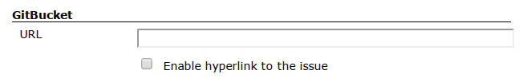
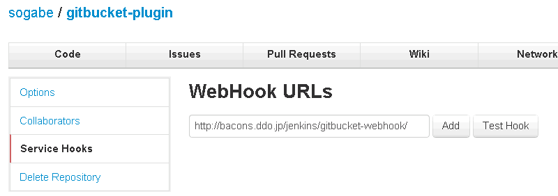
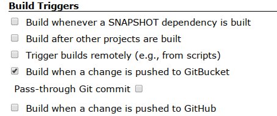
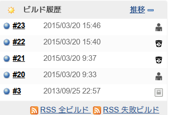

This plugin integrates [GitBucket](https://github.com/takezoe/gitbucket)
to your Jenkins.  
GitBucket is the easily installable Github clone written with Scala. It
provides a basic features below:

-   Public / Private Git repository (http access only)
-   Repository viewer (some advanced features such as online file
    editing are not implemented)
-   Repository search (Code and Issues)
-   Wiki
-   Issues
-   Fork / Pull request
-   Mail notification
-   Activity timeline
-   User management (for Administrators)
-   Group (like Organization in Github)
-   LDAP integration
-   Gravatar support
-   Executable war file

and more

See also [blog](http://takezoe.blogspot.jp/).

### Feature

-   The keywords in changelogs are hyperlinked to the corresponding
    Issue pages, Pull Requests pages and Wiki pages.
-   The changeset and diff in changelogs are hyperlinked to GitBucket
    repository viewer.
-   Trigger a build when a change is pushed to GitBucket using a
    WebHook.
    GitBucket does not fire webHook when merging via GUI, so this plugin
    does not tgigger a build.

### Setup

-   [GitBucket](https://github.com/takezoe/gitbucket) 1.6 or later.
-   Git Plugin 1.5.0 or later.

#### Hyperlinks to GitBucket issue, pull request and wiki pages.

##### Jenkins

{width="550"}

-   Supports the following notation.  
    \_123
    |              |                                                                                                                  |
    |--------------|------------------------------------------------------------------------------------------------------------------|
    | issue        | refs \#*123* , refs *123*, issue \#*123*, issue *123*, fix/es/ed \#*123*, close/s/d \#*456*, resolve/s/d \#*789* |
    | pull request | pull \#*1*, pull *1*                                                                                             |
    | wiki         | wiki *word*                                                                                                      |

#### Repository viewer

##### Jenkins

{width="650"}

#### Trigger a build

##### GitBucket

-   Configure GitBucket to use http://\\\[your.jenkins.host\\\]/jenkins/
    **gitbucket-webhook** **/** as a WebHook.

{width="650"}

##### Jenkins

-   Check "Build when a change is pushed to GitBucket" as a Build
    Triggers.

{width="450"}

-   and configure "Source Code Management"　to use git.

#### Build Trigger Badge Plugin support

### Changelog

#### Version 0.8 (Sep 10, 2015)

-   updated to Jenkins 1.609
-   added several issue notation. see [How to Close Reference issues &
    pull
    request](https://github.com/takezoe/gitbucket/wiki/How-to-Close-Reference-issues-%26-pull-request)
-   only push event is accepted.

#### Version 0.7 (Mar 31, 2015) GitBucket 3.1 is available.

-   use repository.clone\_url instead of repository.url ([pull request
    11](http://jenkins-ci.org/pull/11))
-   make Build Trigger Badge Plugn optional ([pull request
    12](http://jenkins-ci.org/pull/12))
-   refactoring.

#### Version 0.6 (Mar 21, 2015)

-   Build Trigger Badge Plugn support.

#### Version 0.5.1 (Apr 28, 2014)

-   Supported Git Plugin 2.2.1 or later.

#### Version 0.4 (Nov 30, 2013)

-   Support Crumbs exclusion.
-   Show who pushed this build.
-   Add "Pass through Git commit".
-   Honor QuietPeriod when scheduling a job.

#### Version 0.3 (Oct 22, 2013)

-   Updating to Jenkins 1.536 caused NPE.

#### Version 0.2 (Oct 3, 2013)

-   Fixed wrong GitBucket link
    ([JENKINS-19865](https://issues.jenkins-ci.org/browse/JENKINS-19865))

#### Version 0.1 (Sep 30, 2013)

-   First release.

Questions, Comments, Bugs and Feature Requests

To report a bug or request an enhancement to this plugin please [create
a ticket in
JIRA](http://issues.jenkins-ci.org/browse/JENKINS/component/18124).
