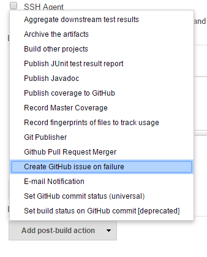
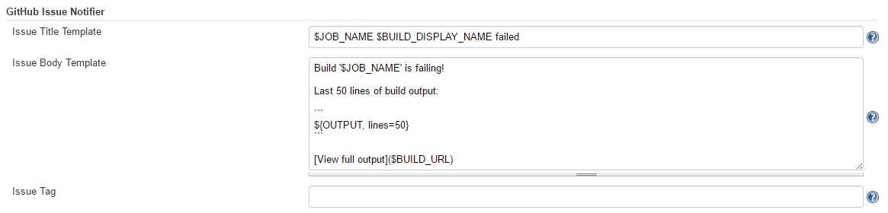

# GitHub Issues Plugin

This plugin allows you to create a GitHub issue whenever your build
fails. Once the build starts passing again, the issue will automatically
be
closed.

Report bugs here: <http://dl.vc/jenkins-github-issues-bug> (you will
need to first create a Jenkins account at
<https://accounts.jenkins.io/>)

## Getting Started

In Manage Jenkins → Configure System → GitHub → GitHub Servers, ensure
at least one GitHub server is configured and the "Test connection"
button works.  
  
Once this has been configured, add "Create GitHub issue on failure" as a
post-build action:  
  
When your build fails, a GitHub issue will be opened.

## Customization

The default template used for the issue title and body can be changed in
the GitHub Issue Notifier section in the Jenkins settings:  


This template can also be modified per job. The "Content Token
Reference" section at the bottom of the settings pane can be used to get
information about all the available tokens.

## Advanced Usage

### Usage with job-dsl

When using the great [job-dsl
plugin](https://github.com/jenkinsci/job-dsl-plugin/wiki), you can
configure a publisher step as follows:

``` syntaxhighlighter-pre
job(String name) {
  publishers {
    gitHubIssueNotifier {
    }
  }
}
```

All the advanced settings are available as optional configuration
properties. To see all the available properties, go to the Job DSL API
viewer at `JENKINS_URL/plugin/job-dsl/api-viewer/index.html` and search
for `gitHubIssueNotifier`.

### Automating global configuration

You can modify the global config using a system groovy script, i.e. add
a `init.groovy` to the `JENKINS_HOME` dir.

``` syntaxhighlighter-pre
import org.jenkinsci.plugins.githubissues.GitHubIssueNotifier
def descriptor = Jenkins.instance.getDescriptorByType(GitHubIssueNotifier.DescriptorImpl)
descriptor.issueTitle = 'ISSUE TITLE TEMPLATE`
descriptor.issueBody = 'ISSUE BODY TEMPLATE`
descriptor.issueLabel = 'LABELA LABELB`
descriptor.save()
```

In the templates you can use all available tokens using `${TOKEN`}
notation. To see all available tokens, click the help button on the
right of the \`Content Token Reference\` label in the GitHub Issues
section of the global configuration UI.

To configure the global GitHub config and the credential config, see the
[init.groovy](https://github.com/jenkinsci/github-issues-plugin/blob/master/src/dev/assets/work/init.groovy)
example in the repo.

### Usage in a Jenkinsfile

Configure a publisher step in a Jenkinsfile as follows:

``` syntaxhighlighter-pre
script {
    properties([[$class: 'GithubProjectProperty',
                projectUrlStr: '<GitHub repo URL>']])
}

...

step([$class: 'GitHubIssueNotifier',
      issueAppend: true,
      issueLabel: '',
      issueTitle: '$JOB_NAME $BUILD_DISPLAY_NAME failed'])
```

## Changelog

### 1.2.4 - 4th November 2017

-   Upgrade to GitHub API 1.90 to fix JENKINS-47601

### 1.2.3 - 22nd July 2017

-   Fixed [JENKINS-42629](https://issues.jenkins-ci.org/browse/JENKINS-42629):
    Plugin now works with Jenkins pipelines.Thanks to [Benjamin
    Gill](https://github.com/BenjaminGill-Metaswitch).

### 1.2.2 - 4th March 2017

-   Fixed
    [JENKINS-40385](https://issues.jenkins-ci.org/browse/JENKINS-40385):
    Now works with Maven builds
-   Fixed
    [JENKINS-42482](https://issues.jenkins-ci.org/browse/JENKINS-42482):
    Made all advanced config options optional in Job DSL

### 1.2.1 - 26th February 2017

-   Fixed
    [JENKINS-42329](https://issues.jenkins-ci.org/browse/JENKINS-42329):
    Support for multi-config projects was broken in v1.2
-   Renamed "Customize issue template" to "Advanced settings"

### 1.2 - 26th November 2016

-   Added [some optional new
    features](https://github.com/jenkinsci/github-issues-plugin/pull/3).
    Thanks to [Felix Simmendinger](https://github.com/fsimmend) and
    [Daniel Zabel](https://github.com/dzabel) for the pull request.
    -   Appending a comment on recurring failures (disabled by default)
    -   Reopening issue if build starts failing again (instead of
        creating a new issue)
    -   Allow custom GitHub repo to be used for issues

### 1.1 - 12th November 2016

-   Fixed
    [JENKINS-39662](https://issues.jenkins-ci.org/browse/JENKINS-39662):
    NullPointerException for multi-config projects
-   Fixed
    [JENKINS-39687](https://issues.jenkins-ci.org/browse/JENKINS-39687):
    Configuration section didn't appear correctly
-   Implemented
    [JENKINS-39663](https://issues.jenkins-ci.org/browse/JENKINS-39663) -
    Allow issue template to be customised per-job instead of just having
    one server-wide template
-   Added help for merge tokens
-   Include changes since last successful build in default body content

### 1.0 - 5th November 2016

-   Initial release
