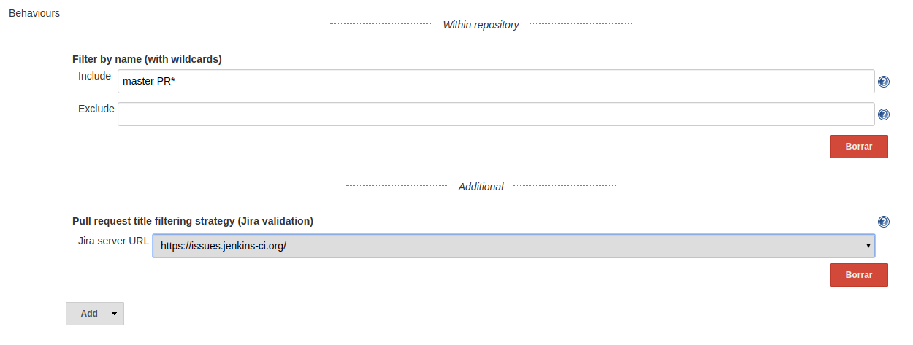
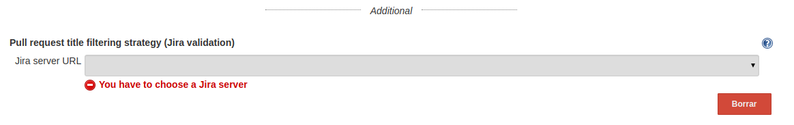

# Summary

## Description

This plugin extends the filtering abilities of the
github-branch-source-plugin one.

These filters will ignore pull requests if its title doesnt contain a
sinvle valid and open JIRA ticket.

## Usage

When defining a new Github Organization job, include an additional
behaviour (placed under the additional separator). 

This behaviour is configurable, being mandatory to select a previously
(globaly) configured JIRA Server:

{height="250"}

In case of not selecting a JIRA server, the form won't validate:

{height="250"}

In case of not selecting a JIRA server, the form won't validate:

