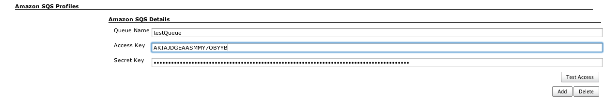
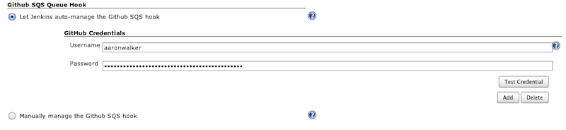
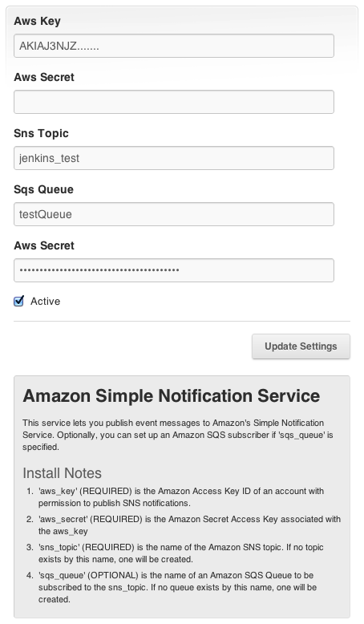

# Github Amazon SQS Plugin

This plugin integrates Jenkins with [Github](http://github.com/)
projects via [Amazon's Simple Queue Service](http://aws.amazon.com/sqs/)

The plugin currently:

-   Consumes a message from an SQS Queue and triggers any jobs that have
    a matching github repository configuration.
-   Atomically adds and removes the Github SQS Service hook
-   Trigger build job using GitHub Amazon SNS service hook that use a
    SQS topic subscription

## Trigger a build when a change is pushed to GitHub using Amazon SQS

To use this feature, first go to the global configuration and add a SQS
Profile

To verify that you have correctly configured the SQS profile you can
click "Test Access" this checks to see if the Queue exists in your SQS
account and tries to create it if it does not. You can always manually
create the queue via [Amazon AWS Management
Console](http://aws.amazon.com/console/)

Once that configuration is done, go to the project config and simply
check "Build when a message is published to an SQS Queue" under "Build
Triggers".

### How to configure the GitHub SQS hook

You can choose to have Jenkins automatically manage the Github SQS hook
automatically. You'll specify GitHub user names and passwords so that
Jenkins can login as you to do this, and yes, we need your password and
not API token because GitHub doesn't have an API for managing service
hooks.

If you want to manually manage the service hook or inspect the config
you navigate to the Admin -\> Service Hooks section and select the
SqsQueue hook and enter your AWS Access Key, the SQS Queue name and your
AWS Secret key. The Queue name will need to match the Queue name you
have configured in Jenkins

### How to configure the GitHub SNS hook

To use the GitHub SNS service hook to trigger builds you need to
manually configure it. You need to navigate to the Admin -\> Service
Hooks section and select the AmazonSNS hook and enter Aws Key, Aws
Secret, Sns Topic and Sqs Queue. The Sqs queue is used by the SNS
service to create a subscription for that queue. The queue name will
need to match the queue you have configured in your Jenkins SQS Profile
config.

## Change Log

##### Version 1.5 (Apr 19, 2013)

-   [JENKINS-16617](https://issues.jenkins-ci.org/browse/JENKINS-16617)
    - Github SQS plugin not starting jobs on Jenkins 1.500  
    Github SQS plugin not starting jobs on Jenkins 1.500
-   [JENKINS-16669](https://issues.jenkins-ci.org/browse/JENKINS-16669) -
    GitHub SQS Plugin works only once after project config

##### Version 1.4 (Feb 04, 2013)

-   [JENKINS-16128](https://issues.jenkins-ci.org/browse/JENKINS-16128) - Broken
    Jenkins Configuration page when Github SQS plugin is installed

##### Version 1.3 (Nov 23, 2012)

-   support for triggering builds using GitHub Amazon SNS service hook
    that have been bridged to SQS Queue.

##### Version 1.2.1 (Nov 22, 2012)

-   Correctly use the Github Credentials supplied in the SQS Profile
    config
-   Atomically adds and removes the Github SQS Service hook

##### Version 1.0 (Mar 13, 2012)

-   Support for consuming messages published to SQS queues with message
    body in the Github webook payload format and triggering the
    appropriate builds.
