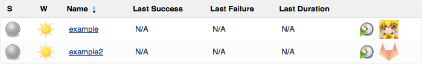
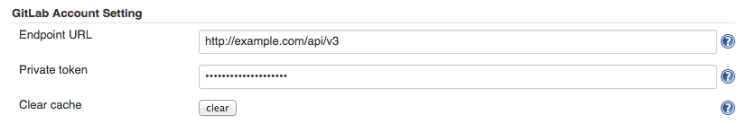
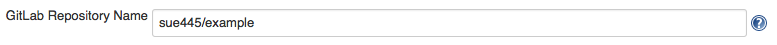

# Summary

Display GitLab Repository Icon on dashboard

#### Table of content

# Example

# Requirements

-   GitLab v7.9.0+ (recommended)
    -   If less than v7.9.0, show only default project icon

# Usage

### Global Configuration

### Job Configuration

# Changelog

<https://github.com/jenkinsci/gitlab-logo-plugin/blob/master/CHANGELOG.md>

### Version 1.0.4 (Sep 18, 2019)

-   **\[SECURITY-1575\]** Save privateToken to Secret field instead of
    String field.
    -   Plain privateToken is automatically encrypted and stored when
        Global Configuration saving

### Version 1.0.3 (Nov 10, 2016)

-   Do not enable gitlab logo column by default.

### Version 1.0.1 (Aug 6, 2015)

-   Old icon -\> new icon

### Version 1.0.0 (Apr 9, 2015)

-   First release
