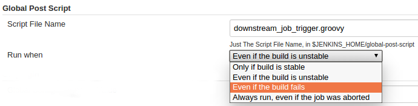

Execute a global configured groovy script after each build of each job
managed by the Jenkins.  
This is typical for cases when you need to do something based on a
shared set of parameters, such as triggering downstream jobs managed by
the same Jenkins or remote ones based on the parameters been passed to
the parameterized jobs.

**Notice: jython script support removed since 1.1.0**

# Global Configure

  
*Default*: the script will be executed when the build result is *better
or equal to `UNSTABLE`*

# Variables that could be used in the script file

## Jenkins Built-in Variables

| Variable               | Description                                           | Sample Data                                                           |
|------------------------|-------------------------------------------------------|-----------------------------------------------------------------------|
| BUILD\_ID              | Build timestamp as ID                                 | 2014-06-26\_07-16-51                                                  |
| BUILD\_NUMBER          | Build No\#                                            | 16                                                                    |
| BUILD\_RESULT          | Build result                                          | SUCCESS / UNSTABLE / FAILURE ...                                      |
| BUILD\_TAG             | Job Name + Build No\#                                 | jenkins-test-job-16                                                   |
| BUILD\_URL             | The URL of this build                                 | <http://localhost:8080/job/test-job/16/>                              |
| JENKINS\_HOME          | The path of the root folder of Jenkins                | \~/workspace-idea/global-post-script-plugin/./work                    |
| JENKINS\_URL           | The root URL of Jenkins                               | <http://localhost:8080/>                                              |
| JOB\_NAME              | Name of the job                                       | test-job                                                              |
| JOB\_URL               | URL of the job                                        | <http://localhost:8080/job/test-job/>                                 |
| MAVEN\_CMD\_LINE\_ARGS | Maven command args                                    | clean install                                                         |
| NODE\_LABELS           | Lables of the nodes where the build could be executed | master                                                                |
| NODE\_NAME             | Name of the node where the build executed             | master                                                                |
| SVN\_REVISION          | SVN revision                                          | 185214                                                                |
| SVN\_URL               | SVN URL                                               |                                                                       |
| WORKSPACE              | The path of the workspace                             | \~/workspace-idea/global-post-script-plugin/work/workspace/LOGANALYZE |
| GIT\_BRANCH            | Git branch                                            | origin/master                                                         |
| GIT\_COMMIT            | Git commit ID                                         | ddaf9c4576e375b42b6bc7c73daa12cb28a92031                              |
| GIT\_URL               | Git repo URL                                          | <https://github.com/jenkinsci/global-post-script-plugin.git>          |

## Extra variables

Parameters of `parameterized build` or parameters been passed in by
`-Dparameter_name=parameter_value` are also available

## the `manager` object

An extra object is available as groovy variables: `manager`, provided 4
methods:

| Method                               | Description                                                                         |
|--------------------------------------|-------------------------------------------------------------------------------------|
| `isVar(String name)`                 | Check if a variable is defined and usable in the script                             |
| `isNotBlankVar(String name)`         | Check if a variable is defined and usable in the script, and with a non-blank value |
| `addBadge(String icon, String text)` | Add a badge to the build                                                            |
| `addShortText(String text)`          | Add a text label to the build                                                       |
| `triggerJob(String jobName)`         | Trigger a job managed by the same Jenkins                                           |
| `triggerRemoteJob(String url)`       | Trigger a job by URL                                                                |

## 3rd-party libraries for groovy script

If your groovy script have dependencies that not shipped with Jenkins,
you can put them into `$JENKINS_HOME/global-post-script/lib`.

# Supported Scripts

## Groovy

**Groovy Sample**

``` syntaxhighlighter-pre
out.println("dropdeploy to: $dropdeploy_targets")
```

**Groovy Sample**

``` syntaxhighlighter-pre
out.println("dropdeploy to: " + dropdeploy_targets)
```

**Groovy Sample**

``` syntaxhighlighter-pre
if (manager.isVar("variable_name")) {
    ...
}
```

**Groovy Sample**

``` syntaxhighlighter-pre
job = hudson.model.Hudson.instance.getItem("demo2")
build = job.getLastBuild()
println build
def action = build.getAction(hudson.plugins.claim.ClaimBuildAction.class)
print action.getReason()
```

**Groovy Sample**

``` syntaxhighlighter-pre
def triggers = [
        wwwsqs8: {
            def params = [
                PARENT_BUILD_NUMBER: '$BUILD_NUMBER',
                PARENT_JOB_NAME: '$JOB_NAME',
                any_param_name: '$deploy_targets'
            ]
            manager.triggerJob("WWW_JBEHAVE_TEST", params)
            manager.triggerJob("WWW_MOBILE_API_TEST")
            manager.triggerRemoteJob("http://localhost/job/Dev_Launch_WWW_SQS_REGRESSION/build?token=88e4b5fd1d28949710a9c4924775ce40&delay=1800sec")
        },
        wwwsqm8: {
            manager.triggerRemoteJob("http://localhost/job/Dev_Launch_WWW_SQM_REGRESSION/build?token=88e4b5fd1d28949710a9c4924775ce40&delay=1800sec")
        },
        bsdsqs8: {
            manager.triggerJob("BSD_JBEHAVE_TEST")
            manager.triggerJob("BSD_MOBILE_API_TEST")
            manager.triggerRemoteJob("http://localhost/job/Dev_Launch_BSD_SQS_REGRESSION/build?token=88e4b5fd1d28949710a9c4924775ce40&delay=1800sec")
        },
        bsdsqm8: {
            manager.triggerRemoteJob("http://localhost/job/Dev_Launch_BSD_SQM_REGRESSION/build?token=88e4b5fd1d28949710a9c4924775ce40&delay=1800sec")
        },
        gmlsqs8: {
            manager.triggerJob("GMIL_JBEHAVE_TEST")
            manager.triggerRemoteJob("http://localhost/job/Dev_Launch_GMIL_SQS_REGRESSION/build?token=88e4b5fd1d28949710a9c4924775ce40&delay=1800sec")
        },
        gmlsqm8: {
            manager.triggerRemoteJob("http://localhost/job/Dev_Launch_GMIL_SQM_REGRESSION/build?token=88e4b5fd1d28949710a9c4924775ce40&delay=1800sec")
        },
        basepom: {
            manager.triggerJob("basepom")
        }
]

if (manager.isVar("deploy") && manager.isNotBlankVar("deploy_targets") && "true" == deploy) {
    dropped = false
    deploy_targets.split(',').each {
        trigger = triggers[it]
        if (trigger) {
            trigger()
            dropped = true
        }
    }
    if (dropped) {
        manager.addBadge("server.png", "[SQ: " + deploy_targets + "]")
    }
}
```

## bat/sh

**NO** variables will passed into the script

# Open Issues

type

key

summary

assignee

reporter

priority

status

resolution

created

updated

due

Data cannot be retrieved due to an unexpected error.

[View these issues in
Jira](https://issues.jenkins-ci.org/secure/IssueNavigator.jspa?reset=true&jqlQuery=project%20=%20JENKINS%20AND%20status%20in%20%28Open,%20%22In%20Progress%22,%20Reopened%29%20AND%20%28component%20=%20global-post-script-plugin%29&tempMax=1000&src=confmacro)

# Changes

## 1.1.4

-   Added support for
    \`pipeline\`[JENKINS-44647](https://issues.jenkins-ci.org/browse/JENKINS-44647)

## 1.1.3

-   Fixed
    [JENKINS-37796](https://issues.jenkins-ci.org/browse/JENKINS-37796)
    Loading jars in `global-post-script/lib` (if exist) as classpath
    entries when running groovy script.

## 1.1.2

-   Not the cache the parsed GroovyShell

## 1.1.1.1

-   \***Do NOT use this version**\*
-   Fixed
    [JENKINS-34056](https://issues.jenkins-ci.org/browse/JENKINS-34056)

## 1.1.1

-   \***Do NOT use this version**\*
-   Parsing and caching the groovy script, to make a smaller footprint.
    [JENKINS-33358](https://issues.jenkins-ci.org/browse/JENKINS-33358)

## 1.1.0

-   Added \`aborted\` condition, to allow triggering the script even the
    build is aborted.
-   Removed support for jython scripts. (jython dependency is too big,
    and Groovy is much better supported by Jenkins.)

## 1.0.12

-   Fixed issue about script been executed for each sub-module of Maven
    multi-module projects.

## 1.0.11

-   Fixed issue about groovy script works in *`script console`* but
    fails as *`global post script`*

## 1.0.10

-   Allow to run also for failed builds (Global configure).
-   Added BUILD\_RESULT to script.

## 1.0.9

-   Supports parameters when triggering local jobs (parameterized
    downstream jobs)
