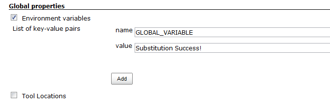
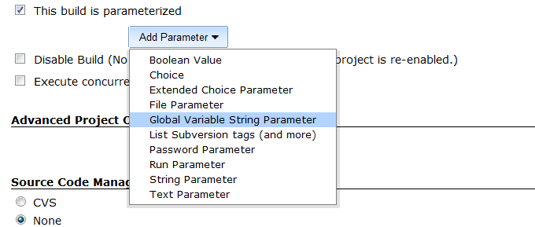
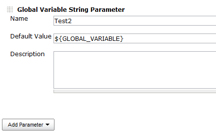
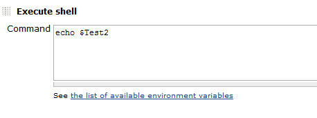
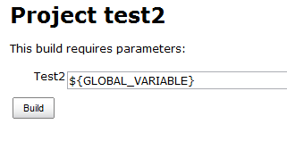
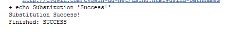
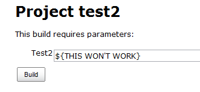
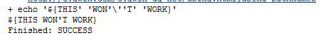

### Global Variable String Parameter Plugin

Provides a parameter with support for global node properties via
$VARIABLE or ${VARIABLE}

### Utilization

After installing, in your job choose Add Parameter and select Global
Variable String Parameter. Use $VARIABLE or ${VARIABLE} in either the
default value or on the build now page to substitute global node
parameters.

### Version History

Version 1.2 (Sept 17 2013)

-   Fix race condition where concurrent builds could cause variables not
    to substitute

Version 1.1 (Nov 02 2012)

-   Initial Release

### Example

1.  Create a global variable  
    
2.  Create a global variable string parameter in a job  
    
3.  Reference the global variable in the default value  
    
4.  Add a simple echo statement to demonstrate the substitution  
    
5.  The variable remains unsubstituted on the Build Now page  
    
6.  But is correctly substituted in the console output  
    
7.  The variable can also be changed from the build now screen to be
    incorrect  
    
8.  And no longer substitutes  
    
