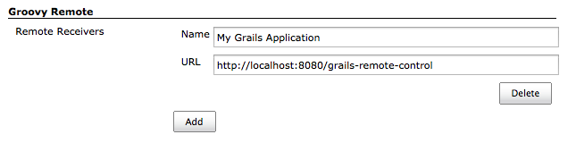
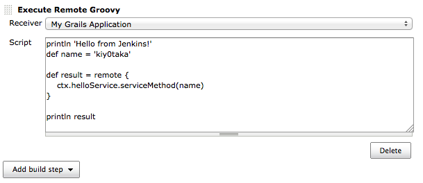

This plugin provides [Groovy Remote
Control](http://groovy.codehaus.org/modules/remote/)'s receiver, and
allows to control external application from Jenkins.

# Control Jenkins from Groovy

``` syntaxhighlighter-pre
import groovyx.remote.client.RemoteControl
import groovyx.remote.transport.http.HttpTransport

def transport = new HttpTransport("http://your-jenkins/plugin/groovy-remote/")
def remote = new RemoteControl(transport)

// This code runs on local.
def name = 'kiy0taka'
println name

def result = remote {
    // This clousre runs on Jenkins server.
    def version = jenkins.version.value
    println "Hi, ${name}!"

    // Return Jenkins version.
    return version
}

// This code runs on local.
println "Jenkins version was ${result}."
```

# Control your Grails application from Jenkins

1.  Install [Grails Remote Control
    plugin](http://grails.org/plugin/remote-control) into your Grails
    application.
2.  Register Remote Receiver to Jenkins.  
    
3.  Create Control Job, and add build step.  
    

# Release History

### Version 0.2 (Sep 12, 2012)

-   Support proxy.
-   Added HTTP header settings.
-   Fixed NoClassDefFoundError in RemoteBuilder.

### Version 0.1 (Aug 9, 2012)

-   Initial release
