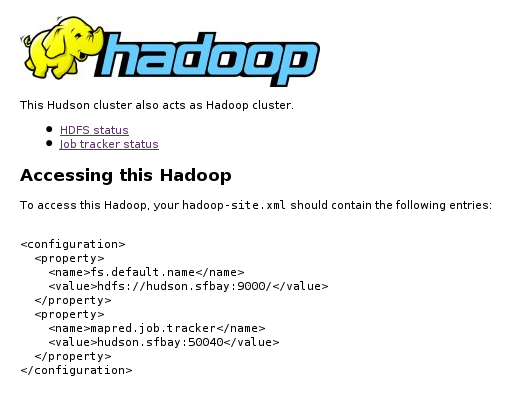

This plugin makes Jenkins cluster act as a Hadoop cluster without any
configuration.

When you install this plugin, Jenkins will start a Hadoop "master"
(namenode and job tracker, in their jargons) on the Jenkins master. On
each slave that Jenkins starts, this plugin also starts a Hadoop "slave"
(datanode and task tracker, in their jargons.) Hudson then instructs
Hadoop to form a cluster among those nodes. All the jar files needed to
run Hadoop is packaged inside this plugin, and will be automatically
deployed to eveyrwhere they are needed.

In this way, this plugin takes your machines in your Jenkins cluster and
runs a Hadoop cluster very easily.

# Jenkins UI addition

Once installed, you'll see the "Hadoop" link in the Jenkins top page.  
  
This link will take you to the information page that shows links to
Hadoop web UI, as well as the configuration users need on their
`hadoop-site.xml`.  

Slave log page (`http://yourserver/hudson/computer/SLAVENAME/log`) will
also include text showing how the hadoop slave JVM is launched. Any
error encountered will be recorded there, too.

# Configuring Hadoop

Once you run this, you'll get $HUDSON\_HOME/hadoop/dist directory that
contains the stripped down version of Hadoop. You can change
conf/hadoop-site.xml in this directory to apply different parameters.

# Notes

-   Hadoop requires that everyone in the cluster can reach everyone else
    in the cluster by a TCP connection.
-   This plugin requires slave.jar from Hudson 1.292 or later, or else
    you'll get "undefined option -cp" error on slaves.
-   Scheduling of the work in Jenkins and that in Hadoop are
    independently done, without consideration to each other.

# Changelog

### Version 1.3 (2009 Sep 2)

-   NameNode now listens on all interfaces.
-   Fixed a cygwin compatibility problem
    ([report](http://issues.apache.org/jira/browse/HADOOP-6209))

### Version 1.2 (2009 Jul 20)

-   Fixed a bug with recent versions of Hudson (1.316, for example)
    where a failure to bring name node causes a failure to start Hudson
-   Improved the plugin so that it automatically figures out the network
    topology.

### Version 1.1 (2009 May 15)

-   Hadoop wasn't seeing hadoop-site.xml and hadoop-default.xml.

### Version 1.0

-   Initial release
