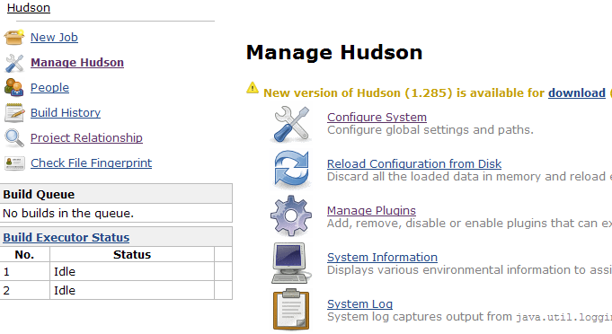
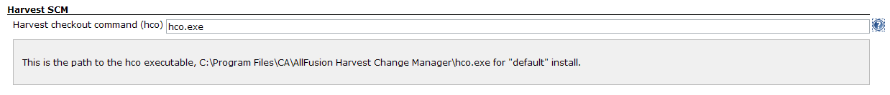
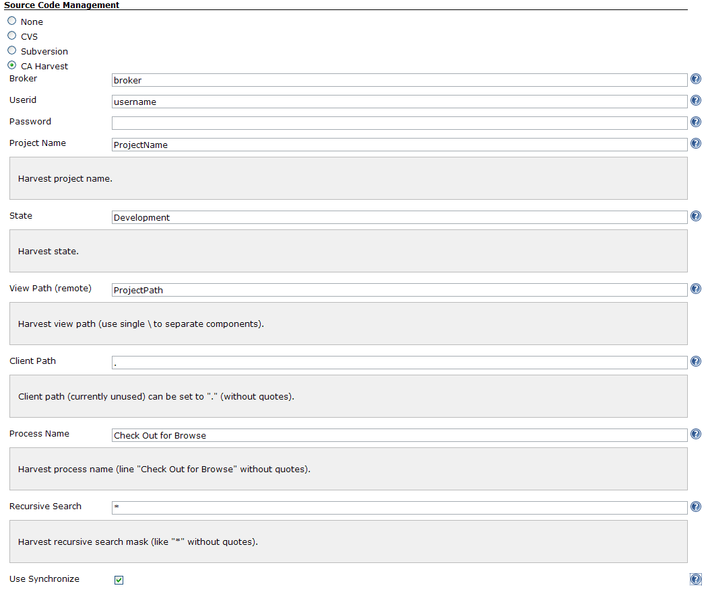

| Plugin Information                                                                              |
|-------------------------------------------------------------------------------------------------|
| View Harvest SCM [on the plugin site](https://plugins.jenkins.io/harvest) for more information. |

The current version of this plugin may not be safe to use. Please review
the following warnings before use:

-   [Passwords stored in plain
    text](https://jenkins.io/security/advisory/2020-02-12/#SECURITY-1553)

**This plugin is up for adoption.** Want to help improve this plugin?
[Click here to learn
more](http://localhost:8085/display/JENKINS/Adopt+a+Plugin "Adopt a Plugin")!

This plugin allows you to use [CA
Harvest](http://www.ca.com/us/products/product.aspx?id=255) as a SCM.

# Configuring the Harvest Plugin

First things first - install the plugin, either through the Jenkins
plugin administration, or manually.

## Configuring the Harvest Settings

Select *Manage Jenkins* from the main menu, then select *Configure
System* from the options presented:

  
  
  
 If the plugin was installed properly, you should find a section on this
page for Harvest which looks like this:  
  
 

## Configuring a Build to Use Harvest

Once the server settings are configured, new builds can choose it for
pulling down code. Create a new build, give it a job name, and select
the type of build (free-style, maven2, etc) and click *OK*. On the
subsequent screen, you'll see a section called *Source Code Management*
where you can select Harvest. Select Harvest, and the following options
will appear:  

# Change Log

#### Version 0.3 (Mar 3, 2010)

-   Update code for more recent Hudson

#### Version 0.2.7 (Sep 5, 2009)
