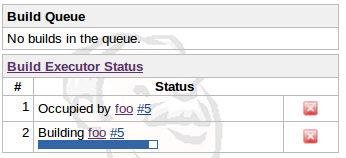

This plugin allows you to define "weight" on each job, and making each
job consume that many executors (instead of just one.) Useful for a job
that's parallelized by itself, so that Hudson can schedule jobs
accordingly.

# Usage

This plugin adds the following configuration UI fragment into your job
configuration page. Specify the total number of executors that this job
should occupy:  

When you run this job, it'll occupy the specified number of executors,
as can be seen below:  

The occupied executors cannot build anything else while this build is in
progress, thereby preserving the necessary computational resources for
the job. It also means that the job with weight=2 cannot be run on a
node with just one executor, or if a node has two executors but one of
them is building something.

# Changelog

### Version 1.1 (Oct 16, 2013)

-   Updated to 1.424 baseline.
-   Fixed plugin metadata.

### Version 1.0 (Sep 26, 2010)

-   Initial release
