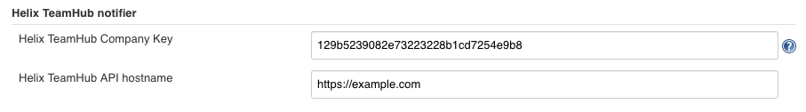
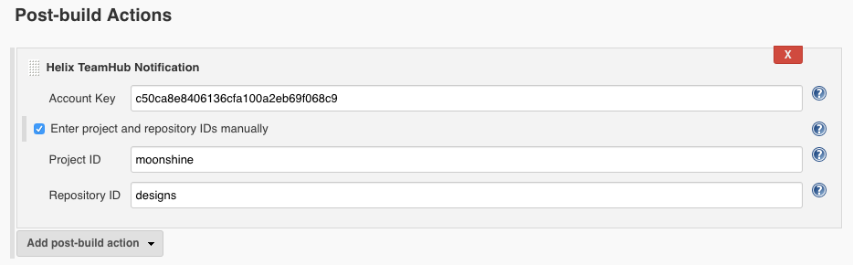

  
This plugin integrates Jenkins with [Helix
TeamHub](https://helixteamhub.com/).

The plugin creates events to Helix TeamHub from Jenkins builds. The
events can then be seen in the activity feeds of Helix TeamHub projects.
The plugin supports Helix Git, Git, Subversion, and Mercurial.

##### Successful build event

##### Failed build event

## Configuring the plugin

To allow Jenkins to send notifications to Helix TeamHub, you'll need to
configure two Helix TeamHub API key for your Jenkins instance, namely
Plugin Key. To do this, open up Jenkins System Configuration (Manage
Jenkins -\> Configure System). There you'll find the Helix TeamHub
notifier section and under it inputs for the two keys. You'll find your
Company Key from your Helix TeamHub User Preferences (Userdropdownmenu
-\> Preferences) under API keys. Lastly, fill in the hostname of
your Helix TeamHub instance.

{height="126"}

After you’re done with the global plugin configuration, you’ll need to
specify which Helix TeamHub bot account each job should utilize. To do
this, open up Job Configuration (Job -\> Configure) and add a new Helix
TeamHub Notification Post-build Action. There you’ll need to give the
Account Key of the Helix TeamHub bot account you want the job to
utilize. To create a bot, navigate to your Helix TeamHub project and
click on Settings and bot accounts. Now click on New bot to create a new
bot. Once you’ve created the bot, its details will be shown to you and
you’ll find the bot’s Account Key under API keys.

In case you use Helix Git repositories with manual depot creation and
custom graph depot path check the 'Enter project and repository IDs
manually' field and fill in the fields.

  

{height="250"}

  

## Changelog

##### Version 1.1.5 (released 29 May, 2019)

-   Add support for HelixGit repositories.
-   Minimal Jenkins version required is 2.60.3.

##### Version 1.1.4 (released 10 Nov, 2017)

-   Fix description typos.

##### Version 1.1.3 (released 25 Oct, 2017)

-   Rebrand to Helix TeamHub.

##### Version 1.1.2 (released 18 Dec, 2015)

-   Added support for repositories with slashes in their names.

##### Version 1.1.1 (released 29 Oct, 2015)

-   Fixed SSH repository URL support.
-   Fixed a bug that would cause Deveo authorization to fail due to
    missing account key.
-   Deveo API hostname now defaults
    to [https://app.deveo.com](https://app.deveo.com/).

##### Version 1.1.0 (released 28 Oct, 2015)

-   The plugin is now built against Jenkins version 1.627.
-   Added support for builds with Mercurial as their primary SCM.
-   Build events now map to matching Deveo code reviews (Git only).
-   API version can no longer be configured in Jenkins' global settings.
-   You no longer need to configure Deveo project and repository on a
    job-basis.

##### Version 1.0.2 (released 14 Mar, 2014)

-   Added more detailed help texts for configuration fields.

##### Version 1.0.1 (released 27 Feb, 2014)

-   Added job name to Deveo build event payload.
-   Fixed loading global config on Jenkins startup.

##### Version 1.0.0 (released 14 Feb, 2014)

-   Initial release.
