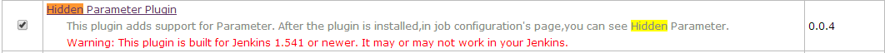

# Hidden Parameter Plugin

This plugin adds support for Parameter. After the plugin is installed,in
job configuration's page,you can see Hidden Parameter.

### Characteristics 

1\. Parameters once more, it looks bad user experience.this plugin can
resolve the problem.  
2. Some key parameters, once modified, can lead to the risk.these
parameters,only administrator can modify,to reduce the risk.  
3. Hidden parameter,only hide in the build execution, in job
configuration's page can modify.  
4. After the build, parameter list can display hidden parameters.

### Install  

### Use Case

After the plugin is installed,in job configuration's page,you can see
Hidden Parameter:  
  
for example,you add a hidden parameter,is called hidden\_para.  
  
click 'Build With Parameters' link ,the parameter hidden\_para of the
set before, is hide,don't display in this page.   
  
After the build , click 'Parameters' link, parameter list can display
hidden parameters hidden\_para.  

### Contribute

Fork me on Github
at <https://github.com/jenkinsci/hidden-parameter-plugin>.
