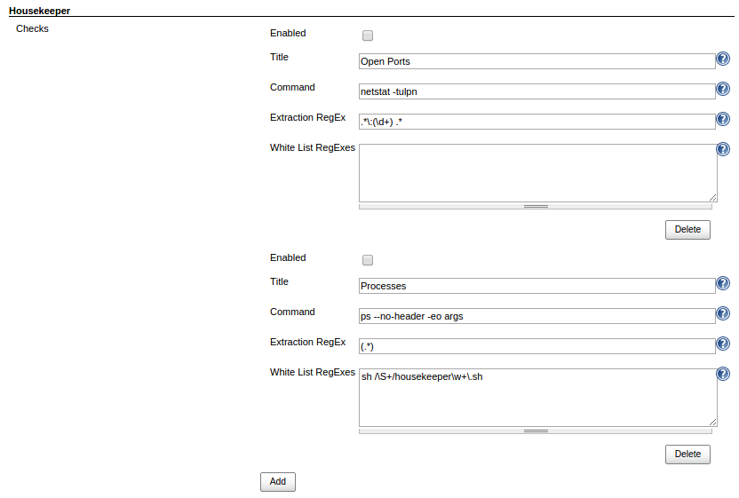
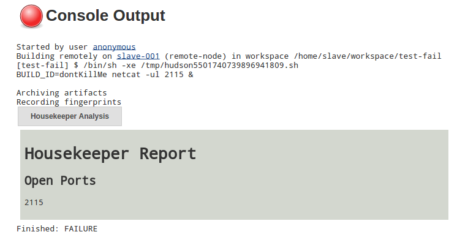

This plugin performs checks before and after every build to ensure that
resources (e.g. open ports) are not leaked.

[For more information about this plugin, see the project's readme on
GitHub.](https://github.com/jenkinsci/housekeeper-plugin/blob/master/README.md)

## Configuration

## Example Output

