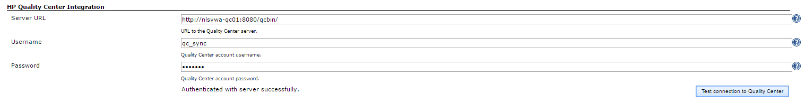
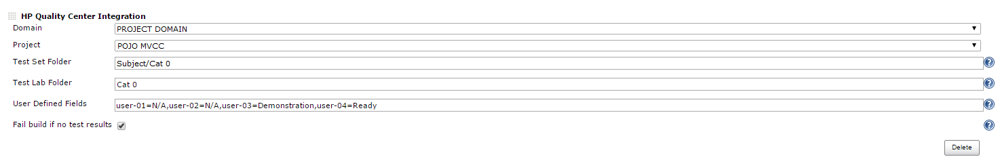
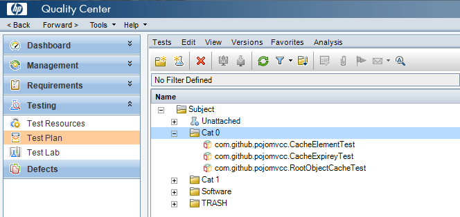
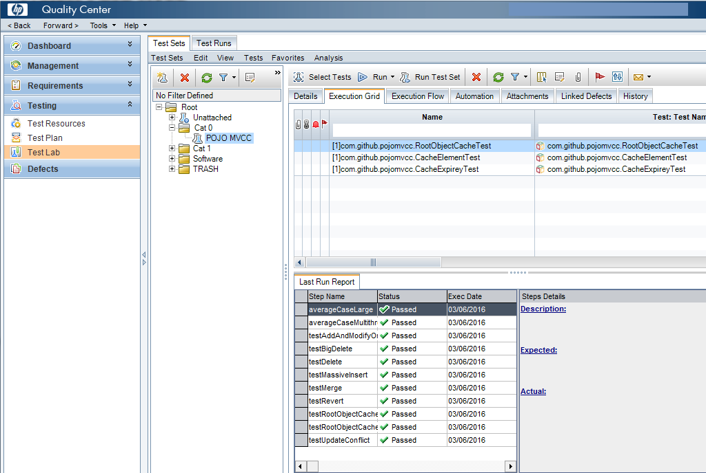

| Plugin Information                                                                                                  |
|---------------------------------------------------------------------------------------------------------------------|
| View HP ALM Quality Center [on the plugin site](https://plugins.jenkins.io/hp-quality-center) for more information. |

The current version of this plugin may not be safe to use. Please review
the following warnings before use:

-   [Password stored in plain
    text](https://jenkins.io/security/advisory/2020-07-02/#SECURITY-1576)

Allows users to synchronize test results from Jenkins with HP ALM
Quality Center.

# Configuration 

## Quality Center Connection

## Job Configuration

### User Interface Method

### Pipeline Syntax Method

As of **V1.4** this plugin support Jenkins pipeline syntax for job
configuration using the 'qc' symbol. For example:

 

> qc domain: 'DOMAIN', project: 'PROJECT', planFolder:
> 'Subject/Software/Cat 0/Unit Tests', labFolder: 'Software/Cat 0',
> userDefinedFields: 'user-01=Demonstration', failOnNoTestResults: false

  

Note that *userDefinedFields *and *failOnNoTestResults* are optional
parameters that do not need to be specified unless required.

Synchronized Unit Tests

## Test Plan

## Test Lab

