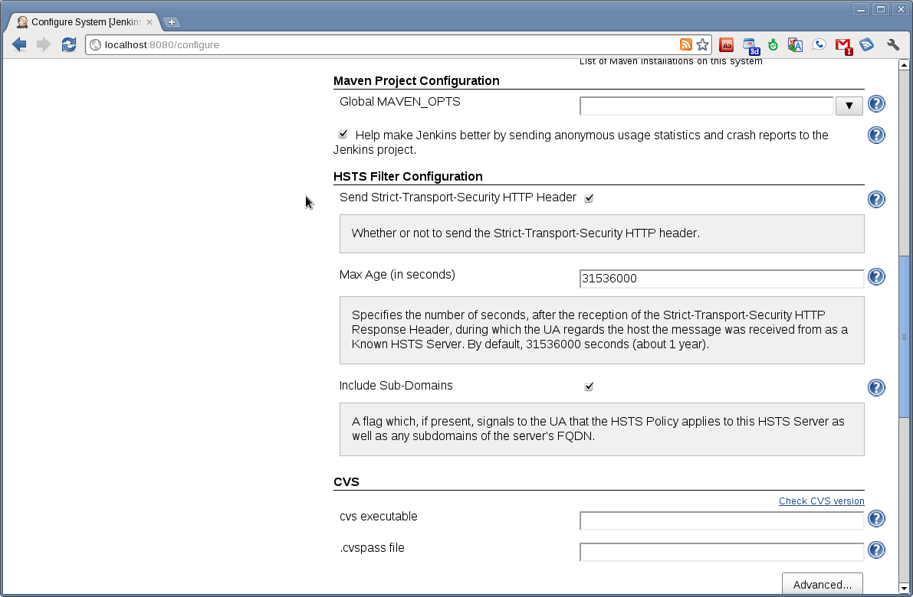
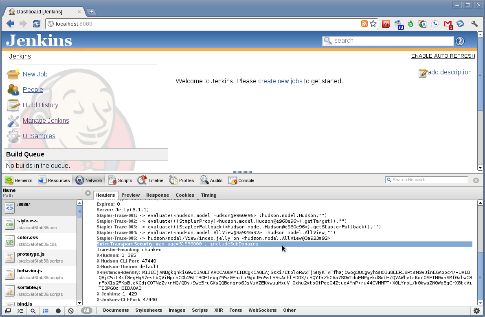

Provides a very simple filter which adds a response header indicating
that [HTTP Strict Transport
Security](http://tools.ietf.org/html/draft-hodges-strict-transport-sec-02)
(HSTS) response headers should be sent.

When recent browsers (including Chrome 4+ and Firefox 4+) see this
information, this causes them to send all subsequent requests to your
Jenkins installation securely via "https://", even if you enter the URL
starting with "http://".  
This ensures that browsers will not send any requests (including your
cookie data) unencrypted for the duration specified in the
configuration, making it less likely that your build data and login data
can be captured while passing through insecure networks.

  

| Configuration                                                                                                           | HSTS Header                                                                                                             |
|-------------------------------------------------------------------------------------------------------------------------|-------------------------------------------------------------------------------------------------------------------------|
|  |  |

  

------------------------------------------------------------------------

  

### Changelog

#### 1.0 (released 2011-09-26)

-   initial implementation
-   fully I18N
