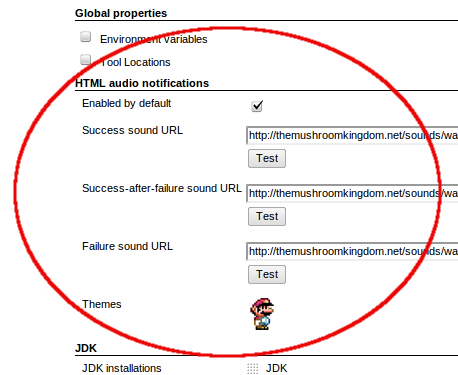
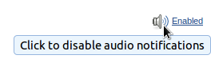

### 

Plays audio-notifications directly in the browser when builds fail

### Prerequisites

-   A browser that supports the \<audio\>-tag, works fine in newer
    versions of both Firefox & Chrome.

### Configuration

The global configuration page contains a section with the global config,
which sounds to play etc.  

There's an additional way to turn the notifications on/off per browser.
This can be toggled by clicking the icon at the bottom-right of the
screen.  

### Troubleshooting

-   .wav & .ogg files are your best bet
-   Make sure that the URLs are accessible, i.e. they give "200 OK" or
    similar responses
-   If all else fails, firebug is your friend

### Changelog

#### Version 0.4 (2011-11-25)

-   Added support for long-polling through the global configuration
    section. In this mode client requests are blocked until new
    notifications arrive, or until a timeout occurs. The end result is
    immediate audio feedback, without excessive polling.

#### Version 0.3 (2011-10-15)

-   added support for a new notification-type, success-after-failure
-   improved the enable/disable control (bottom-right of each page)
-   added a super mario theme
-   refactoring / cleanup, added more tests & an automated
    release-system for the plugin

#### Version 0.2 (2011-10-02)

-   support for playing sounds for successful builds, defaults to
    pop.wav
-   changed core-dependency to 1.425
-   added wiki-location to pom
-   two new sounds embedded, pop.wav & explosion.wav

#### Version 0.1 (2011-09-26)

-   Initial release
