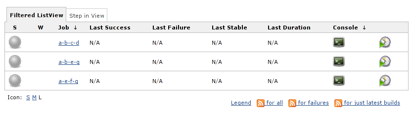
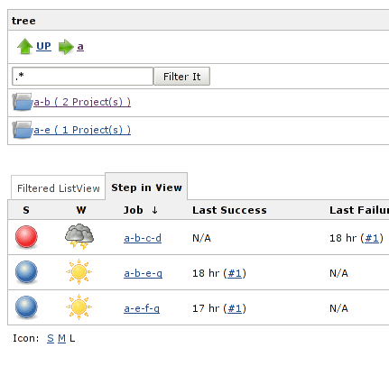

This plugin gives every user, also non administrative one the
possibility to create his own view and to use a pseudo tree-view where
every user can administer it's own delimiter which is used as path
delimiter

# Hudson Personal View Plugin

## intention

to provide a possibility for every user to have it's own filter of
hudson-jobs  
(we have in our hudson nearly 1000 jobs and the list is very long)

## download

<http://download.jenkins-ci.org/plugins/hudson-pview-plugin/>

## usage samples

### configuration

### usage as filtered view

### usage as Step in Tree

  

## changelog

### V 1.8 (Jan 3, 2011)

-   Translation updates
-   Fix one little typo

### V 1.7 (Jan 12, 2010)

1.  **FIXED**
    1.  filter works now also at the root of the "step in view"

### V 1.6

1.  **FIXED**
    1.  RSS feed are now working on all views
2.  **Extended**
    1.  Step In view is now on the fly filterable by everyone
    2.  Filtered view is now on the fly filterable by everyone
    3.  default value for path delimiter is global configurable
    4.  default regexp for filtered view is global configurable

### V 1.5

1.  **FIXED**  
    default value of shown projects in the step in view is now set from
    0 to 30

### V 1.4

1.  **FIXED**  
    if I run hudson at / instead of /hudson it works.\\  
    I think it might be line 116 of PViewLinkAction which checks for\\  
    req.getOriginalRequestURI().startsWith(URL\_PVIEW\_SI\_VIEW)...\\  
    If hudson is run with any prefix then this check probably fails.
2.  **Extended**  
    a new option per server up to how many jobs the jobs in the
    stepin-view will be shown

### V 1.2

fixes empty user configuration

### V 1.1

extension of the personal view

1.  every user has possibility to decide which columns will be shown

additional tree view

1.  every user has the possibility to decide where the tree should be
    located
2.  every user can administer it's own delimiter which is used as path
    delimiter

### V 1.0

initial release
