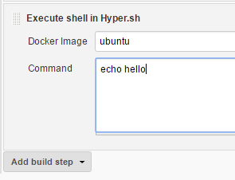

Run some tasks of Jenkins job in
[Hyper.sh](https://hyper.sh/) container. This plugin allows to add
"Execute shell in Hyper.sh" build step into your job.

  

## Read more on <https://github.com/jenkinsci/hyper-build-step-plugin>
