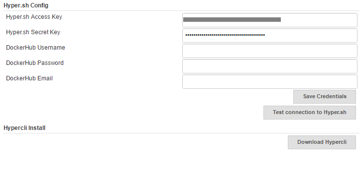

The current version of this plugin may not be safe to use. Please review
the following warnings before use:

-   [Hyper.sh Commons Plugin stores credentials in plain
    text](https://jenkins.io/security/advisory/2019-04-03/#SECURITY-964)

This plugin provides common functions for other hyper plugins.

# 1. Features

Plugin currently support following features:

-   Install hyper cli
-   Set Hyper.sh Credentials
-   Test connection to your account.

# 2. Config plugin

login [https://console.hyper.sh](https://console.hyper.sh/) to get a
Hyper.sh Credentials.

Manage Jenkins -\> Configure System -\> Hyper.sh Config

# 3. Install hypercli

Manage Jenkins -\> Configure System -\>Hypercli Install: Download
Hypercli
