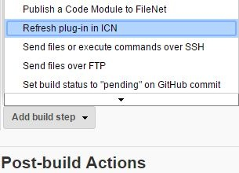
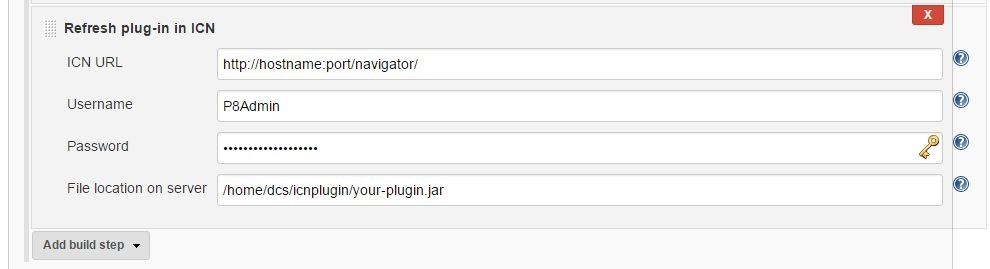
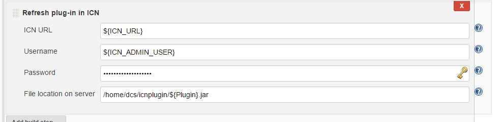

Allows users to remotely reload IBM Content Navigator Plug-ins from
Jenkins.

## Features

-   Reload existing plug-ins in IBM Content Navigator

## Requirements

### Jenkins

Jenkins version 1.638 or newer is required.

### ICN

The plug-in is using an application managed authentication at this time
to authenticate so that's the only authentication supported.

### Please note

-   This reloads/updates only existing plug-ins, they must be added
    manually once before being able to use this plug-in.
-   This does not update the plug-in's configuration, which will stay
    untouched after the reload.
-   This does not copy the plug-in's jar to the ICN server, there are
    plenty other Jenkins plug-ins for that.

## Setup

### One-time

#### Install plugin

Install this plugin via the Jenkins plugin manager.  
There is no global configuration in this plug-in, credentials are
per-job configuration (see next section).

### Per-job configuration

#### Freestyle job configuration

Once the plug-in installed, you will see a new build step, add it to
your job.

Then configure the build step:

##### ICN URL

The Content Navigator root URL. You can use the secured version (https)
but if you're using a self signed certificate, make sure you've added it
to the keystore of the JRE running Jenkins or you will get an exception.

##### Username

The username of an ICN administrator.

##### Password

The password of the ICN administrator you used above

##### File location on server

The path to use to reload the plug-in. The path is from the ICN server
point-of-view, not Jenkins since this plug-in is triggering a remote
reload in ICN. If your job is building the plug-in's jar, as it is
usually what is done, you should first copy the jar to where ICN is
expecting it to be, using any Jenkins plug-in you want, for instance the
Publish over SSH plug-in.

If you're refreshing the plug-in in a clustered environment and the
plug-in is not in a shared location, make sure you copy it to all
instances before reloading it.

##### Using variables

All parameters above can use job variables, or be a simple variable. A
few examples of what this will allow you to do:

-   Ask for the password as a job parameter to make sure only an
    authorized user is triggering a build/reload.
-   Let the user choose which plug-in he wants to reload as a job choice
    list parameter if you have several plug-ins.
-   Let the user choose to which platform he wants to deploy with a job
    choice list parameter
-   ...

Here is an example of a configuration making use of job variables.

You can't see it here but the password is also using a variable
(ICN\_ADMIN\_PWD).

## What is reloaded and when

When you reload a plug-in in ICN, all the Java classes are immediately
reloaded on the server side. That means all services will be immediately
using your new code. The JavaScript files (Dojo classes) will also
immediately be served by the ICN server. However, users already
connected will still be using their own cached version of the JavaScript
files, which can lead to some confusing behavior. Likewise, the default
cache-control expiration time for JavaScript resources in ICN is 24
hours, so users with cached versions of the files can also experience
confusing behavior during the next 24 hours following the reload.
Emptying the browser cache might be required depending on what changes
you've made.

## Expected output

Here is an output of the plug-in when reload was successful:

    Connecting to ICN as P8Admin...
    OK
    Reloading plugin /home/dcs/icnplugin/my-plugin.jar...
    OK
    Plug-in MyPlugin(id: MyPlugin) successfully reloaded.
    Saving configuration...
    JSON conversion OK
    Returned message is:
    The configuration was updated.
    Finished: SUCCESS

## Version history

### Version 1.0 (February 11, 2017)

-   Initial release
