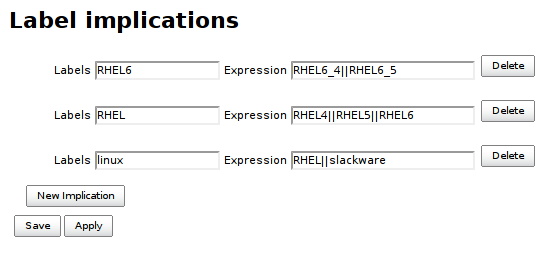

Older versions of this plugin may not be safe to use. Please review the
following warnings before using an older version:

-   [Missing permission check allows reconfiguring the
    plugin](https://www.jenkins.io/security/advisory/2020-09-23/#SECURITY-2004)

# Implied Labels Plugin

Infer dynamic node labels using configured implications.

Lets have a node with `linux`, `rhel`, `rhel6` and `rhel6_4` labels.
Most of this information is redundant and can be inferred from `rhel6_4`
label. Here is an excerpt of Implied Labels Plugin configuration to do
just that.

This plugin gathers the implication rules to one place (*Manage Jenkins
\> Label implications*) so explicit node labels can be defined in more
concise form (without redundancy). Implications are readable for every
user with `Jenkins.READ` but only `Jenkins.ADMINISTER` is authorized to
configure. Plugin also detects explicitly configured node labels that
can be inferred using existing implication rules.

## Details

Jenkins administrator can declare any number of implication rules for
label inference. An implication consists of *label expression* and *atom
list*. A node that matches *label expression* will have assigned new
labels from *atom list*. Labels contributed from Implied Labels Plugin
are dynamic labels and thus not saved in configuration. Implications are
evaluated in topological order so implication expressions can refer to
labels contributed by other implications.
