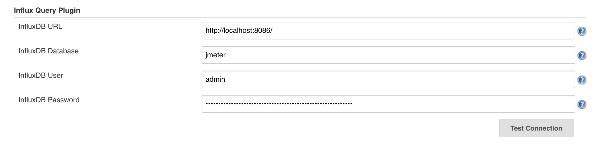
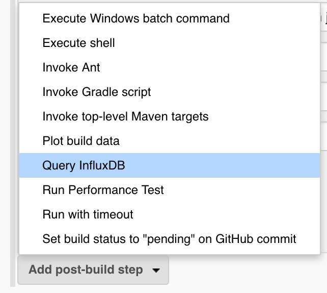
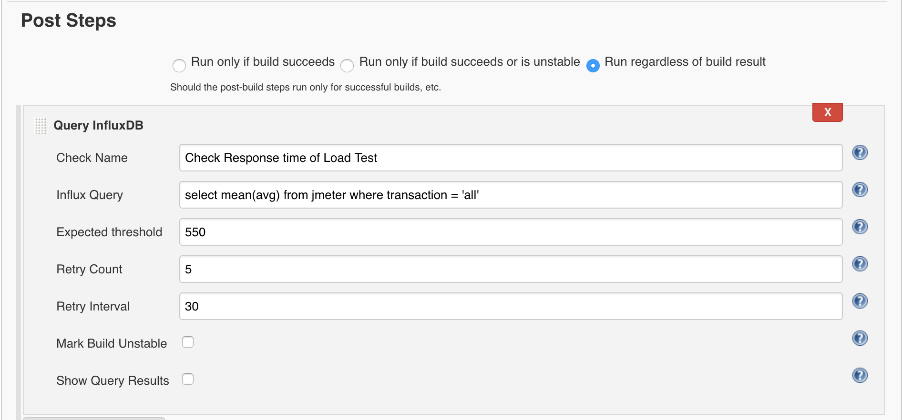

# Description

The plugin provides a mechanism for querying InfluxDB as a post build
step for use as a deployment gateway.  
Using a time series database to for aggregating testing and development
tool data makes sense if you can query it after all the testing is
complete to determine if a build is stable.  

## [Installation](https://github.com/jenkinsci/influxdb-query-plugin#installation)

### Prequisites

-   Jenkins running on Java 1.7 or later

## [Global Configuration](https://github.com/jenkinsci/influxdb-query-plugin#global-configuration)

Select Manage Jenkins -\> *Configure System*, scroll to InfluxDB Query
Plugin

{height="250"}

### Configuration parameter:

-   **InfluxDB URL**: The complete url including port of the Influxdb
    e.g. [http://localhost:8086](http://localhost:8086/) or [http://host.domain.com:8086](http://host.domain.com:8086/)
-   **InfluxDB Database: **Database name where relevant events are
    stored e.g. *devops*
-   **InfluxDB User:** InfluxDB username with access to the relevant
    events.
-   **InfluxDB Password:** Password for InfluxDB user.

Test connection would show you a count of available metrics.

If the count shows 0 measurements, credentials are correct but database
may be wrong.

If credentials are incorrect you will receive an authentication error.

## [Job Post Step Configuration](https://github.com/jenkinsci/influxdb-query-plugin#job-post-build-configuration)

On Job, select Add Post-build step, select Query InfluxDB:

{height="250"}

Then configure:

{height="250"}  

### Configuration parameters

-   **Check Name:** Name for the check to be run, it is display in
    console for better understanding of performed check.
-   **Influx Query:** InfluxDB select query supposed to return 1 value.
    It can be a sum, count or function returning only one value. May use
    Jenkins tokens such as build number in the query. e.g. :

        select count(errors) from DevOps where application = 'ArchRival2.1' deployment = '2-1-$BUILD_NUMBER'. 

    It may also be a query against any metric in InfluxDB that is filled
    by a step of the build, for example if you run a Load Test with
    [Apache JMeter](https://jmeter.apache.org/) with an [Backend
    Listener](http://jmeter.apache.org/usermanual/component_reference.html#Backend_Listener)
    with
    [InfluxdbBackendListenerClient](http://jmeter.apache.org/api/org/apache/jmeter/visualizers/backend/influxdb/InfluxdbBackendListenerClient.html)
    client, you could query the errors to fail a build:

        select 100*sum(countError)/sum(count) from jmeter where application = 'mygreatapp' and buildNumber = '${BUILD_TAG}'

-   **Expected Threshold:** Threshold for the value returned by query
    result. If exceeded and if Mark Build Unstable is selected, the
    build will be marked unstable.
-   **Retry Count:** Number of times to execute the query as a single
    post-build step.
-   **Retry Interval:** Time to wait in between each query in seconds.
-   **Mark Build Unstable:** Check if we should mark the build unstable
    if the Max Record Count is exceeded.
-   **Show Query Results:** Check if we should should display the query
    results in the Jenkins console.

You can configure multiple Queries.

  

For any issue please report at our [official
repository](https://github.com/jenkinsci/influxdb-query-plugin).

# Change Log

## Version 1.0 (2018-11-20)

###  [Release notes of 1.0](https://github.com/jenkinsci/influxdb-query-plugin/milestone/1?closed=1)

## Version 1.1 (2018-11-28)

### [Release notes of 1.1](https://github.com/jenkinsci/influxdb-query-plugin/milestone/2?closed=1)

## Version 1.2 (2018-12-12)

### [Release notes of 1.2](https://github.com/jenkinsci/influxdb-query-plugin/milestone/3?closed=1)
