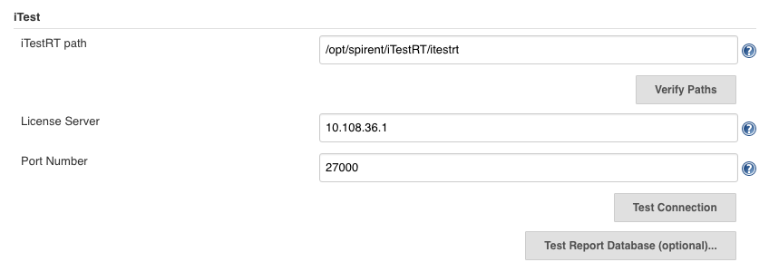
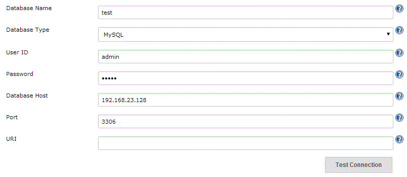
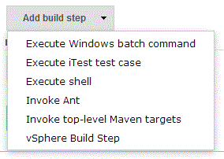
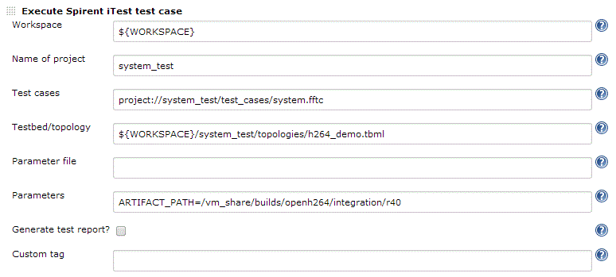
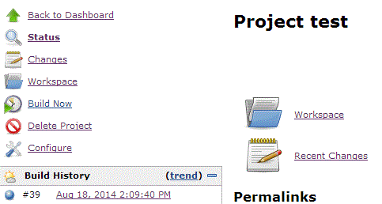
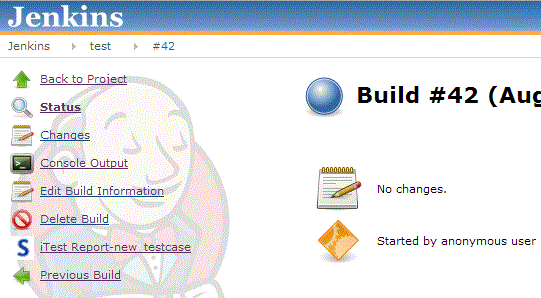
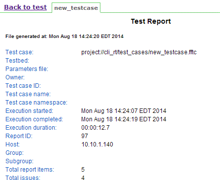

This plugin enables Spirent iTest support in Jenkins.

Spirent iTest is a comprehensive suite creating an Agile enabled
platform for agnostic network test automation that validates both
virtual and physical environments for network communications, cloud
services, mobile networks, IT teams and more.
<http://www.spirent.com/automation>

Note that this plugin does not come with Spirent iTest.

The code for this plugin is publicly available
here: [itest-plugin](https://github.com/jenkinsci/itest-plugin)

    Wiki page for version 1.1.1: iTest plugin version 1.1.1 change log

**Requirement: **

-   Windows: iTestRT version 7.0.1 or later.
-   Unix: iTestRT version 6.0 or later.

### General Tips:

-   Always “Save” or “Apply” any changes you make before clicking the
    validation buttons
-   Help text is available for all fields with the 
     icon
    next to it, and contain instructions for correctly entering values
    for each field (where applicable). 
-   If you are generating test reports, iTestRT will use
    "resources.itar" in the "iTestRT/tar" directory for its report
    transforms. If you wish to customize the report transforms, remove
    "resources.itar" from the "iTestRT/tar" directory and place your
    customized "resources.itar" in the "iTest Workspace" directory
    specified in the job's iTest configuration. This plugin uses the
    HTML report transform when generating test reports. 
-   To reference the Jenkins build workspace, use ${WORKSPACE}.
    -   See the following sections for examples of usage. 

### **Setting up for first use in the “Configure System” page of Jenkins**

-   Provide path to iTestRT if necessary (i.e., if it's not in PATH on
    your system)
    -   The “Verify Paths” button will ensure that the path specified
        point to the executable
-   If you leave “Port Number” blank, the default of 27000 will be used
    -   The “Test Connection” button will check if a connection to the
        server can be made
-   Click “Test Report Database options…” to expand the optional
    settings for external databases for test reports 

{width="707"
height="250"}

### **Sending test reports to an external database**

-   External databases currently supported are MySQL and Postgresql
-   You must specify the “User ID” and “Password” fields
-   If you choose to specify a URI, you do not need to specify the
    “Database Name,” “Database Type,” “Database Host,” or “Port” fields.
-   The “Test Connection” button will generate a connection URI and will
    check if a connection to the database can be made 

### **Executing test cases**

-   In the job configuration page, select “Add build step” and click
    “Execute iTest test case.”

-   The following is a basic configuration to execute a single test
    case. At the very least the “Workspace,” “Name of Project,” and
    “Test cases” fields are required
    -   “Workspace” can be left blank if the iTest project files have
        been imported into the Jenkins workspace
    -   Check “Generate test report?” to send a test report to the iTest
        internal database (or external database if you set one up) and
        render the HTML-formatted report in the Jenkins job build page. 

### **Viewing test reports in Jenkins**

-   In the job page, click on a build number.

-   In the sidebar, click on iTest Report-name-of-testcase. 

-   Click “Back to project-name” to return to the job page.

### Analyzing Build Results

-   A build failure results if: 
    -   A test case fails
    -   An error occurs during execution 
    -   The specified license server/external database is down 

### Troubleshooting:

-   Error messages generated by iTestRT are printed to the “Console
    Output” of each build 
-   In order to generate test reports, the default HTML template
    provided by iTest in the "resources" project is used. The
    "resources" project included with the iTestRT installation (in the
    itar directory) will be used, if present. Otherwise, the resources
    project in the job's workspace directory will be used. 
-   Consult the iTestRT user guide and Spirent forums for more
    information about error messages not covered here. 
-   In case the test report is not rendered as a hyperlink, Jenkins may
    be enforcing a security policy which could be relaxed.
     See [Configuring Content Security
    Policy](http://localhost:8085/display/JENKINS/Configuring+Content+Security+Policy) for
    more information on this topic.  In some cases, an additional JAVA
    ARG can be added to the Jenkins startup.  For example, under
    /etc/defaults/jenkins, the following would be
    added: JAVA\_ARGS="$JAVA\_ARGS
    -Dhudson.model.DirectoryBrowserSupport.CSP="

### **Change Log**

##### Version 1.0 (September 29, 2014)

-   Initial Release

##### Version 1.1.1 (March 8, 2018)

-   Remove iTestCLI dependence

##### Version 1.1.1 (March 12, 2018)

-   Remove documentation related to iTestCLI requirements
