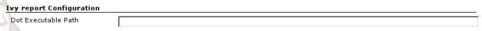
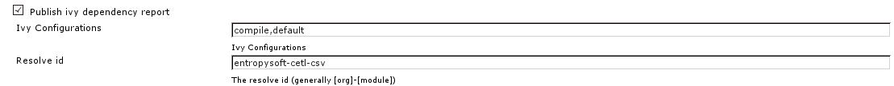
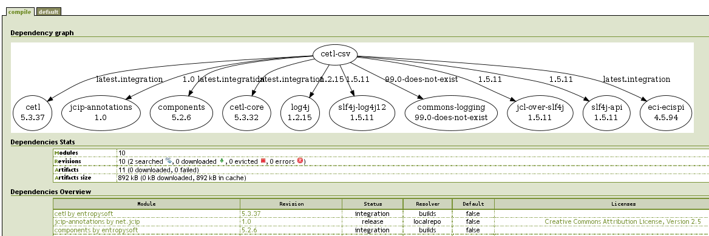

This plugin publishes [Apache Ivy](http://ant.apache.org/ivy) reports
for each build.

  
This plugin depends on the [Ivy
Plugin](https://wiki.jenkins.io/display/JENKINS/Ivy+Plugin) and requires a
graphviz installation on the server.

# Using the plugin

1.  Install graphviz on the server.  
    Configure the dot executable path in "Configure System"  
    
2.  Create (using the [Ivy
    Plugin](https://wiki.jenkins.io/display/JENKINS/Ivy+Plugin)
    [\|\\](https://wiki.jenkins.io/display/JENKINS/Ivy+Report+Plugin)) or
    edit an ivy project   
    Check "Publish ivy dependency report", give the ivy configurations
    for which to generate the report and the resolve id (generally
    \[org\]-\[module\]  
    
3.  The report will be generated after the build :  
    

# Changelog

#### Version 1.2 (Feb 17, 2012)

-   Svg elements are now clickable

#### Version 1.1 (Feb 16, 2012)

-   Icon for action was missing
-   Use helvetica 11 in generated svg files
-   Add a version label to the link between two artifacts only if it is
    not the selected version for the target artifact

#### Version 1.0 (Feb 14, 2012)

-   First release : an html ivy report containing a dependency graph (in
    svg format) can be generated for each ivy project build
