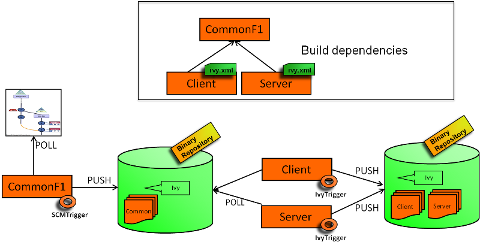

**This plugin is up for adoption.** Want to help improve this plugin?
[Click here to learn
more](http://localhost:8085/display/JENKINS/Adopt+a+Plugin "Adopt a Plugin")!

IvyTrigger provides polling mechanisms to poll an Ivy file and triggers
a build if an Ivy dependency version has changed.  

# Features

The plugin makes it possible to monitor the dependencies of an Ivy
descriptor.  
For example, if a dependency has the following revision 'latest.release'
or '2.+' and a new artifact has been deployed in the repository manager
(managed by Ivy), a new build is scheduled.

Note: The plugin uses only persistence in memory. There is no impact on
the Jenkins infrastructure (no new files created).  
This plugin provides a polling typology among the [XTrigger
Plugin](http://localhost:8085/display/JENKINS/XTrigger+Plugin).

# Changelog

## Release 0.34

\* Added option to control whether or not artifacts are downloaded  
\* Fix
[JENKINS-28044](https://issues.jenkins-ci.org/browse/JENKINS-28044) -
IvyTrigger plugin description indicates that it "has no impact on the
Jenkins infrastructure", but it does download all dependencies to the
local file system

## Release 0.33

\* Added ability to download Ivy settings through URL

## Release 0.32

\* Fix
[JENKINS-19796](https://issues.jenkins-ci.org/browse/JENKINS-19796) -
IvyTrigger fails on Jenkins 1.532

## Release 0.31

\* Fix
[JENKINS-19459](https://issues.jenkins-ci.org/browse/JENKINS-19459) -
IvyTrigger reports
[ERROR](http://localhost:8085/display/JENKINS/IvyTrigger+Plugin#) -
Polling error...

## Release 0.30

\* Update to xtrigger-lib 0.30 (Change locking object)

## Release 0.29

\* Fix NullPointerException when saving job config

## Release 0.27 & 0.28

\* Fix
[JENKINS-17831](https://issues.jenkins-ci.org/browse/JENKINS-17831) -
Update to latest xTrigger

## Release 0.26

\* Fix
[JENKINS-17641](https://issues.jenkins-ci.org/browse/JENKINS-17641) -
Unknown field 'logEnabled' in org.jenkinsci.lib.xtrigger.XTriggerCause

## Release 0.25

\* Fix
[JENKINS-17831](https://issues.jenkins-ci.org/browse/JENKINS-17831) -
Update to latest xTrigger

## Release 0.24

\* Add support for multiple properties files

## Release 0.23

\* set debug field in IvyTriggerEvaluator

## Release 0.22

\* Upgrade to xtrigger-lib 0.14 (more log)

## Release 0.21

\* Add extension capabilities (thanks to Stephen Slocum)

## Release 0.20

\* Fix temporary file deletion

## Release 0.19

\* Add a debug mode on demand for the resolution artifacts log

## Release 0.18

\* Fix check when there is no revision in the Ivy pattern (check on
timestamp only)

## Release 0.17

\* Inject propoerties to ivysettings file for variable resolution

## Release 0.16

\* Fix settings resolutions variable

## Release 0.15

\* Update to xtrigger-lib 0.9  
\* Fix
[JENKINS-12992](https://issues.jenkins-ci.org/browse/JENKINS-12992) -
Error - Job Copy & Saving Configuration when using Ivy Trigger Plugin
(v0.14)  
\* Introduce a cache system at job level  
\* Enable to detect changes when no revision is used for a filesystem
resolver

## Release 0.14

\* Update to xtrigger-lib 0.8 (Fix
[JENKINS-12888](https://issues.jenkins-ci.org/browse/JENKINS-12888))

## Release 0.13

\* Add error messages

## Release 0.12

\* Add a ivy properties content

## Release 0.11

\* Fix double startup

## Release 0.10

\* Update to xtrigger-lib 0.7  
\* Can add variables to Ivy through a properties file

## Release 0.9

\* Update to xtrigger-lib 0.5  
\* Update to envinject-lib 1.2

## Release 0.8

\* Update to xtrigger-lib 0.3  
\* Update to envinject-lib 1.0

## Release 0.7

\* A job is not triggered when Jenkins is quieting down and is buildable

## Release 0.6

\* Migrate to xtrigger-lib

## Release 0.5

\* Environment variables are managed

## Release 0.4

\* Fix node running detection

## Release 0.3

\* Fix bug for a slave usage

## Release 0.2

\* Fix help messages

## Release 0.1

\* Initial release
