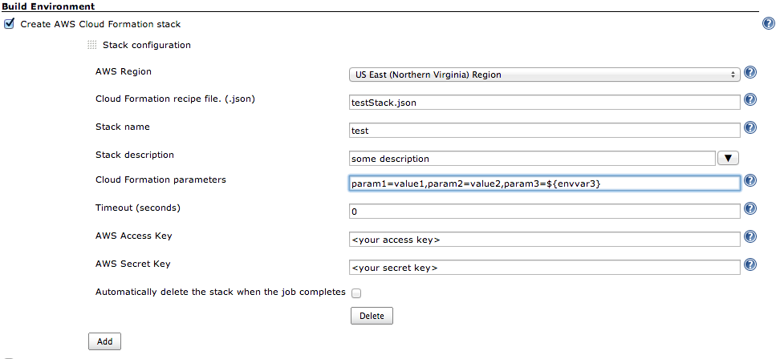
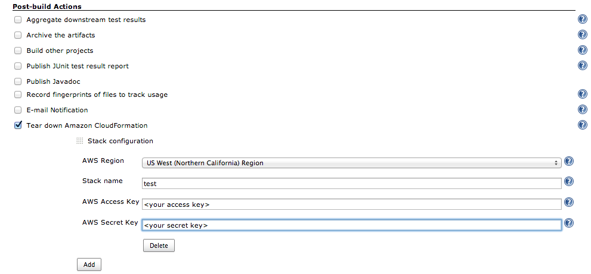

The current version of this plugin may not be safe to use. Please review
the following warnings before use:

-   [Credentials stored in plain
    text](https://jenkins.io/security/advisory/2019-04-03/#SECURITY-1042)

**This plugin is up for adoption.** Want to help improve this plugin?
[Click here to learn
more](http://localhost:8085/display/JENKINS/Adopt+a+Plugin "Adopt a Plugin")!

A plugin that allows for the creation of cloud formation stacks before
running the build and the deletion of them after the build is completed.

This plugin gives Jenkins the ability to spawn [Amazon Cloud
Formation](http://aws.amazon.com/cloudformation/) stacks before running
the build and stopping it at the end.

This is particularly useful for testing; where you can create your
application stacks in the Amazon cloud; deploy your application to them,
run tests against it and finally take all the stacks down.



If the stack takes
[parameters](http://docs.amazonwebservices.com/AWSCloudFormation/latest/UserGuide/using-cfn-input-parameters.html),
you can enter them as a semi-colon separated list of value=pair. For
backward compatibility you can also use comma as separator for
parameters. This however prevents you from passing comma separated lists
as values for parameters. If you need to pass lists as values for
parameters then you should separate your parameters with a semi-colon
like this:

``` syntaxhighlighter-pre
 param1=value1;param2=v2,v3,v4,v5;param3=v3,v4;param4=value4
```

If the stack that is created has
[outputs](http://docs.amazonwebservices.com/AWSCloudFormation/latest/UserGuide/using-cfn-return-values.html),
they will be added as variables to the build environment so you can use
them during the build just as any other environment variable like
$WORKSPACE. The name of the variables will be the name of the output
item defined in the stack json document prefixed with the name of the
stack that produced it (ie. stack1\_outputName).

This has the useful side effect of allowing for the chaining of several
stacks where the ones further down can be fed the outputs of the
previous stacks as parameters. In this way, if you have a stack that
creates an instance and outputs its IP address you can potentially pass
the IP address into another stack as a parameter and use it in whatever
way you need.

The timeout value in the configuration refers to the maximum amount of
time to wait before giving up on the stack creation. Keep in mind that
if this threshold is reached the plugin will make no effort to delete
the stack. Future version may change this behavior.

The stacks order can be re-arranged by dragging them. WARNING: If you
are chaining stacks the order is relevant and therefore you should
revise the parameters configuration of each of the stacks.

If an error occurs during the creation of the stack, this plugin will
mark the build as failed and all previously created stacks will be
deleted (Assuming they were flagged to be deleted at the end of the job)

As of version 0.8 a Build Notifier has been added to delete stacks. This
feature allows jobs to kill stacks that were created in previous jobs.
Here is a snapshot of the configuration for notifier:  

