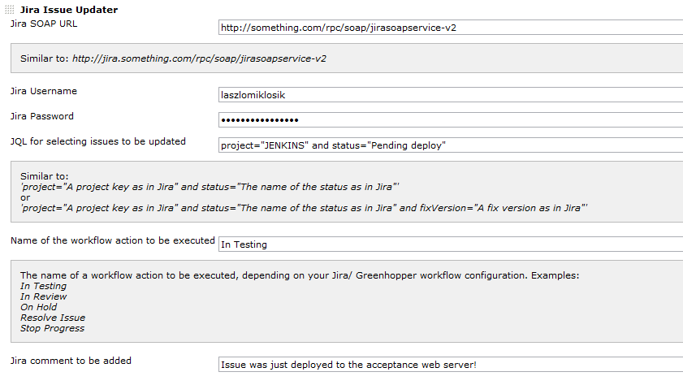

I see only questions and no answers. Does anybody answers these
questions? Otherwise what is the point to ask?

  

The current version of this plugin may not be safe to use. Please review
the following warnings before use:

-   [Credentials stored in plain
    text](https://jenkins.io/security/advisory/2019-04-03/#SECURITY-837)

This is a Jenkins plugin which updates issues in Atlassian JIRA (by
changing their status, adding a comment or updating fields) as part of a
Jenkins job.

Jira-Issue-Updater-Plugin can search for issues to update using a
flexible, user-definable JQL which can contain arbitrary variable values
from the Jenkins Build, and update the contents of the JIRA.

The plugin can be called during a Post Build Step and/or as a Post Build
Action.

Common Use Cases:

-   Update a JIRA when a build passes/fails, for example to keep an
    audit trail in JIRA
-   Update Fixed Versions in JIRA
-   Fail a build if a JIRA cannot be found 

## What's new

### Version 1.20

Version 1.19 failed due to using out of date build settings. Updated and
re-released as Version 1.20.

Changes:

-   Added fixed versions
-   Use up to date build settings, deal with FindBugs and Javadoc issues

### Version 1.18

Changes:

-   Added version management

### Version 1.17

Changed to use the REST interface (SOAP has been deprecated and is being
removed). The current functionality is:

-   JIRA selection using JQL
-   Add a JIRA comment (supports variable substitution)
-   Update a field with a value (supports variable substitution)
-   Set a workflow status

Note: "Fixed Versions" removed temporarily

Added "Post Build Action"

### Version 1.3

Added support for build parameters and environment variables.

Use e.g

``` syntaxhighlighter-pre
$BUILD_NUMBER
```

and not:

``` syntaxhighlighter-pre
${BUILD_NUMBER}
```

and then they will get replaced for any of the below:

-   jira comment
-   jql
-   workflow action name

## When to use it

-   in case you would like to announce or just log in Jira that the
    deployment of certain fixes / issues the acceptance server has
    completed (this makes sense if you already use Jenkins to deploy
    your applications to the acceptance web/app server).
-   in case you would like Jenkins to update multiple issues when a new
    version of one of your projects is released (this makes sense if you
    use the "maven release plugin" and you trigger it from Jenkins).
-   in case you would like to progress multiple Jira issues in the
    workflow (bulk changing the status of multiple Jira issues) and/or
    add a comment to issues after a Jenkins job has successfully
    completed.

## How to use it

After installing this plugin you will find it:

-   under the 'Add build step' option (in case of a free-style or
    multi-configuration project build jobs) 
-   under the 'Add pre-build Step' & 'Add post-build step' options (in
    case of Maven project build jobs)

### Inputs

-   the Jira SOAP URL (e.g.
    <http://something.com/rpc/soap/jirasoapservice-v2>)
-   the Jira username and password to be used to connect to Jira
-   a JQL query selecting the issues to be updated (e.g.
    project="JENKINS" and status="Pending deploy")
-   the name of the workflow action to be executed (not mandatory)
-   the message to be added to each issue (not mandatory)

### Example plugin configuration

## Usage


