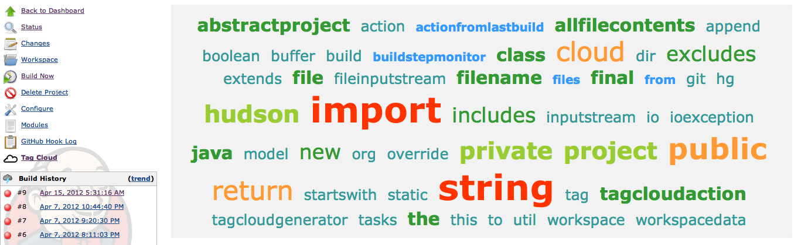

Plugin which generates a tag cloud from source code.

# Description

A plugin which scans a project's source and generates a tag cloud of
commonly used words. Taken from an idea demonstrated by Kevlin Henney at
a recent Bash.ie event in Belfast, NI. 

# Screenshot

{width="700"}

# Version history

## Version 1.6 (03/07/2012)

-   Making number of tags configurable.

## Version 1.5 (15/04/2012)

-   Minor POM updates.

## Version 1.4 (10/04/2012)

-   Moving under jenkinsci organization in github.

## Version 1.3 (08/04/2012)

-   Initial release.
