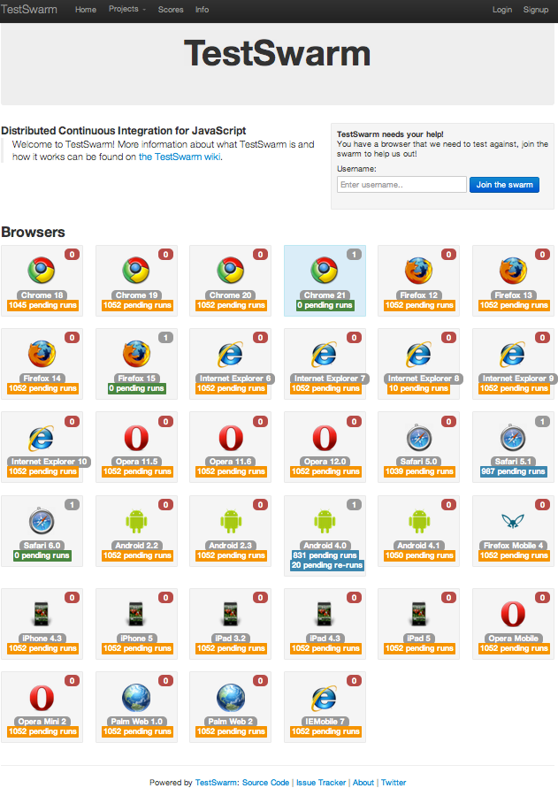
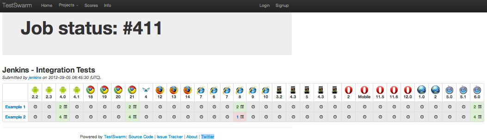
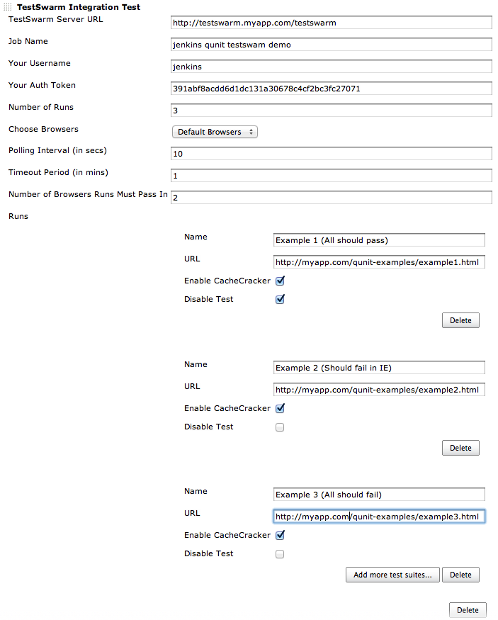
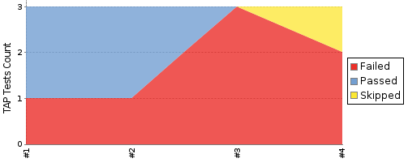
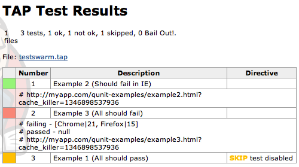

Welcome to the jenkins-testswarm-plugin wiki!  
Testswarm is used to run javascript tests in all browser. This plugin
allows you to run testswarm tests and see results from jenkins.

**TestSwarm Landing Page**  

**TestSwarm Job that was Launched from Jenkins**  

**Sample Jenkins Configuration**  

**Results in TestSwarm Results shown in Jenkins**  

**Details of TestSwarm Results in Jenkins**  

