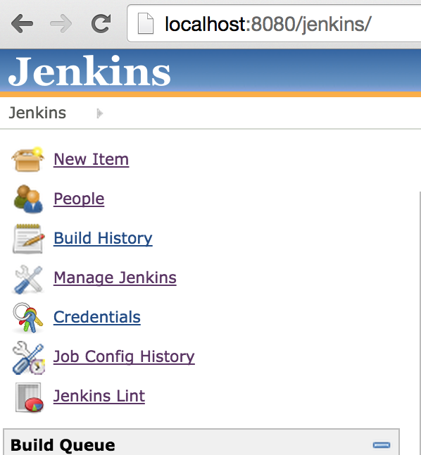
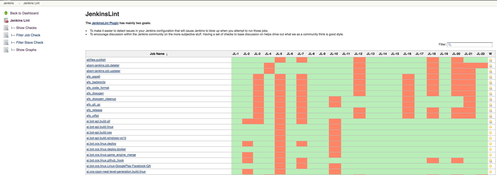
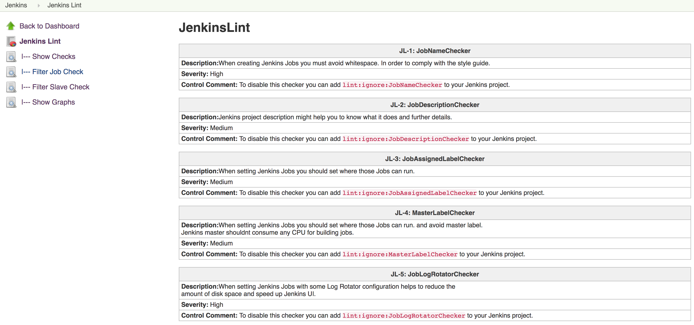
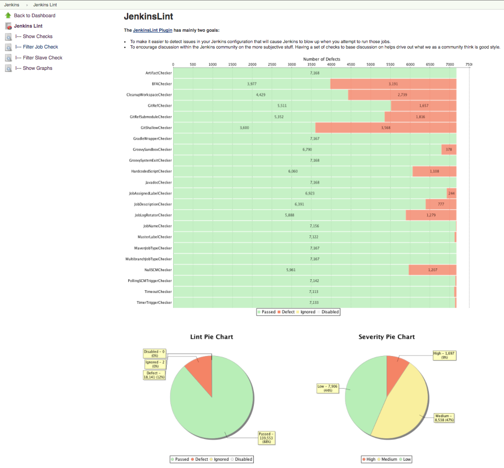
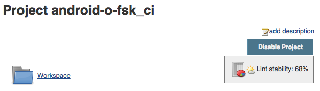
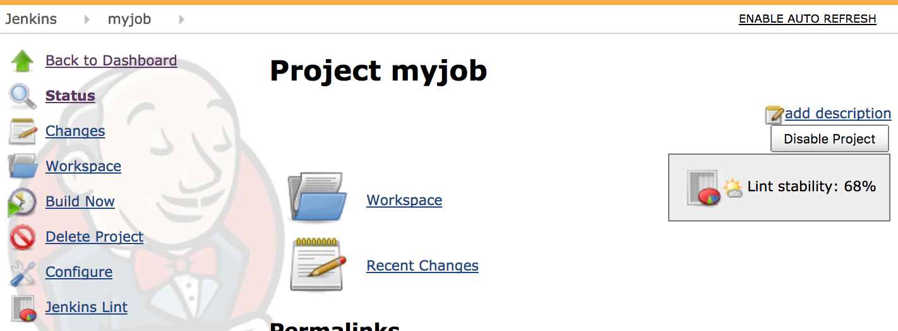
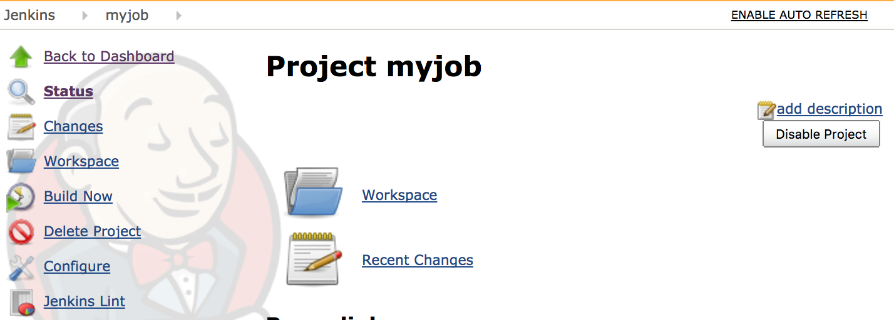

Detects whether your Jenkins configuration follows those best practices 

This plugin has mainly two goals:

-   To make it easier to detect issues in your Jenkins configuration
    that will cause Jenkins to blow up when you attempt to run those
    jobs.
-   To encourage discussion within the Jenkins community on the more
    subjective stuff. Having a set of checks to base discussion on helps
    drive out what we as a community think is good style.

   

# **Summary**

Jenkins is an awesome Automation System, and there are a bunch of people
using it in different ways, for example: developers, testers,
automation, build engineers, release engineers, scrum master, product
owner and so on. Unfortunately, as the number of jobs grows, maintaining
them becomes tedious, and the paradigm of using a predefined set of best
practices falls apart.

The Jenkins Lint plugin attempts to solve this problem by allowing jobs
to be evaluated with some predefined best practices. The goal is for
your team to be able to define those best practices to be related to
their project.

Manually reviewing those jobs wouldn't be too hard, but doing the same
thing all over again for every new job or for a hundred other projects
is where it gets difficult and tedious. This provides a much more
powerful way of analyzing them.

# Usage

You can find it under ***`<jenkins_url>/jenkinslint`*** or reach it via
links in the sidepanel of the main page. You don't need to do anything
else, just click on the Jenkins Lint link and those Lint checkers will
be shown.

  
{height="300"}

{height="400"}

  
{width="1135"}

 

{width="1135"}

{width="626"
height="178"}

# Features

List of available Job checks:

-   Artifact Publisher check
-   BFA check
-   Built Timeout check
-   CleanUp Workspace check
-   Git Ref repo check
-   Git Ref Submodule repo check
-   Git Shallow clone check
-   Gradle Wrapper check
-   Groovy system exit check
-   Hard-coded Script check
-   Javadoc Publisher check
-   Job Assigned Label check
-   Master Assigned Label check
-   Job Description check
-   Job Log Rotator check
-   Job Name check
-   Maven Job Type check
-   Multibranch Job Type check
-   Null SCM check
-   Polling SCM Trigger check
-   TimerTrigger Hash check

List of available Slave checks:

-   Slave description check
-   Slave label check
-   Slave version check
-   Windows slave launch check

## Planned upcoming features

-   Configure Checks (change severity)
-   Load checks dynamically via Jenkins.
-   Load checks dynamically via Reflection. 
-   Define some kind of programmatically scripts.
-   Check: Cyclomatic complexity check
-   Support Declarative pipeline and shared Libraries

**Controlling checks:**

You can ignore a particular check  in a specific job, by adding a
trailing ***lint:ignore:\<check name\>*** comment to the job
description.

You can ignore a check globally, by deselecting it in the system
configuration: "***Manage Jenkins***" / "***Configure System***" in the
"***Advanced***" section below "*Jenkins Lint*".

**Disabling the healthy floating box in the Job Summary Page**

You can disable the healthy floating box in the Job Summary Page, by
unchecking "Enable JobAction" in the system configuration 

## Features controlled by system properties

Based on the [Features controlled by system
properties](http://localhost:8085/display/JENKINS/Features+controlled+by+system+properties),
you can disable the healthy floating box in the Job Summary Page

[TABLE]

  
By default you will see the below view:

{width="676"
height="250"}

 

If you disabled then:

{width="697"
height="250"}

# Global settings

You can easily disable/enable Checkers and customise them from the
Global Settings ***\<jenkins\_url\>/configure*** section "***Jenkins
Lint***"  

 

{height="250"}

## Enable/Disable with Groovy script

You can also configure your lint checkers using the Script console, from
version 0.10.0 onwards!

``` syntaxhighlighter-pre
import org.jenkins.ci.plugins.jenkinslint.JenkinsLintGlobalConfiguration
import jenkins.model.GlobalConfiguration

// Disable Globally
JenkinsLintGlobalConfiguration.all().get(JenkinsLintGlobalConfiguration.class).setGlobalEnabled(false)

// Disable JobAction
JenkinsLintGlobalConfiguration.all().get(JenkinsLintGlobalConfiguration.class).setJobActionEnabled(false)

// Disable Lint
JenkinsLintGlobalConfiguration.all().get(JenkinsLintGlobalConfiguration.class).setCleanupWorkspaceCheckerEnabled(false)
 
// More properties in the JenkinsLintGlobalConfiguration class: https://github.com/jenkinsci/jenkinslint-plugin/blob/a97f3e17b14d7410164bb4bea50ba5968a3a97b8/src/main/java/org/jenkins/ci/plugins/jenkinslint/JenkinsLintGlobalConfiguration.java#L18-L45
```

# API

You can retrieve jenkins lint defects by requesting the following URLs :

-   \<jenkins/hudson\_url\>/**jenkinslint/api/json?depth=2&pretty=true  
    **
-   \<jenkins/hudson\_url\>**/jenkinslint/api/xml?depth=2**

**  
**

And also you can retrieve lint defects per job/agents:

-   \<jenkins/hudson\_url\>/job/\<your\_job\>/**jenkinslint/api/json?depth=2&pretty=true  
    **
-   \<jenkins/hudson\_url\>/job/\<your\_job\>/**jenkinslint/api/xml?depth=2**
-   \<jenkins/hudson\_url\>/computer/\<agent\>/**jenkinslint//**api/json?depth=2&pretty=true****
-   \<jenkins/hudson\_url\>/computer/\<agent\>/**jenkinslint//api/xml?depth=2**

# Workaround

 

There is already a [known
issue](https://issues.jenkins-ci.org/browse/JENKINS-29418) in the
**initial version 0.1.0** , [Workspace Cleanup
Plugin](https://wiki.jenkins-ci.org/display/JENKINS/Workspace+Cleanup+Plugin) is
a required dependency otherwise JenkinsLint will fail when analyzing
those Jobs

**Console Output**

``` syntaxhighlighter-pre
Jul 13, 2015 10:21:06 PM hudson.ExpressionFactory2$JexlExpression evaluate
WARNING: Caught exception evaluating: it.data in /jenkinslint/. Reason: java.lang.reflect.InvocationTargetException
java.lang.reflect.InvocationTargetException
        at sun.reflect.NativeMethodAccessorImpl.invoke0(Native Method)
        at sun.reflect.NativeMethodAccessorImpl.invoke(NativeMethodAccessorImpl.java:62)
        at sun.reflect.DelegatingMethodAccessorImpl.invoke(DelegatingMethodAccessorImpl.java:43)
        at java.lang.reflect.Method.invoke(Method.java:483)

.... Giant Stacktrack ....

        at winstone.BoundedExecutorService$1.run(BoundedExecutorService.java:77)
        at java.util.concurrent.ThreadPoolExecutor.runWorker(ThreadPoolExecutor.java:1142)
        at java.util.concurrent.ThreadPoolExecutor$Worker.run(ThreadPoolExecutor.java:617)
        at java.lang.Thread.run(Thread.java:745)
Caused by: java.lang.NoClassDefFoundError: hudson/plugins/ws_cleanup/WsCleanup$DescriptorImpl
        at org.jenkins.ci.plugins.jenkinslint.check.CleanupWorkspaceChecker.executeCheck(CleanupWorkspaceChecker.java:22
)
        at org.jenkins.ci.plugins.jenkinslint.JenkinsLintAction.getData(JenkinsLintAction.java:60)
        ... 112 more
```

There are two workarounds:

1.  Installing  [Workspace Cleanup
    Plugin](https://wiki.jenkins-ci.org/display/JENKINS/Workspace+Cleanup+Plugin) 
2.  Upgrading the JenkinsLint version

## Requirements

### Jenkins

Jenkins version:

-   1.607 or newer if Jenkins pipelines are installed
-   1.580 or newer is required if jenkins pipelines are not installed

It might work with previous versions.

NOTE: Jenkins version is required when testing those checkers using the
mvn test command. This plugin uses java reflection to get rid of those
plugins/jenkins version dependencies although it's required in the test
phase when developing it to verify/test those checkers.

# Open Issues

# Version history

### Planning 

 Check:
Cyclomatic complexity check ([issue
\#42269](https://issues.jenkins-ci.org/browse/JENKINS-42269))

### Version 0.14.0 (August 29, 2017)

-    
    Enable/Disable whether to analyse disabled jobs from Global
    Settings ([issue
    \#46395](https://issues.jenkins-ci.org/browse/JENKINS-46395))

### Version 0.13.0 (August 24, 2017)

-    Show
    graphs. ([issue
    \#46350](https://issues.jenkins-ci.org/browse/JENKINS-46350))
-    Fixed
    NPE when using MultijobProjects ([issue
    \#46424](https://issues.jenkins-ci.org/browse/JENKINS-46424)) 
-    Fixed
    ClassCastException when using a misconfigured restrict where to run
    field ([issue
    \#46383](https://issues.jenkins-ci.org/browse/JENKINS-46383))

### Version 0.12.0 (August 15, 2017) 

-    Check:
    Detect ignored groovy sandbox in Projects. ([issue
    \#46177](https://issues.jenkins-ci.org/browse/JENKINS-46177) )
-    Check:
    Detect ignored groovy sandbox in Pipelines. ([issue
    \#46162](https://issues.jenkins-ci.org/browse/JENKINS-46162))
-    Customise
    HardcodedScript lint to enable/disable comments as lines. ([issue
    \#46146](https://issues.jenkins-ci.org/browse/JENKINS-46146))
-    Fully
    support of Pipeline linting. ([issue
    \#46162](https://issues.jenkins-ci.org/browse/JENKINS-46162))
-    Search
    box. ([issue
    \#42359](https://issues.jenkins-ci.org/browse/JENKINS-42359))
-    Bumped
    minimal Jenkins Core version to 1.607 ([issue
    \#46162](https://issues.jenkins-ci.org/browse/JENKINS-46162))
-    Remove:
    Deprecated System Property (Features controlled by system
    properties) . ([issue
    \#46164](https://issues.jenkins-ci.org/browse/JENKINS-46164))
-    Fixed
    Column Ordering based on Check Status and Job/Slave Name ([issue
    \#46033](https://issues.jenkins-ci.org/browse/JENKINS-46033))
-    Fixed
    Linting with multi-configuration projects. ([issue
    \#46176](https://issues.jenkins-ci.org/browse/JENKINS-46176))

### Version 0.11.0 (August 10, 2017)

-    Check:
    Groovy system exit check in Input Parameters  ([issue
    \#45961](https://issues.jenkins-ci.org/browse/JENKINS-45961))
-    Check:
    Groovy system exit check in Publishers  ([issue
    \#45960](https://issues.jenkins-ci.org/browse/JENKINS-45960))
-    Check:
    Run Timeout Check in Build Steps ([issue
    \#45938](https://issues.jenkins-ci.org/browse/JENKINS-45938))
-    Fixed
    Hardcoded Script check with empty lines ([issue
    \#46035](https://issues.jenkins-ci.org/browse/JENKINS-46035))
-    Fixed
    Column Ordering based on Check Status and Job Name ([issue
    \#46033](https://issues.jenkins-ci.org/browse/JENKINS-46033))

### Version 0.10.1  (August 1, 2017)

-     Fixed
    false positive with Timer Trigger Checker ([issue
    \#45879](https://issues.jenkins-ci.org/browse/JENKINS-45879))

-     Fixed
    sortable columns ([issue
    \#45880](https://issues.jenkins-ci.org/browse/JENKINS-45880))

### Version 0.10.0  (August 1, 2017)

-   ****  Check: BFA
    Check  ([issue
    \#42268](https://issues.jenkins-ci.org/browse/JENKINS-42268))

-    
    Check: Git Ref Submodule Check  ([issue
    \#41528](https://issues.jenkins-ci.org/browse/JENKINS-41528))
-    
    Enable/Disable Checks globally/individually from Global Settings
    ([issue
    \#45882](https://issues.jenkins-ci.org/browse/JENKINS-45882))
-    
    Hardcoded Script Threshold value is now part of the Global Settings
    ([issue
    \#45882](https://issues.jenkins-ci.org/browse/JENKINS-45882))

### Version 0.9.0 (July 27, 2017)

-    JobAction
    View (Controlled by System
    Property) (**PR** [\#17](https://github.com/jenkinsci/jenkinslint-plugin/pull/17 "Expose lint defects per job"))
-    AgentAction
    View (PR [\#17](https://github.com/jenkinsci/jenkinslint-plugin/pull/17 "Expose lint defects per job"))
-    RestAPI
    for the JobAction and AgentAction
-    Jenkinsfile
    integration
    with [ci.jenkins.io](http://ci.jenkins.io/) (**PR** [\#18](https://github.com/jenkinsci/jenkinslint-plugin/pull/18 "Service has been deprecated so let's move to Jenkinsfile instead"))
-    Fixed [Jelly
    and XSS
    prevention](http://localhost:8085/display/JENKINS/Jelly+and+XSS+prevention)
-    Bumped
    minimal Jenkins Core version to 1.580

### Version 0.8.0 (Mar 7, 2017)

-     RestAPI.  ([issue
    \#41449](https://issues.jenkins-ci.org/browse/JENKINS-41449))  
-     TimerTrigger
    'Hash' check supporting @  ([issue
    \#42337](https://issues.jenkins-ci.org/browse/JENKINS-42337))
-     Removed
    dependent plugins.  ([issue
    \#42383](https://issues.jenkins-ci.org/browse/JENKINS-42383))

### Version 0.7.0 (Feb 26, 2017)

-     Maven
    and Matrix projects weren't supported when linting some defects
     ([issue
    \#42310](https://issues.jenkins-ci.org/browse/JENKINS-42310))

&nbsp;

-    
    Check: TimerTrigger 'Hash' check  ([issue
    \#42267](https://issues.jenkins-ci.org/browse/JENKINS-42267))

&nbsp;

-     i18
    support

### Version 0.6.0 (Feb 12, 2017)

-    Check: Git
    local ref cache repos check  ([issue
    \#41528](https://issues.jenkins-ci.org/browse/JENKINS-41528))

&nbsp;

-    Check: Groovy
    system exit check  ([issue
    \#38617](https://issues.jenkins-ci.org/browse/JENKINS-38617))

&nbsp;

-    Updated
    pom file  ([infra
    \#588](https://issues.jenkins-ci.org/browse/INFRA-588))

### Version 0.5.0 (Oct 1, 2015)

-    Check: Build
    Timeout check  ([issue
    \#30725](https://issues.jenkins-ci.org/browse/JENKINS-30725))

### Version 0.4.0 (Aug 27, 2015)

-    Support
    Jenkins lint check for Jenkins Slaves ([issue
    \#30161](https://issues.jenkins-ci.org/browse/JENKINS-30161))

### Version 0.3.0 (Jul 29, 2015)

-    Check: Gradle
    Wrapper check  ([issue
    \#29486](https://issues.jenkins-ci.org/browse/JENKINS-29486))

### Version 0.2.0 (Jul 21, 2015)

-    Health
    Icons plus percentage ([issue
    \#29466](https://issues.jenkins-ci.org/browse/JENKINS-29466))
-    Refactor:
    remove optional dependencies ([issue
    \#29545](https://issues.jenkins-ci.org/browse/JENKINS-29545)) ([issue
    \#29544](https://issues.jenkins-ci.org/browse/JENKINS-29544)) ([issue
    \#29546](https://issues.jenkins-ci.org/browse/JENKINS-29546))

### Version 0.1.2 (Jul 15, 2015)

-     Some
    builders cannot be cast to hudson.tasks.CommandInterpreter ([issue
    \#29427](https://issues.jenkins-ci.org/browse/JENKINS-29427))
-     HardcodedScript
    Check supports MatrixProjects ([issue
    \#29444](https://issues.jenkins-ci.org/browse/JENKINS-29444))
-     Create
    unit test suite for UI

### Version 0.1.1 (Jul 14, 2015)

-    Project
    dependency with ws-cleanup plugin [(issue
    \#29418)](https://issues.jenkins-ci.org/browse/JENKINS-29418)
-    Check: Hardcoded
    Script check

### Version 0.1.0 (Jul 12, 2015)

-      Initial
    release

  
