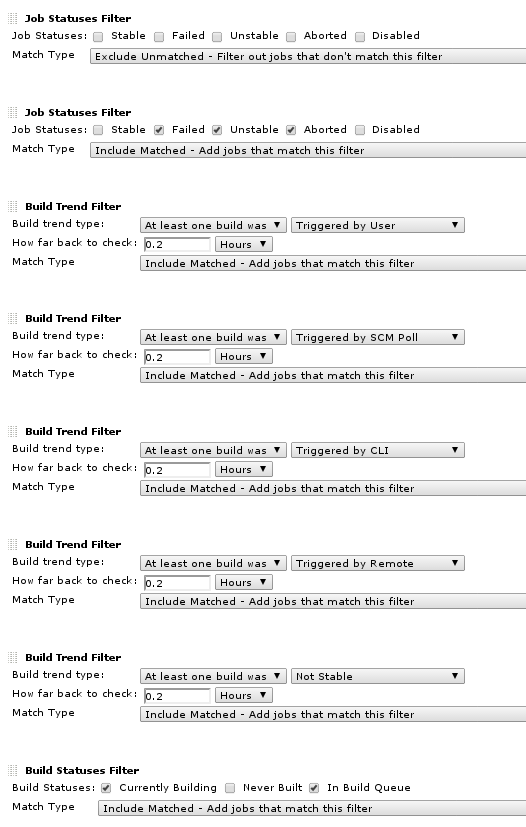

The current version of this plugin may not be safe to use. Please review
the following warnings before use:

-   [Reflected XSS
    vulnerability](https://jenkins.io/security/advisory/2019-08-07/#SECURITY-751)

  
A wall display that shows job build progress in a way suitable for
public wall displays. Rendering is performed using javascript based on
REST API calls, so requires no page refreshes. 

## **Demo and current development snapshot**

For a live demo and the latest development snapshot
see <http://pelle.io/jenkins-walldisplay/>.

## Usage

Simply click on the 'Wall Display' link in the sidebar of your project.
Configuration may be done globally via the jenkins administration screen
and also via URL parameters (e.g. &theme=boss)

## **Sample Wall Display Tips**

If you have a lot of jobs, try setting filters on your view. The follow
example creates a wall display that only shows interesting builds, i.e.
builds with any type of failure or builds that are currently building /
in the build queue. 

### Version History

##### Version 0.6.29

-   Bug fix - JENKINS-26873 Sorting by Status does not work correctly

##### Version 0.6.28

-   Bug fix - JENKINS-26745 : fix javascript error on undefined object
-   New Feature - The gravatar URL can now be configured in the plugin
    configuration (thanks to <https://github.com/timlevett>)
-   New Feature - The Junit result display can be switched of now
-   New Feature - Jenkins display name feature is used for job name
    display

##### Version 0.6.26

-   Bug fix - If there is no custom CSS theme to display it will no
    longer cause a JavaScript error
-   Bug fix - If there is a custom CSS theme to display, it will no
    longer repeatedly add (jQuery 'append') the CSS to the page, it will
    be appended onto the page once.

##### **Version 0.6.25**

-   Bug fix/UI enhancement - When there are no jobs for the filter to
    show, it will now print "No jobs to display" instead of an empty
    page

##### Version 0.6.24

-   Bug fix - Where a job that does not have any health report
    information would cause a JS error and the job would not be
    displayed correctly.

##### Version 0.6.23

-   Support for health icons (see <http://pelle.io/health-info-icons/>)

##### Version 0.6.22 (snapshot)

-   UI Tweaks
-   Custom theme CSS can be provided through the configuration screen

&nbsp;

-   New/Updated job info screen - touch a job panel to see further
    information, e.g. claim details, culprits, plus direct links to test
    results, console and build details. 

&nbsp;

-   Claim Improvements - claim shown while next job building, claims
    don't interfere with title placement.

##### Version 0.6.16 (11.10.2012)

-   [JENKINS-14660](https://issues.jenkins-ci.org/browse/JENKINS-14660)
    Plugin doesn't work when using the Nested View plugin (thanks
    to [rodikal](https://github.com/rodikal))
-   [JENKINS-15482](https://issues.jenkins-ci.org/browse/JENKINS-15482)
    OOM when clicking on a view link inside a nested view
-   [Encoding
    fix](https://github.com/jenkinsci/walldisplay-plugin/pull/12)
-   Updated dependency to Jenkins 1.424 for JDK 7 support
-   Basic sorting support

##### Version 0.6.13 (21.09.2012)

-   JENKINS-14660 add support for Nested View plugin (thanks to
    [rodikal](https://github.com/rodikal))
-   Restrict by last run date (thanks to
    [gavD](https://github.com/gavD), see [pull
    request](https://github.com/jenkinsci/walldisplay-plugin/pull/10)
    for details)
-   Add Gravatar display on the build wall (thanks
    to [athieriot](https://github.com/athieriot), see [pull
    request](https://github.com/jenkinsci/walldisplay-plugin/pull/11)
    for details)

##### Version 0.6.12 (11.07.2012)

-   JENKINS-14379 Wall Display Plugin fails when hits the build with
    'yellow' status
-   Support for font family selection
-   Added option to omit disabled builds

##### Version 0.6.10 (15.06.2012)

-   Fix for JENKINS-12452 WallDisplay Plugin incompatible with IE8
-   Make bright colour for burrent build a little darker to increase
    contrast to white text
-   Added the HTML5 style document type

##### Version 0.6.9 (09.03.2012)

-   Added configuration for build number display
-   Added configuration for culprit
-   Added Colorblind Theme

##### Version 0.6.8 (unknown)

-   fixed job flickering
-   support for job names containing spaces
-   new theme with a dark background
-   api read intverval as well as read timeout is now configurable via
    the jenkins management page

##### Version 0.6.7 (Dec 14, 2011)

-   added build progress display for aborted jobs
-   reduced data fetched via job api
-   fixed broken job updates
-   fixed flickering jobs
-   added "boss" theme
-   fixed removal of deleted builds

##### Version 0.6.5 (Nov 25, 2011)

-   Support for nested views
-   Fixed display of error messages
-   Plugin now automatically reloads the page when a new plugin version
    is detected

##### Version 0.6.4 (Nov 15, 2011)

-   Fixed job sorting order

##### Version 0.6.1 (Nov 11, 2011)

-   First Html/Javascript based release
-   General maven and matrix jobs support

##### Version 0.5.11 (Jul 13, 2011)

-   plugin fails to read manually set job names when build parameters
    are defined

##### Version 0.5.10 (Jul 12, 2011)

-   plugin didn't work for jobs with multiple properties showing up in
    the api
-   marking of jobs with failed api calls (magenta colored jobs)
-   paint queued markers also for running jobs

##### Version 0.5.9 (Jul 11, 2011)

-   job names to display are no longer taken from jobs description,
    instead is configurable now (sorry I had to alter the behavior, but
    I think the new solution is much cleaner since the jobs description
    is there for other purposes)
-   the time for computation of job progress is now taken from http
    response header
-   job height calculation for one column displays corrected

##### Version 0.5.7 (Jun 06, 2011)

-   plugin now also works for jobs containing spaces

##### Version 0.5.6 (May 20, 2011)

-   fixed incorrect error with jobs that have not been executed yet
-   corrected width calculation

##### Version 0.5.3 (Mar 17, 2011)

-   fixed incorrect display with viewnames containing spaces
