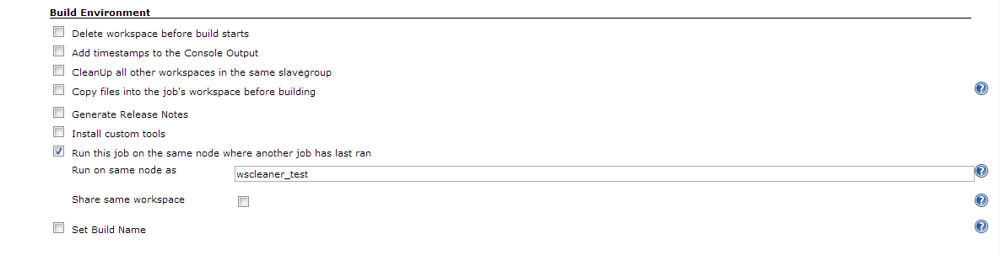
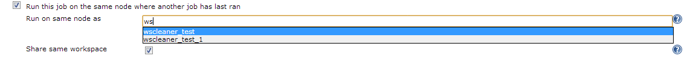
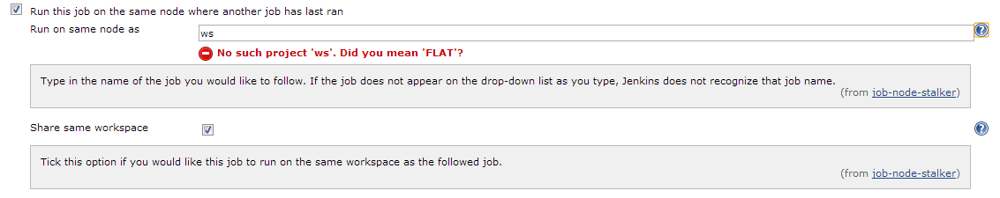

{width="200"}

Developed by [Datalex](http://www.datalex.com/) Infrastructure Team.

This plugin lets you configure jobs to run on the same node, and if
desired the same workspace, as another job.

## Description

This plugin lets you configure a job to build on the same node as
another job, with an option to also build on the same workspace as that
job. Having an option to set a job to always build on the same node as
another can be necessary when you have jobs that rely on each other, on
a Jenkins instance with multiple slaves that lets Jenkins decide where
to build jobs. The Parameterized Trigger plugin allows you to set a
downstream job to build on the same node as its upstream job, but to use
that function you must launch the downstream job through the upstream
one, however you may want certain jobs to build on the same node as
another job without having to build that job again. With this plugin ,
any job may be configured to use the same node (and if desired the same
workspace) as another job.

## Usage

 The plugins configuration is located in the ‘Build Environment’ section
of the job configuration UI. 

Only one job may be entered as the job to be followed and the job name
must be valid. Node Stalker will try to help you pick a valid jobname by
populating a drop-down list with all possible options.

 If the ‘*Share Workspace*’ option of the plugin is enabled, the
‘*Custom Workspace*’ field will be overwritten with the path to the
workspace of the followed job.

Node Stalker plugin synergises well with the [Prerequisite Build Step
Plugin](https://wiki.jenkins-ci.org/display/JENKINS/Prerequisite+build+step+plugin) 
as  Node Stalker plugin does not stop the job from trying to build while
the followed job is building or has failed its most recent build, which
would lead to unreliable errors. The prerequisite build step plugin
allows you to ensure that another job has successfully completed and is
not currently running before letting your job run.

## Incompatibilities

If the 'build on same node' parameter of the Parameterized Trigger
plugin is used while triggering a job that has Node Stalker enabled for
the upstream job, no custom workspace will be set and the triggered job
will build on it's default workspace.

## **Changelog**

#### Version 1.0.5

-   Re-release of 1.0.4, no changes

#### Version 1.0.4

-   Merged pull request that makes nodestalker compatible with item
    folders.

#### Version 1.0.3

-   Merged pull request that fixes the use of plugin with maven jobs.

#### Version 1.0.2

-   Fixed bug where custom workspace value would not be restored if it
    was empty.

#### **Version 1.0.1**

-   Edited help text to better reflect plugin functionality. 
-   Changed code to restore original Custom Workspace configuration of
    job if 'Share Workspace' option of Node Stalker plugin is enabled.
-   Fixed ClassCastException when the plugin was used within a maven
    project.

#### Version 1.0 

Initial release.
