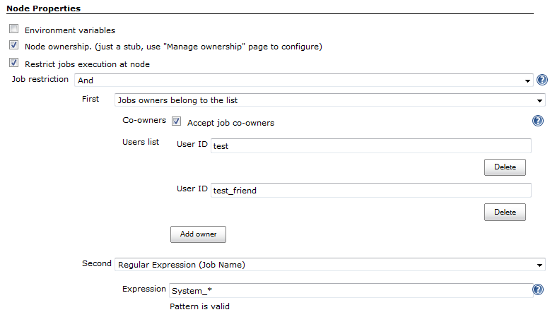

The plugin allows restricting job executions in order to change their
behavior or to harden the security. With this plugin it is possible to
configure nodes to accept only particular jobs. It is also possible to
prevent job triggering by users and other jobs using various conditions.

# About the plugin

Features:

-   Execution restrictions on the node level
    -   Example 1: Take jobs according to the specified name pattern
        (e.g. allow running only "QA\_.\*" jobs on a node)
    -   Example 2: Prevent execution of user jobs on the Jenkins master
        node
-   Restrictions of jobs triggering by external causes
    -   Example 1: Prohibit manual builds
    -   Example 2: Allow triggering only by a job with the
        specified [owner](https://wiki.jenkins.io/display/JENKINS/Ownership+Plugin).
-   Several built-in restrictions + JobRestriction extension point

Contributors:

1.  [Oleg Nenashev](hhttp://www.linkedin.com/in/onenashev) (maintainer)
    -   Initial plugin version has been sponsored by Synopsys Inc.,
        [www.synopsys.com](http://www.synopsys.com/)

# Usage

## Job restrictions for nodes

These restrictions can be configured in node's configuration page.

-   Node won't accept jobs, which violate the specified restrictions
-   Other requirements (executors, labels, etc.) will be checked as well

## Job restrictions for projects

This type of restrictions allows to prevent execution of jobs by the
launch cause.  
If the cause does not satisfy requirements, job fails before running of
SCM (the job cannot be aborted due to
[JENKINS-19497](https://issues.jenkins-ci.org/browse/JENKINS-19497)).

The current version supports the following checks:

-   **Apply Job restrictions to upstream build** - prohibits the
    invocation from specific builds, which do not satisfy the specified
    requirements
-   Prohibit manual launch of the job (since 0.2)

# Extension points

Plugin provides a JobRestriction extension point, which allows
implementation of new restrictions.

Built-in extensions:

-   Logic operations (and, or, not)
-   Started by user/group restrictions
    -   Restrictions support upstream projects (UpstreamCause)
    -   [Rebuild
        Plugin](https://wiki.jenkins.io/display/JENKINS/Rebuild+Plugin)
        and other specific causes are not supported
-   Regex restriction - check the jobs name by a regular expression

The following plugins produce additional job restrictions:

-   Page:

    [Priority Sorter
    Plugin](https://wiki.jenkins.io/display/JENKINS/Priority+Sorter+Plugin)
    — This plugin allows Jobs to be prioritised based on *Queue
    Strategies* and *Priority Strategies*.

-   Page:

    [Ownership
    Plugin](https://wiki.jenkins.io/display/JENKINS/Ownership+Plugin)

If your plug-in is not listed here, then simply add the label
**job-restriction-producer** to your plug-in wiki page and it will be
automatically listed.

# JIRA issues

If you have any proposals/bug reports, please create an issue on Jenkins
JIRA.

type

key

summary

assignee

reporter

priority

status

resolution

created

updated

due

Data cannot be retrieved due to an unexpected error.

[View these issues in
Jira](https://issues.jenkins-ci.org/secure/IssueNavigator.jspa?reset=true&jqlQuery=project%20=%20JENKINS%20AND%20status%20in%20%28Open,%20%22In%20Progress%22,%20Reopened%29%20AND%20component%20=%20%27job-restrictions-plugin%27&tempMax=1000&src=confmacro)

# Version history

## Version 0.8 (Oct 06, 2018)

-   [ JENKINS-51359](https://issues.jenkins-ci.org/browse/JENKINS-51359) -
    Fix Form validation issue for classname restrictions when a class
    belongs to another plugin
-    Jenkins
    core requirement is updated to 2.60.3

## Version 0.7 (May 16, 2018)

-    Jenkins
    core requirement is updated to 2.7.3
-    [PR
    \#19](https://github.com/jenkinsci/job-restrictions-plugin/pull/19) -
    Performance: use new core API to speedup user retrieval in the
    plugin
-    [PR
    \#22](https://github.com/jenkinsci/job-restrictions-plugin/pull/22) -
    Add Chinese localization for top-level entries

## Version 0.6 (10/14/2016)

-   
    Get full names for queue items when they're available. Solves the
    issue with restricting Pipelines within Folders
    ([JENKINS-36626](https://issues.jenkins-ci.org/browse/JENKINS-36626))
-   
    Add Job Class Restriction
    ([JENKINS-38644](https://issues.jenkins-ci.org/browse/JENKINS-38644))
-   
    Update core dependency to 1.609.3 due to Pipeline autotest
    requirements

## Version 0.5 (08/03/2016)

-   
    Upgraded the core baseline to 1.580.x in order to support Pipeline
    in near future
-   
    Upgrade to the new parent POM
-   
    Change the display name of AnyJobRestriction to "No restriction
    (take any)"
    ([JENKINS-36960](https://issues.jenkins-ci.org/browse/JENKINS-36960))

## Version 0.4 (01/18/2015)

-   
    Support of "Started by user" restriction
    ([JENKINS-25726](https://issues.jenkins-ci.org/browse/JENKINS-25726))
-   
    Support of "Started by user from the group" restriction
    ([JENKINS-25726](https://issues.jenkins-ci.org/browse/JENKINS-25726)) -
    thanks to [Unknown User (csms)](https://wiki.jenkins.io/display/~csms)
-   
    Avoid NPEs for deleted builds in UpstreamCauseRestriction for jobs
    ([JENKINS-26374](https://issues.jenkins-ci.org/browse/JENKINS-26374))

## Version 0.3 (06/29/2013)

-   
    Added support of full names for all items: support of Folders Plugin
    and Maven modules
    ([JENKINS-23597](https://issues.jenkins-ci.org/browse/JENKINS-23597))

## Version 0.2.2 (12/08/2013)

-   
    Missing jelly file causes errors on job configuration pages
    ([JENKINS-20357](https://issues.jenkins-ci.org/browse/JENKINS-20357))

## Version 0.2.1 (11/13/2013)

-   
    Broken release, equals to **0.2**

## Version 0.2 (10/26/2013)

-   
    AND and OR expressions with multiple entries
    ([JENKINS-20207](https://issues.jenkins-ci.org/browse/JENKINS-20207))
-   
    Restriction of manual build's execution
    ([JENKINS-20281](https://issues.jenkins-ci.org/browse/JENKINS-20281))

    Warning!

    This version has corrupted resources, which may affect Jenkins
    installations on several platforms.  
    Use job-restrictions 0.2.2 to avoid this issue

## Version 0.1 (08/26/2013)

-   
    Initial version with basic restrictions for nodes and jobs
