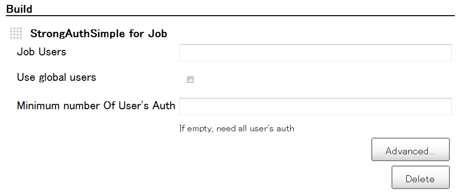

Japanese: [Job StrongAuthSimple
Plugin](http://localhost:8085/display/JA/Job+StrongAuthSimple+Plugin)

# Summary

This plugin allows you to safety builds for job, when multi-people
approved

# Why this plugin ?

This plugin avoid careless 'Job Build'. If single people execute 'Job
Build', this plugin stop build. However, if multiple people execute 'Job
Build', this plugin doesn't stop build. And continue execution of job.

# Features

-   Job StrongAuthSimple can configure the people who approve job
    executtion.
-   Support for setting of minimum numbers, which approved.

# Screenshot

# Dependencies

-   None

### Tested minimum core

1.374 works fine

# Configuration

After installing the plugin you'll get a new entry in the Job
configuration view and Jenkins configuration view.

The job configuration view similar to other build task.

# FAQ

### cancel auth ?

-   currentry, delete job execution.

# Todo list

-   Support to build by Timer, after condition be approved

# Change log

### Version 0.5 (December 17, 2012)

-   Add display global user for user friendly at configuration of job
-   Add help at configuration of job
-   Implement help at configuration of global

### Version 0.4 (December 08, 2012)

-   **Initial release**

## About

-   Author: KK.Kon
-   Contributors: -
