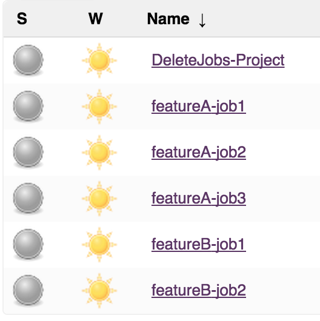
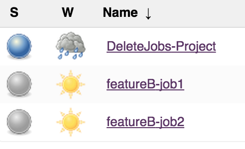
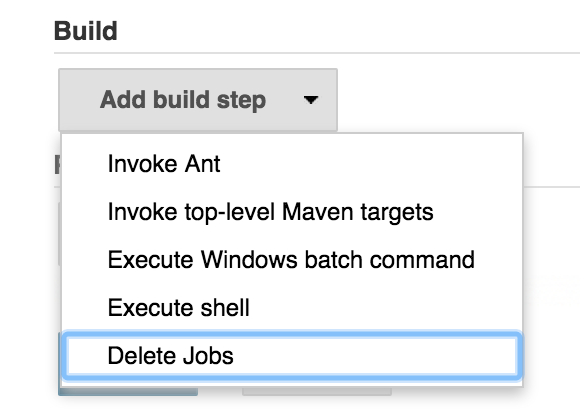
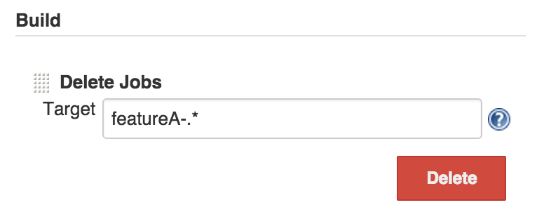

  
This plugin to "delete jobs" in a build step.

# Execute example

## Delete featureA jobs

1.  before delete  
    
2.  Execute job  
      
    
3.  after delete  
    

# Config and Usage

## Simple build

1.  Add "Delete Jobs" build step  
    
2.  Set target job name with Regular Expression  
    

## Build with parameters

1.  Set parameters  
    
2.  Add a build step, and set environment value  
    
3.  Build and input parameters  
    

# Change Log

## Version 1.0 (Sep 23, 2015)

Initial release
