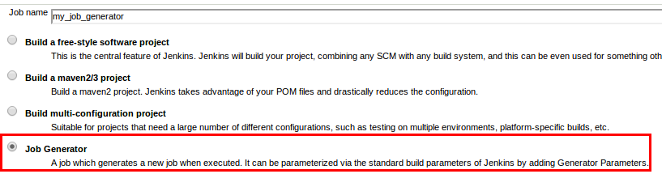
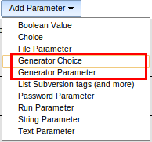
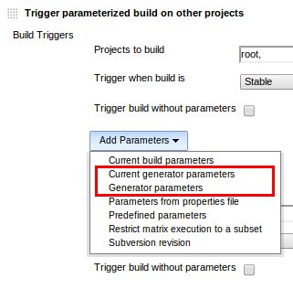
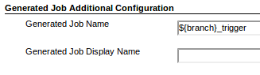
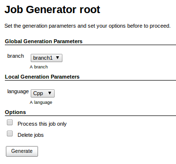
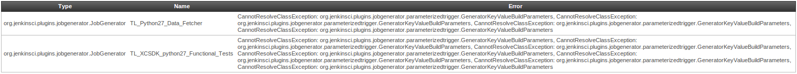

# Summary

This plugin adds a new job type "Job Generator" which can generate new
projects when executed.

###### Table of content 

# Why this plugin ?

This plugin is a good fit for generating pipelines based on
parameterized templates. Typical parameter is the branch name or base
directory where to execute a job.

It is possible to do it with the built-in build parameters of Jenkins
but you have to manage input/output parameters for each job (i.e.
duplicate the branch name parameter) if you want to be able to execute a
job manually in the pipeline. Moreover some plugins don't expand
variables which can be a show-stopper till they get fixed. Last but not
least you may want to avoid to pollute the job history with different
parameters which make hard to follow trends (i.e. different branch
locations) and you need history isolation with different explicit jobs
pre-configured with each parameter value.

Of course you don't want to do this by hand as the number of jobs can
grow quickly if you have a big pipeline. Many teams work around this by
developing external tools to duplicate jobs. There are some plugins
available which allow to generate job configurations, you may want to
take a look a the [Job DSL
Plugin](https://wiki.jenkins-ci.org/display/JENKINS/Job+DSL+Plugin).

The Job Generator plugin proposes a different approach by allowing to
define job templates in a natural way, there is no need to learn an
additional script language.

# Features

-   Global and Local Generator Parameters.
-   Powered by the plugins [Parameterized Trigger
    Plugin](https://wiki.jenkins-ci.org/display/JENKINS/Parameterized+Trigger+Plugin), [Conditional
    BuildStep
    Plugin](https://wiki.jenkins-ci.org/display/JENKINS/Conditional+BuildStep+Plugin) and [Flexible
    Publish
    Plugin](https://wiki.jenkins-ci.org/display/JENKINS/Flexible+Publish+Plugin)
-   Pipeline generation and deletion in a few clicks.
-   Conditional steps are resolved at generation time.
-   Requires explicit action from the user for critical operations.
-   Should support all free-style job plugins out of the box.
-   Hot creation/deletion of jobs. No need to reload from disk and
    restart jenkins.

# How it works ?

A job generator copies itself when it is executed replacing all
generator parameters by the given values. The conditional entries
([Conditional BuildStep
Plugin](https://wiki.jenkins-ci.org/display/JENKINS/Conditional+BuildStep+Plugin) and [Flexible
Publish
Plugin](https://wiki.jenkins-ci.org/display/JENKINS/Flexible+Publish+Plugin))
are resolved during the generation so generated job configurations are
clean.

By using the [Parameterized Trigger
Plugin](https://wiki.jenkins-ci.org/display/JENKINS/Parameterized+Trigger+Plugin) (see
example below) you can generate multiple jobs in one pass by calling a
downstream job generator multiple times with different parameter values;
this way you can fork jobs easily.

# Configuration

After installing the plugin you'll get a new entry in the Job creation
view.

  
*A new type of job*

The job configuration view is the same as a free-style software build
job with a few additions:

-   New choices of build parameters:  *Generator Parameter*, and
    *Generator Choice Parameter.*
-   New choices of parameters for the [Parameterized Trigger
    Plugin](https://wiki.jenkins-ci.org/display/JENKINS/Parameterized+Trigger+Plugin):
    *Generator Parameter* and *Current Generator Parameters*.
-   Text box entries to provide the name of the generated job as well as
    its display name (section is at the bottom of the configuration
    page).
-   Check box to automatically run the generated job once the generation
    is complete.

  
*Build parameters*

  
*Trigger build parameters*

  
*Provide a name for the generated job*

When a Job Generator is executed an action view is displayed allowing
you to define the declared generator parameters and to set several
options:

-   Process this job only: Downstream jobs are skipped.
-   Delete jobs: If checked, the jobs are deleted instead of being
    generated.

  
*Generation Page*

# Usage

##### In a nutshell

Define your pipeline once with job generators =\> Make instances of your
pipeline by running the top most job generator (trigger of your
pipeline). There is no need to restart the server to use the generated
jobs.

##### **Details**

**Parameters**

Parameters are defined using the regular build parameters of Jenkins.
New types of build parameters and factories allow to define generation
parameters:

-   Predefined Generator Parameter: a key-value parameter.
-   Generator Choice Parameter: a set of predefined key-value
    parameters.
-   Counter Generator Parameter Factory: it creates generator parameters
    based on a counter.
-   File Generator Parameter Factory: it creates generator parameters
    based on a list of parameters stored in a file.

As you can see on the above screenshot, Generator Parameters are
splitted into two categories depending on their declaration location:

-   Global: These parameters are declared in the top most jobs of the
    pipeline (the trigger jobs). They are globally available in the
    whole pipeline.
-   Local: These parameters are declared in any other jobs which are not
    top most. They are only visible for the job which declares them.
    This is useful to fork a generation at a certain point in the
    pipeline, this is possible by using the [Parameterized Trigger
    Plugin](https://wiki.jenkins-ci.org/display/JENKINS/Parameterized+Trigger+Plugin) which
    can call the same Job Generator several times with different values
    for the local Generator Parameters.

**Job Names**

The name of a generated job must be provided and it cannot be the same
as the Job Generator name or cannot produce a name of a Job Generator.  
To let the display name parameter available to the Job Generator, a
special configuration item is available in the Additional Configuration
section to define the display name for the generated jobs.

**Recommended additional plugins**

This plugin works best coupled to the following plugins:

-   [Conditional BuildStep
    Plugin](https://wiki.jenkins-ci.org/display/JENKINS/Conditional+BuildStep+Plugin)
-   [Flexible Publish
    Plugin](https://wiki.jenkins-ci.org/display/JENKINS/Flexible+Publish+Plugin)
-   [Parameterized Trigger
    Plugin](https://wiki.jenkins-ci.org/display/JENKINS/Parameterized+Trigger+Plugin)

**Good practices**

-   You can prefix the Job Generator names (i.e. name starting with
    TL\_) and put them in a special view with a matching regular
    expression. Use of the [View Job
    Filters](https://wiki.jenkins-ci.org/display/JENKINS/View+Job+Filters) to
    hide this view to non-admin users.

# Advanced Usage

##### **On the fly replacement**

It is possible to perform string replacement operations at generation
time. There are 2 special forms for string replacement:

-   Asterisk
-   Regular expression (something like sed)

**Asterisk form**  
If you put an asterisk at the end of a variable name then all special
characters will be replaced by underscores.  
Exhaustive special characters list:  **\\ / : \* ? " \< \> \|** 

Example:

``` syntaxhighlighter-pre
FOO = "<Hello::World>"
${FOO*}= "_Hello__World_"
```

Note: Generated job names are always generated with the asterisk form.

**Regular expression form**  
Regular expression can be specified with an *a la sed* syntax. Some
examples are worth a thousand word:

``` syntaxhighlighter-pre
FOO = "One more hello world example"
${FOO/.*(hello).*/$1} = "hello"
${FOO/\s/_} = "One_more_hello_world_example"
```

# **Example/Tutorial**

Given a pipeline

``` syntaxhighlighter-pre
A > B > C
```

where A is the trigger job which defines the following global generator
parameter:

-   BRANCH

And C is the last job which defines the local generator parameter:

-   LANGUAGE

Configuration of job A

-   A build parameter with type *Generator Parameter* and name
    **BRANCH**
-   An *Execute Shell* build step:** echo A**
-   *Generated Job Name*: 
    ``` syntaxhighlighter-pre
    ${BRANCH}_A
    ```

-   *Generated Job Display Name*: 
    ``` syntaxhighlighter-pre
    (${BRANCH}) A Trigger
    ```

-   A publisher *Trigger a parameterized build* for job B with:
    -   a parameter type *Current Generator Parameters*

Configuration of job B

-   *Generated Job Name*:
    ``` syntaxhighlighter-pre
    ${BRANCH}_B
    ```

-   *Generated Job Display Name*:
    ``` syntaxhighlighter-pre
    (${BRANCH}) B
    ```

-   An *Execute Shell* build step: **echo B**
-   A publisher *Trigger a parameterized build* for job C with:
    -   a parameter type *Current Generator Parameters*
    -   a parameter type *Generator Parameter*: **LANGUAGE=Cpp**
-   Another\_ *publisher \_Trigger a parameterized build* for job C
    with:
    -   a parameter type *Current Generator Parameters*
    -   a parameter type Generator Parameter: **LANGUAGE=Java**

Configuration of job C

-   *Generated Job Name*:
    ``` syntaxhighlighter-pre
     ${BRANCH}_${LANGUAGE}_C
    ```

-   *Generated Job Display Name*:
    ``` syntaxhighlighter-pre
    (${BRANCH}) C (${LANGUAGE})
    ```

-   An *Execute Shell* build step:
    ``` syntaxhighlighter-pre
    echo ${LANGUAGE}
    ```

Launch a build on job A with BRANCH=prod, the generated jobs are:

``` syntaxhighlighter-pre
prod_A > prod_B > prod_Cpp_C
                > prod_Java_C
```

``` syntaxhighlighter-pre
(prod) A > (prod) B > (prod) C (Cpp)
                    > (prod) C (Java)
```

When this pipeline is executed the following merged output is:

``` syntaxhighlighter-pre
~$ A
~$ B
~$ Cpp
~$ Java
```

# Limitations

-   Support for free-style build software jobs only.
-   Job generators cannot use *Poll SCM* and *Time* triggers (but it is
    possible to define a free-style top level job to trigger the
    generation).

# Todo list

-   Check for the possibility to support all kind of jobs.
-   Preview of impacted jobs in the generation view.
-   Batch generation by providing multiple values separated by commas.

# Need help ?

The comments on this page are not well suited to ask for help. Please
join the
 [jenkins-user](https://wiki.jenkins-ci.org/display/JENKINS/Mailing+Lists) mailing
list and ask your questions there. For bug report or new feature
request, please open a ticket on
[JIRA](http://issues.jenkins-ci.org/secure/IssueNavigator.jspa?mode=hide&reset=true&jqlQuery=project+%3D+JENKINS+AND+status+in+%28Open%2C+%22In+Progress%22%2C+Reopened%29+AND+component+%3D+%27jobgenerator%27).

# Change log

##### 1.23 (**will be released soon**)

**New Feature**

-   [\[JENKINS-22808\]](https://issues.jenkins-ci.org/browse/JENKINS-22808) Add
    support for [Parameterized
    Trigger](https://wiki.jenkins-ci.org/display/JENKINS/Parameterized+Trigger+Plugin)
    blocks nested in [Flexible
    Publish](https://wiki.jenkins-ci.org/display/JENKINS/Flexible+Publish+Plugin) block.

**Dependencies**

-   Updated dependency on Jenkins core to 1.509.3.
-   Add [Flexible Publish
    Plugin](https://wiki.jenkins-ci.org/display/JENKINS/Flexible+Publish+Plugin) dependency
    to 0.12.
-   Updated [Parameterized Trigger
    Plugin](https://wiki.jenkins-ci.org/display/JENKINS/Parameterized+Trigger+Plugin) dependency
    to 2.24.
-   Updated [Conditional
    BuildStep Plugin](https://wiki.jenkins-ci.org/display/JENKINS/Conditional+BuildStep+Plugin) dependency
    to 1.3.3.
-   Updated [Run Condition
    Plugin](https://wiki.jenkins-ci.org/display/JENKINS/Run+Condition+Plugin)
    dependency to 1.0.
-   Updated [Token Macro
    Plugin](https://wiki.jenkins-ci.org/display/JENKINS/Token+Macro+Plugin) dependency
    to 1.10.

##### 1.22 (**released April 13, 2014**)

**Major bug fix**

-   [\[JENKINS-22455\]](https://issues.jenkins-ci.org/browse/JENKINS-22455) FATAL:
    Null value not allowed as an environment variable: VARIABLE\_NAME

##### **1.21 (released February 15, 2014)**

**New feature**

-   [\[JENKINS-21238\]](https://issues.jenkins-ci.org/browse/JENKINS-21238) Ability
    to run the generated job immediately after generation.

##### 1.20 (released December 29, 2013)

**Major bug fix**

-   [\[JENKINS-21072\]](https://issues.jenkins-ci.org/browse/JENKINS-21072) White
    screen after submitting job generation (thanks to Alex
    Artyukhovskii).

##### 1.19 (released December 11, 2013)

**Major bug fix**

-   [\[JENKINS-20972\]](https://issues.jenkins-ci.org/browse/JENKINS-20972) Exception
    when updating a generated job.

##### 1.18 (released July 16, 2013)

**New feature**

-   On the fly string replacement of generator parameter values, [see
    the advanced usage section for
    examples](https://wiki.jenkins-ci.org/display/JENKINS/Job+Generator+Plugin#JobGeneratorPlugin-AdvancedUsage).

*1.17 is a non-release.*

##### 1.16 (released July 14, 2013)

**Major bug fix**

-    [\[JENKINS-18663\]](https://issues.jenkins-ci.org/browse/JENKINS-18663) Generator
    triggers the build step using "conditional build step"

**Note**: Freestyle jobs which are part of a Job Generators hierarchy
**are not executed anymore at generation time as in 1.15**. This should
not bother anyone since it should be the expected behavior. If this
behavior causes some troubles please [post an issue on the bug
tracker](http://issues.jenkins-ci.org/secure/IssueNavigator.jspa?mode=hide&reset=true&jqlQuery=project+%3D+JENKINS+AND+status+in+%28Open%2C+%22In+Progress%22%2C+Reopened%29+AND+component+%3D+%27jobgenerator%27).

##### 1.15 (released July 4, 2013)

**Major bug fix**

-    [\[JENKINS-17814\]](https://issues.jenkins-ci.org/browse/JENKINS-17814) hudson.model.FreeStyleProject
    cannot be cast to org.jenkinsci.plugins.jobgenerator.JobGenerator

##### 1.14 (released May 30, 2013)

**Major bug fix**

-    [\[JENKINS-18146\]](https://issues.jenkins-ci.org/browse/JENKINS-18146) Support
    for comma separated fields for downstream jobs

**New feature**

-   Add a new generation option: Disable jobs. If true, all generated
    jobs will be disabled.

##### 1.13 (**released May 29, 2013**)


**  WARNING !! **

**This version has a breaking change: **GeneratorKeyValueBuildParameters
class has been removed. It is replaced by PredefinedGeneratorParameters.

Please DO NOT remove the data in Manage Old Data section (as seen in the
thumbnail below), instead you can make a **global search and replace in
all your config.xml files** to replace all
GeneratorKeyValueBuildParameters occurrences to
PredefinedGeneratorParameters** and then restart your Jenkins server.**



**New features**

-   New Counter Generator Parameters for *'call build'* build step
    of [Parameterized Trigger
    Plugin](https://wiki.jenkins-ci.org/display/JENKINS/Parameterized+Trigger+Plugin).
-   New File Generator Parameters for *'call build'* build step
    of [Parameterized Trigger
    Plugin](https://wiki.jenkins-ci.org/display/JENKINS/Parameterized+Trigger+Plugin).
-   New Predefined Generator Parameters (it replaces the old
    GeneratorKeyValueBuildParameters).

**Major Change**

-   GeneratorKeyValueBuildParameters class has been removed.

##### **1.12 (released May 27, 2013)**

**Major change**

-   New dependency: [Conditional Build Step
    Plugin](https://wiki.jenkins-ci.org/display/JENKINS/Conditional+BuildStep+Plugin)
-   [Parameterized Trigger
    Plugin](https://wiki.jenkins-ci.org/display/JENKINS/Parameterized+Trigger+Plugin) dependency
    is now mandatory.

**Bug Fixes**

-   [\[JENKINS-17862\]](https://issues.jenkins-ci.org/browse/JENKINS-17862) multi
    step job generation doesn't work with multiple calls.
-   [\[JENKINS-18100\]](https://issues.jenkins-ci.org/browse/JENKINS-18100)
    Nested call builds in conditional steps are not triggered and their
    names are not expanded.

##### **1.11 (released May 26, 2013)**

**New feature**

-   [\[JENKINS-17730\]](https://issues.jenkins-ci.org/browse/JENKINS-17730) Added
    support for Custom Workspace (thanks to [Marko
    Macek](https://issues.jenkins-ci.org/secure/ViewProfile.jspa?name=markom) and [Chris
    Bush](https://issues.jenkins-ci.org/secure/ViewProfile.jspa?name=cjbush)).

##### **1.10 (released March 16, 2013)**

**Bug Fixes**

-   Fixed special characters in generated job names, the characters
     **\\ / : \* ? " \< \> \|**  are now replaced by **\_**
-   Fixed support for [Parameterized Trigger
    Plugin](https://wiki.jenkins-ci.org/display/JENKINS/Parameterized+Trigger+Plugin) build
    steps (which are no longer listed as downstream projects since
    version 2.17).

**Dependencies**

-   Updated [Parameterized Trigger
    Plugin](https://wiki.jenkins-ci.org/display/JENKINS/Parameterized+Trigger+Plugin) optional
    dependency to 2.17.
-   Updated [Token Macro
    Plugin](https://wiki.jenkins-ci.org/display/JENKINS/Token+Macro+Plugin) dependency
    to 1.6.

##### 1.09 (released January 17, 2013)

**New feature**

-   Added support for
    *http://\<servername\>/job/\<jobname\>/buildWithParameters* end
    point.

##### 1.08 (released January 8, 2013)

**New feature**

-   It is now possible to insert a regular job type (i.e. Free-Style
    Build Software job) in the hierarchy of job generators.

**Enhancements**

-   Evaluation of conditional blocks from [Conditional BuildStep
    Plugin](https://wiki.jenkins-ci.org/display/JENKINS/Conditional+BuildStep+Plugin) and [Flexible
    Publish
    Plugin](https://wiki.jenkins-ci.org/display/JENKINS/Flexible+Publish+Plugin) are
    performed for the following expressions only:
    -   Boolean condition
    -   Numerical comparison
    -   Regular expression match
    -   String match
-   Display a summary of deleted jobs when deleting a hierarchy of
    generated jobs.

**Major change**

-   Simplified the options on the generation page to better fit the most
    common use case:
    -   removed "overwrite" option, a generation now always overwrites
        an existing job.
    -   Inverted option to generate downstream jobs. Now the default
        behavior is to generate downstream jobs and there is an option
        to only generate the launched job generator.

**Bug fix**

-   Fixed a race condition when deleting a hierarchy of generated jobs.

##### 1.07 (released 12-12-12)

**Enhancement**

-   Generator parameters are recursively evaluated.
-   ``` syntaxhighlighter-pre
    i.e. X="${VAR1}" with VAR1="${VAR2}", VAR2="Hello" and VAR1, VAR2 are generator parameters, X is evaluated to "Hello"
    ```

##### 1.06 (released December 10, 2012)

**Major bug fix**

-   Conditional entries from [Conditional BuildStep
    Plugin](https://wiki.jenkins-ci.org/display/JENKINS/Conditional+BuildStep+Plugin) and [Flexible
    Publish
    Plugin](https://wiki.jenkins-ci.org/display/JENKINS/Flexible+Publish+Plugin) with
    unresolved variables are not discarded anymore.

##### 1.05 (released December 10, 2012)

**Major changes**

-   Reorganized packages as the plugin is getting bigger and more
    complicated. Backward compatibility is broken (should be the last
    time).
-   New mandatory dependencies on [Run Condition
    Plugin](https://wiki.jenkins-ci.org/display/JENKINS/Run+Condition+Plugin) and [Token
    Macro
    Plugin](https://wiki.jenkins-ci.org/display/JENKINS/Token+Macro+Plugin)
-   Dependency on [Parameterized Trigger
    Plugin](https://wiki.jenkins-ci.org/display/JENKINS/Parameterized+Trigger+Plugin) is
    now optional.

**Major enhancement**

-   Conditional entries for builders and publishers are now evaluated at
    generation time. Conditional entries require the
    plugins [Conditional BuildStep
    Plugin](https://wiki.jenkins-ci.org/display/JENKINS/Conditional+BuildStep+Plugin) for
    builders and [Flexible Publish
    Plugin](https://wiki.jenkins-ci.org/display/JENKINS/Flexible+Publish+Plugin) for
    publishers.

##### 1.04 (released December 5, 2012)

**New feature**

-   Added a summary in build page showing which job has been created or
    updated.

**Minor change**

-   Removed quiet period when a Job Generator is triggered.

##### 1.03 (released December 3, 2012)

**New features**

-   New generator build parameter entry available: Generator Choice
    Parameter.
-   New parameterized build trigger entry available: Current Generator
    Parameters.

**Minor change**

-   Added 2 specific sections for global and local generator parameters
    in build action view.

**Bug Fix**

-   Trigger job names in parameterized trigger section are now correctly
    resolved when there is more than 1 parameter specified in the
    Generator Parameter field.

##### 1.02 (released December 2, 2012)

**Major changes**

-   changed base package and renamed classes which break the backward
    compatibility with version 1.01.
-   mandatory dependency on [Parameterized Trigger
    Plugin](https://wiki.jenkins-ci.org/display/JENKINS/Parameterized+Trigger+Plugin)

**New feature**

-   Powered by the [Parameterized Trigger
    Plugin](https://wiki.jenkins-ci.org/display/JENKINS/Parameterized+Trigger+Plugin).
    It is now possible to generate more complex pipelines.

**Minor changes**

-   renamed Template Parameter for Generator Parameter.
-   Revamped UI of generation view in order to be simpler
    (removed unnecessary Additional parameter block).

**Bug fix**

-   Fixed generation of fields containing a coma separated list of
    projects (previous version only generated the first entry in the
    field).

##### 1.01 (released November 29, 2012)

**New features**

-   SCM and Time build triggers are now ignored for Job Generator.
-   SCM configuration is now ignored when a Job Generator is executed.
-   Job generators are always executed on the master node.

**Minor change**

-   Configuration entries added by the plugin are now in their own
    section at the bottom of the configuration page.

**Bug fixes**

-   Build is now marked as a failure if the generated job name is empty
    or equal to a Job Generator name.
-   Generated Job Display Name is now correctly saved.
-   Fixed a side effect when using the [Parameterized Trigger
    Plugin](https://wiki.jenkins-ci.org/display/JENKINS/Parameterized+Trigger+Plugin) which
    prevented the predefined parameters from being generated.

##### 1.0 (released November 28, 2012)

-   **Initial version**

# About

-   Author: [Sylvain
    Benner](https://issues.jenkins-ci.org/secure/ViewProfile.jspa?name=syl20bnr)
-   Contributors:
    -   [Marko
        Macek](https://issues.jenkins-ci.org/secure/ViewProfile.jspa?name=markom)
    -   [Chris
        Bush](https://issues.jenkins-ci.org/secure/ViewProfile.jspa?name=cjbush)
    -   [Alex
        Artyukhovskii](https://issues.jenkins-ci.org/secure/ViewProfile.jspa?name=foxbat_a)
