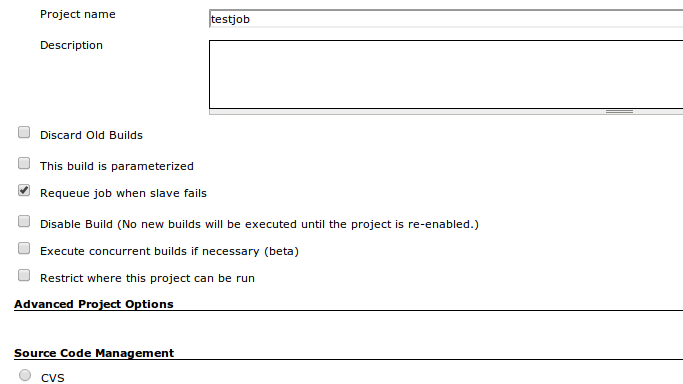

A plugin to requeue any jobs that fail due to the remote slave going
down.

# Description

If the server/slave that the job is running on fails for any reason, the
job will be added to the queue again to ensure that it is run.  
The original job will still appear to have failed, but the job will be
run again when a slave is available for processing.  
This plugin is very useful if the up time of your slaves are not
guaranteed or even otherwise unreliable.

# Screen Shot

|                                                                                                                                   |
|-----------------------------------------------------------------------------------------------------------------------------------|
|  |

_(To\ use\ this\ plugin,\ you\ just\ need\ to\ install\ it,\ then\ click\ the\ check\ box\ in\ the\ project\ properties\ to\ requeue\ jobs.)

# Change Log

### V1.1 @ 2016-09-08

-   Support requeueing jobs with parameters

### V1.0 @ 2013-04-17

-   Initial release
