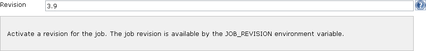

This plugin enables users to set a revision (a version) for the Jenkins
job.

## Features

The job revision sets the JOB\_REVISION as an environment variable in
the Jenkins job.

## Some use cases

-   To bring traceability when there are multiple branches of a product.

## Configuration

## Combination with other plugins

It is suggested to use the [EnvInject
Plugin](http://localhost:8085/display/JENKINS/EnvInject+Plugin) to
manage all job environment variables.  
EnvInject plugin retrieves the job revision variable (JOB\_REVISION).

## Roadmap

-   Retrieve the revision from the main build step stored in your build
    descriptor (Maven, Ivy, Gradle, ...)

## Changelog

##### Version 0.6 (2012-01-03)

-   Add an optionalBlock

##### Version 0.5 (2011-05-16)

-   Built for Jenkins 1.410 (company target)

##### Version 0.4 (2011-02-17)

-   Workaround issue in IBM JVM causing intermittent
    ClassNotFoundException.
    ([JENKINS-5141](https://issues.jenkins-ci.org/browse/JENKINS-5141))

##### Version 0.3 (2010-07-02)

-   Added a dedicated page to display the revision; the revision is also
    exposed by API (XML, JSON and Python).

##### Version 0.2 (2009-11-08)

-   Added an Hudson ParameterValue to keep track of the revision through
    the builds.

##### Version 0.1 (2009-11-02)

-   Initial release
