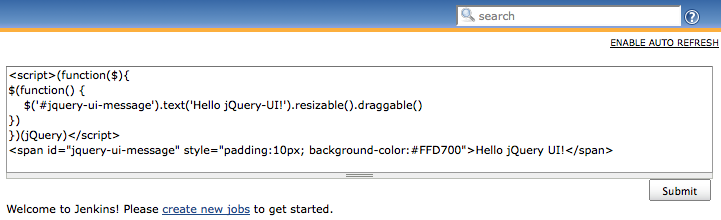

This plugin allows you to use jQuery UI on each view descriptions.

Warning

This plugin has been replaced with the [jQuery
Plugin](https://wiki.jenkins.io/display/JENKINS/jQuery+Plugin). Please
remove this plugin from your installation.

## Version History

#### Version 1.0.2 (Feb 27, 2011)

-   Rerelease 1.0.1 to properly set required Jenkins version.

#### Version 1.0.1 (Feb 22, 2011)

-   Upgrade [jQuery
    Plugin](https://wiki.jenkins.io/display/JENKINS/jQuery+Plugin) (1.0
    -\> 1.0.1)

#### Version 1.0 (Feb 20, 2011)

-   Initial release
