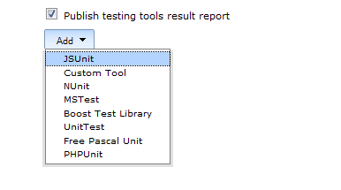
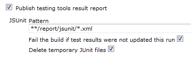

This plugin allows you publish [JSUnit](http://www.jsunit.net/) test
results   
This plugin makes it possible to import JSUnit reports from each build
into Hudson so they are displayed with a trend graph and details about
which tests that failed.

# Configuration

-   Step 1: Setup an ant task to run jsUnit's 'standalone\_test' target
    (and configure logsDirectory where the reports (xml) are stored) 
-   Step 2: Configure your Hudson job to execute this ant task
-   Step 3: Configure the JSUnit plugin:  

  

  
  

### Roadmap

### Changelog

##### Version 1.6

\* Upgrade to xUnit 1.90

##### Version 1.5

\* Upgrade to xUnit 1.17  
\* Built for Jenkins 1.410  
\* Changed packaging

##### Version 1.4.2

\* Upgraded to the dependency xUnit plugin 1.16.2

##### Version 1.4.1

\* Upgraded to the dependency xUnit plugin 1.16.1 for fixing slave mode

##### Version 1.3

\* Upgraded to latest xUnit API 1.16  
\* Built for Jenkins 1.398  
\* Fixed
[JENKINS-8228](https://issues.jenkins-ci.org/browse/JENKINS-8228) -
Parsing error on some JSUnit reports

##### Version 1.2

-   JSUnit is now [xUnit
    plugin](http://wiki.jenkins-ci.org/display/HUDSON/xUnit+Plugin) V1.8

##### Version 1.1

-   JSUnit is now [xUnit
    plugin](http://wiki.jenkins-ci.org/display/HUDSON/xUnit+Plugin) V1.6
    compatible (Fixed error message: "Attribute 'hostname' is not
    allowed to appear in element 'testsuite'")
-   Added jsunit xml input validation

##### Version 1.0

-   Updated to the new [xUnit
    plugin](http://localhost:8085/display/JENKINS/xUnit+Plugin)
    architecture.  
    Gallio Hudson plugin uses xUnit 1.6

##### Version 0.4

-   Changed plugin to handle latest JSUnit (2.2) reporting format. Old
    format is not supported anymore. ([Issue
    5333](http://issues.jenkins-ci.org/browse/JENKINS-5333)).  
    Many thanks to
    [mrobinet](http://issues.jenkins-ci.org/secure/ViewProfile.jspa?name=mrobinet)
    for supplying the patch and Jeffrey Erikson for doing some research
    as well.

##### Version 0.3

-   Using JSUnit plugin without the [xUnit
    plugin](http://wiki.jenkins-ci.org/display/HUDSON/xUnit+Plugin) is
    no longer possible. JSUnit plugin doesn't work standalone anymore
    (it is fully dependent on the xUnit plugin).

##### Version 0.2

-   Added an extension for the [xUnit
    plugin](http://wiki.jenkins-ci.org/display/HUDSON/xUnit+Plugin).

##### Version 0.1

-   First version. Many  thanks to [Erik
    Ramfelt](http://wiki.jenkins-ci.org/display/~redsolo). This version
    of the plugin is based on his [NUnit
    plugin](http://wiki.jenkins-ci.org/display/HUDSON/NUnit+Plugin).
