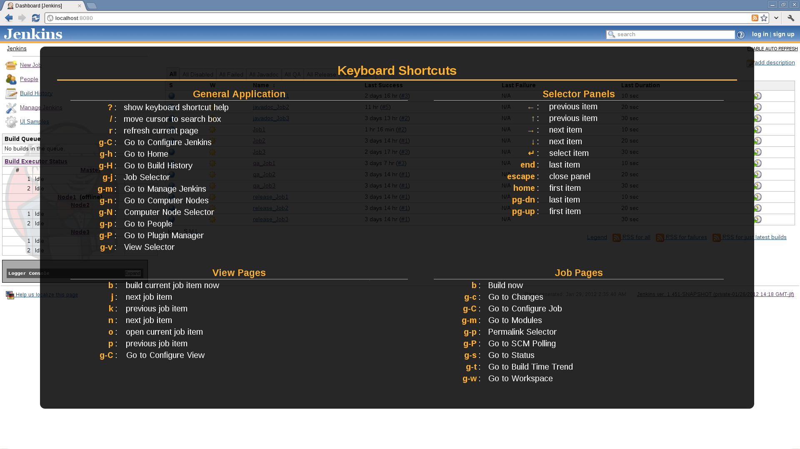
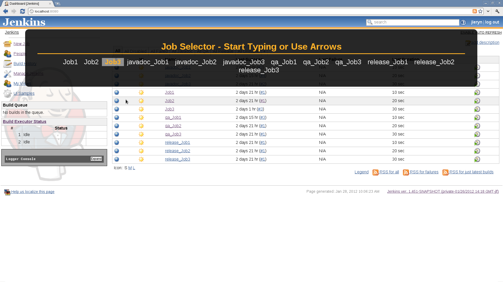
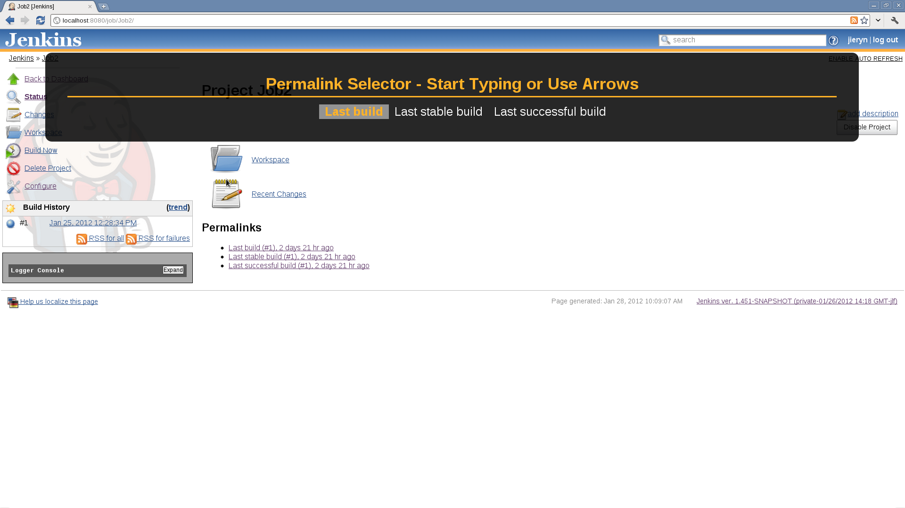
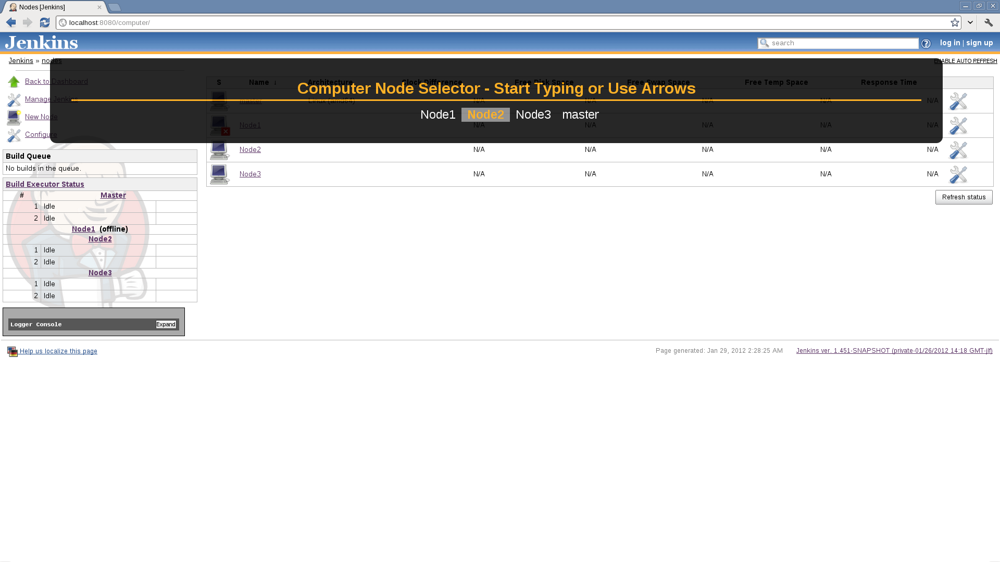
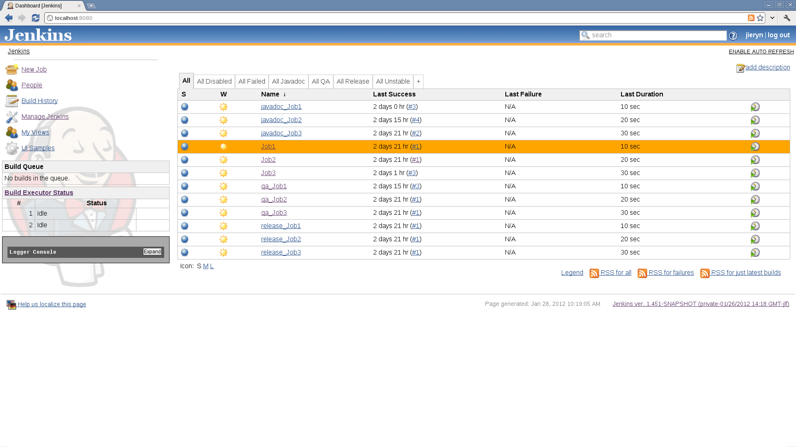

# Keyboard Shortcuts Plugin

  

Provides keyboard shortcuts to quickly and efficiently navigate and
manage Jenkins.

  

------------------------------------------------------------------------

  

### Screenshots

Despite being keyboard oriented, there are several visual user interface
elements to this plugin.

  

|                              |                                                                                                                                                 |                                                                                                                                                             |
|------------------------------|-------------------------------------------------------------------------------------------------------------------------------------------------|-------------------------------------------------------------------------------------------------------------------------------------------------------------|
| Help Panel                   |                 | Launched via **?**, shows all the known shortcuts                                                                                                           |
| View Selector Panel          |        | Launched via **g-v**, lets the user select from all Views and jumps to the selected View                                                                    |
| Job Selector Panel           |         | Launched via **g-j**, lets the user select from all Jobs and jumps to the selected Job                                                                      |
| Job Permalink Selector Panel |   | Launched via **g-p** when user is on a **Job** page, selects from all Permalinks                                                                            |
| Node Selector Panel          |        | Launched via **g-N**, selects from all Computer Nodes                                                                                                       |
| Job in View Navigation       |  | When user is on a **View** page, **arrow keys**, **vim j/k** and **n/p**, and others, migrate the selected **Job** selector, hit **o** to open that **Job** |

  

------------------------------------------------------------------------

  

### Shortcuts

  

#### Shortcuts from any Job page

These shortcuts are available when you are on a `./job/.**` page:

  

| Shortcut | Action                 |
|----------|------------------------|
| b        | Build now              |
| g-c      | Go to Changes          |
| g-C      | Go to Configure Job    |
| g-m      | Go to Modules          |
| g-p      | Permalink Selector     |
| g-P      | Go to SCM Polling      |
| g-s      | Go to Status           |
| g-t      | Go to Build Time Trend |
| g-w      | Go to Workspace        |

  

#### Shortcuts from any View page

These shortcuts are available when you are on a `./view/.*` **page, but
\*not** a Job page (e.g. `./view/All/job/.**`):

  

| Shortcut | Action                 |
|----------|------------------------|
| b        | build current job item |
| j        | next job item          |
| k        | previous job item      |
| n        | next job item          |
| o        | open current job item  |
| p        | previous job item      |
| g-C      | Go to Configure View   |

  

#### Shortcuts from any page

These shortcuts are available when you are on **any** page, unless
overridden by a **Job** or **View** page shortcut:

  

| Shortcut | Action                      |
|----------|-----------------------------|
| ?        | show keyboard shortcut help |
| /        | move cursor to search box   |
| r        | refresh current page        |
| g-C      | Go to Configure Jenkins     |
| g-h      | Go to Home                  |
| g-H      | Go to Build History         |
| g-j      | Job Selector                |
| g-m      | Go to Manage Jenkins        |
| g-n      | Go to Computer Nodes        |
| g-N      | Computer Node Selector      |
| g-p      | Go to People                |
| g-P      | Go to Plugin Manager        |
| g-v      | View Selector               |

  

#### Shortcuts from any Selector Panel

These shortcuts are available when you are on **any** selector panel:

  

| Shortcut   | Action        |
|------------|---------------|
| ←          | previous item |
| ↑          | previous item |
| →          | next item     |
| ↓          | next item     |
| \<escape\> | close panel   |
| \<enter\>  | select item   |
| \<home\>   | first item    |
| \<end\>    | last item     |
| \<pg-up\>  | first item    |
| \<pg-dn\>  | last item     |

  

#### Shortcuts from the Search Results Panel

These shortcuts are available when you are on the **Search Results**
panel:

  

| Shortcut | Action                   |
|----------|--------------------------|
| j        | next search item         |
| k        | previous search item     |
| n        | next search item         |
| o        | open current search item |
| p        | previous search item     |

  

------------------------------------------------------------------------

  

### Changelog

#### 2.0 (planned)

-   make keyboard shortcuts an extension point for other plugins

#### 1.3 (not yet released)

-   Help/Selectors should use the offset from the top of the viewport,
    not top of the screen
    [JENKINS-13375](https://issues.jenkins-ci.org/browse/JENKINS-13375)
-   Add keyboard shortcut for console output
    [JENKINS-13723](https://issues.jenkins-ci.org/browse/JENKINS-13723)
    -   **NOTE: the best way to do this was g-c which was previously
        used by /changes .. /changes now accessed via g-g**
-   allow j/k navigation for search results
    [JENKINS-13105](https://issues.jenkins-ci.org/browse/JENKINS-13105) -
    this forced bump to requiredCore of v1.461

#### 1.2 (released 2012-04-03)

-   depend on Jenkins v1.455, mistake with v1.1 to depend on v1.454
-   typing within a selector should be for anywhere in the selector item
    name
    [JENKINS-13305](https://issues.jenkins-ci.org/browse/JENKINS-13305)
-   hitting / key puts / in the search box
    [JENKINS-13106](https://issues.jenkins-ci.org/browse/JENKINS-13106)

#### 1.1 (released 2012-03-07)

-   depend on Jenkins v1.454 which uses upgraded prototype.js library to
    not collide with new breadcrumbs
-   fixed URL handling for proxy/reverse proxy/weird deploy contexts
    [JENKINS-12730](https://issues.jenkins-ci.org/browse/JENKINS-12730)

#### 1.0 (released 2012-02-22)

-   depend on the released jenkins 1.451
-   fixed a simple bug with permalink jumping

#### 1.0-beta-2 (released 2012-02-08)

-   added ability to type prefixes in selectors and have results
    filtered
-   add node selector
-   properly handle selectors to prevent multiples being active
    simultaneously
-   fixed prototype.js problem
    [JENKINS-11618](https://issues.jenkins-ci.org/browse/JENKINS-11618)
-   provide a user property to allow logged in users to enable/disable
    shortcuts

#### 1.0-beta-1 (released 2012-01-29)

-   initial implementation
-   fully I18Ned
