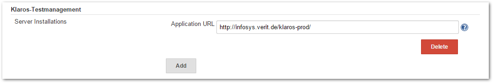
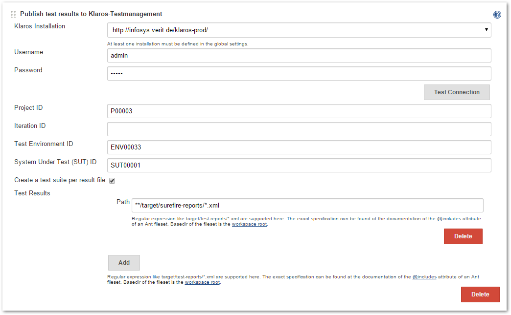

Older versions of this plugin may not be safe to use. Please review the
following warnings before using an older version:

-   [Credentials stored in plain
    text](https://jenkins.io/security/advisory/2019-04-03/#SECURITY-843)

Integrates Jenkins with
[Klaros-Testmanagement](http://www.klaros-testmanagement.com/) by
publishing the test results of a build to the
[Klaros-Testmanagement](http://www.klaros-testmanagement.com/)
application.  
The test results will be stored in the
[Klaros-Testmanagement](http://www.klaros-testmanagement.com/) database
for further evaluation and reporting purposes.

# How to install this plugin

## Using the interface

The simplest way is by going to your installation's management screen
and clicking there "Manage Plugins".
(`http:``//yourhost/jenkins/pluginManager`). The web interface will then
download `*.hpi` files from here, you will just need to restart your
Jenkins instance to pick up the changes.

## Manual Installation

[Download
Site](http://updates.jenkins-ci.org/download/plugins/klaros-testmanagement/)

Save the downloaded `*.hpi` file into the `$JENKINS_HOME/plugins`
directory. You will need then to restart Jenkins (many containers let
you do this without restarting the container).

# Configuration

In the Jenkins system configuration you are able to specify one or more
[Klaros-Testmanagement](http://www.klaros-testmanagement.com/)
installations which you may publish test results to. The only
configuration option is the URL of the application.

In the Jenkins project configuration (under Post-build Actions) you can
define the following parameters:

-   **Username**: Specify this if Klaros is configured to require
    authentication for test results imports
-   **Password**: Specify this if Klaros is configured to require
    authentication for test results imports
-   **Project ID**: The ID of the Klaros Project to store to
-   **Iteration ID**: The optional ID of the Klaros project iteration to
    which the test results should belong.
-   **Test Environment ID**: The ID of the Klaros test environment (OS
    etc.)
-   **System Under Test ID**: The ID of the Klaros system under test
    (Software version etc.)
-   **Create a test suite per result file**: If enabled, there will be a
    test suite and corresponding  
    test suite result created in Klaros for each result file imported
-   **Test Report files**: Multiple Ant FileSet includes to the result
    files to be published

# Notes

If the exported test cases are not yet present in
[Klaros-Testmanagement](http://www.klaros-testmanagement.com/) they are
created automatically for the given project.

This plugin requires
[Klaros-Testmanagement](http://www.klaros-testmanagement.com/) version
2.2.1 or later. User authentication is supported starting from Klaros
version 2.6.

Starting with version 2.0.0 this plugin is no longer supporting Hudson.

# Version History

### Version 2.0.0 (Jan 21, 2017)

-   java.io.NotSerializableException when plugin is executed on a slave
    node
    ([JENKINS-34334](https://issues.jenkins-ci.org/browse/JENKINS-34334))

### Version 1.7 (Feb 16, 2016)

-   Extend the list of supported result file formats to the supported
    list of Klaros-Testmanagement 4.4
    ([JENKINS-32973](https://issues.jenkins-ci.org/browse/JENKINS-32973))
-   NullpointerException in KlarosTestResultPublisher:752
    ([JENKINS-32972](https://issues.jenkins-ci.org/browse/JENKINS-32972))

### Version 1.6 (Feb 15, 2016)

-   Support specifying result file formats during result publishing
    ([JENKINS-30369](https://issues.jenkins-ci.org/browse/JENKINS-30369))
-   Send additional build information while exporting test results
    ([JENKINS-30338](https://issues.jenkins-ci.org/browse/JENKINS-30338))
-   Support build environment and build parameter variables
    ([JENKINS-30337](https://issues.jenkins-ci.org/browse/JENKINS-30337))

### Version 1.5.1 (May 31, 2015)

-   Add proper migration of test result path settings for existing
    projects
    ([JENKINS-28659](https://issues.jenkins-ci.org/browse/JENKINS-28659))

### Version 1.5 (May 30, 2015)

-   Add support for iteration assignment of imported test runs
    ([JENKINS-28296](https://issues.jenkins-ci.org/browse/JENKINS-28296))
-   Support the creation of test suites on test result import
    ([JENKINS-27596](https://issues.jenkins-ci.org/browse/JENKINS-27596))
-   Do not try to export test results for canceled or broken builds
    ([JENKINS-27593](https://issues.jenkins-ci.org/browse/JENKINS-27593))
-   Support multiple test result set specifications for uploading
    ([JENKINS-27592](https://issues.jenkins-ci.org/browse/JENKINS-27592))
-   Whitespace at the end of input fields leads to bogus file upload
    ([JENKINS-15744](https://issues.jenkins-ci.org/browse/JENKINS-15744))

### Version 1.4 (Apr 15, 2011)

-   No longer tries to authenticate with an empty username when no name
    was specified
-   Remote Slave execution finally works

### Version 1.3 (Apr 08, 2011)

-   Fixes a problem when executed on a slave node

### Version 1.2 (Feb 14, 2011)

-   Update link in help

### Version 1.1 (Mar 19, 2010)

-   Support for the user authentication introduced in version 2.6

### Version 1.0 (Oct 6, 2009)

-   Initial Release
