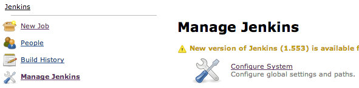
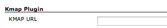
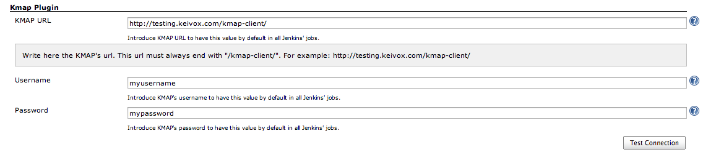
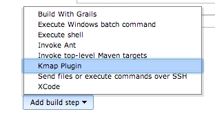
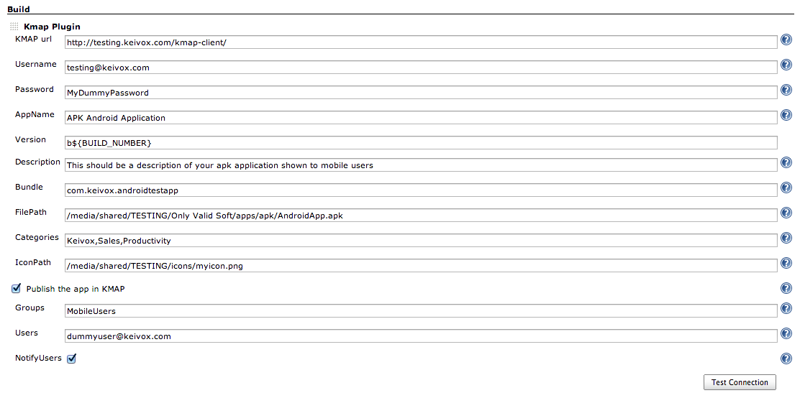

The current version of this plugin may not be safe to use. Please review
the following warnings before use:

-   [CSRF vulnerability and missing permission check allow
    SSRF](https://jenkins.io/security/advisory/2019-04-03/#SECURITY-1055)
-   [Credentials stored in plain
    text](https://jenkins.io/security/advisory/2019-04-03/#SECURITY-1056)

Publish mobile applications to your Keivox KMAP Private Mobile App Store
[http://www.keivox.com](http://www.keivox.com/)

The current version of this plugin may not be safe to use. Please review
the following warnings before use:

-   [CSRF vulnerability and missing permission check allow
    SSRF](https://jenkins.io/security/advisory/2019-04-03/#SECURITY-1055)
-   [Credentials stored in plain
    text](https://jenkins.io/security/advisory/2019-04-03/#SECURITY-1056)

## Installing the Keivox KMAP plugin

You can install the plugin either through the Jenkins plugin
administration or manually.

## **Configuring the Global Settings**

Go to *Manage Jenkins*, *Configure System*.

If the plugin has been installed properly, you should see a section
called *Kmap Plugin*.

To avoid configuring the URL and credentials of your KMAP Private Mobile
App Store in every job, you may configure them in the global settings.
They will be automatically pre-configured in every job when you add the
step to use the Keivox KMAP Plugin.

## Configuring a Build to use the Keivox KMAP Plugin

Create a new build, give it a job name, and select the type of build and
click OK.  
If the plugin has been installed, you will be able to add an step called
*Kmap Plugin*.

Once added, you can configure the different parameters to be used with
your KMAP Private Mobile App Store. Check the help buttons to get
specific information and format for every field. Before saving the job,
we recommend that you use the option *Test Connection* to verify the
connectivity with your KMAP Private Mobile App Store.

