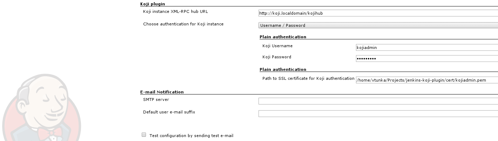
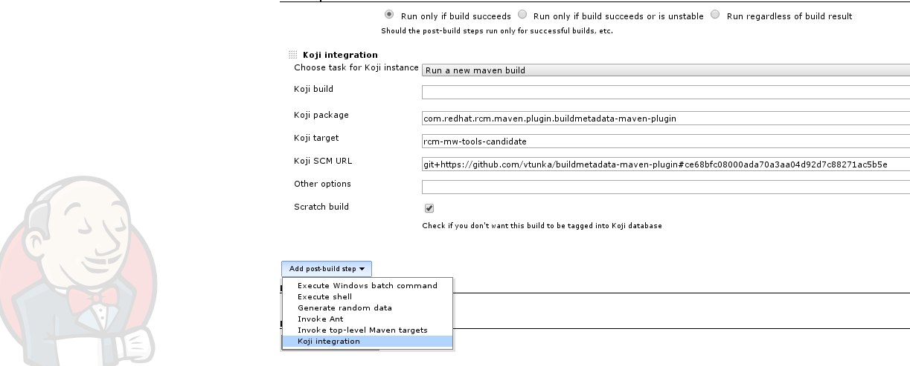
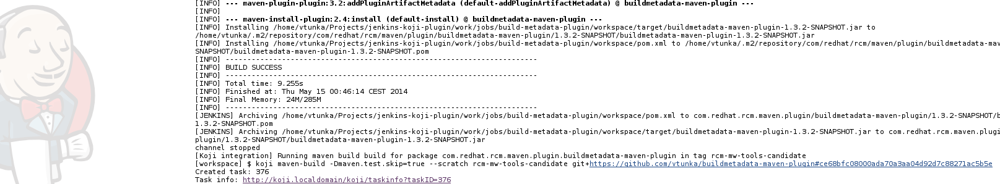
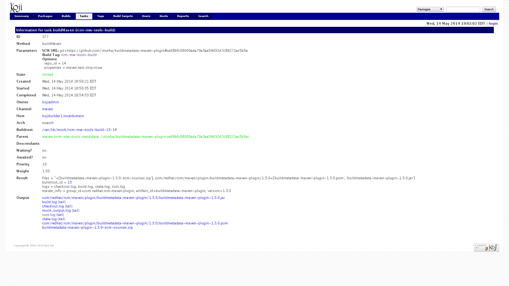

This plugin enables integration with
[Koji](https://fedorahosted.org/koji/) build system providing clean-room
environment for production builds. Main focus of Koji is on
reproducibility, auditability and isolation of build executors which are
freshly provisioned each time.

This plugin focuses on Koji/Maven builds, however if there will be
requirements to work with RPM builds, Windows native builds or images in
the future, I can add the support as well and of course I will accept
your contributions.

You can use [Kojak](https://github.com/sbadakhc/kojak) scripts to easily
provision & automatically configure your own Koji instance including
configuration of the Java/maven ecosystem.

A potential usage of Jenkins-Koji plugin can be described as such:

-   Run your builds using Jenkins CI, as you do now
-   Once build & tests are passing and you are ready to produce a
    production build call Jenkins-Koji build step
-   Jenkins-Koji plugin orchestrates the jobs in Koji, you can choose a
    "scratch build" which is a temporary build which is garbage
    collected after a time 
-   Once Koji is finished, use Jenkins-Koji plugin to automatically
    fetch the artifacts from Koji and for example run a set of smoke
    tests
-   Once these advanced tests pass, you are ready for a full build, once
    again execute Koji build, this time a regular build, which will be
    stored permanently in Koji

Installation Requirements

Currently this plugin requires koji CLI installed on the filesystem,
limiting usage to Linux. In time the functionality of koji CLI will be
transfered to core plugin, allowing execution from various OSes.

# Description

Koji plugin is meant for orchestration of Koji instance from Jenkins CI.
The idea is to use Jenkins as a developer tool and build the production
releases via Koji.

The following features are provided by this plug-in:

-   Orchestrate a Koji maven build
-   Collect the results from Koji
-   Find metadata about builds, packages or build targets from Koji
-   Simple authentication

# How To Use

1.  Download [Kojak](https://github.com/sbadakhc/kojak.git) to set up
    your own Koji environment or use [existing Koji
    instance](https://fedoraproject.org/wiki/Koji/RunsHere).
2.  Install Koji CLI on your system (yum install koji)
3.  Configure the Koji CLI to use your SSH key for Koji instance 
4.  Install the Koji plugin in Jenkins
5.  Restart Jenkins
6.  Execute Koji-plugin in Jenkins as you desire
7.  Monitor build using Koji-web, Koji CLI, etc.

Step no. 3 - configuring global plugin settings: 

Step no. 6 - invoking Jenkins-Koji plugin in your project:

  
Build log;

  
Step no. 7 - monitoring Koji build:

# Roadmap

-   Eliminate usage of Koji CLI to enable support for multiplatform
    Jenkins executors
-   Revamp of Jelly UI
-   Provide more operations
-   Include rule based decisions for Koji builds based on test results /
    successful executions 
-   Try to provide authentication via SSL or Kerberos if desired by
    community
-   Enable basic operations for RPMs

# Changelog

### Release 0.3 (Jun 1, 2015)

-   Fixed plugin artifact ID, allowing users pre-0.2 to upgrade
-   Added plugin wiki URL
-   No functional changes since 0.2

### Release 0.2 (May 19, 2014)

-   Correctly handle Koji XML-RPC login
-   Correctly handle MalformedURL of Koji HUB
-   Fix number of arguments issue for non-scratch builds
-   Add documentation

### Release 0.1.3

-   Standardize naming conventions of plugin to Jenkins standards

### Release 0.1.1 -\> 0.1.2

-   Solving issues with maven release plugin releasing SNAPSHOTs

### Release 0.1

-   Initial release
